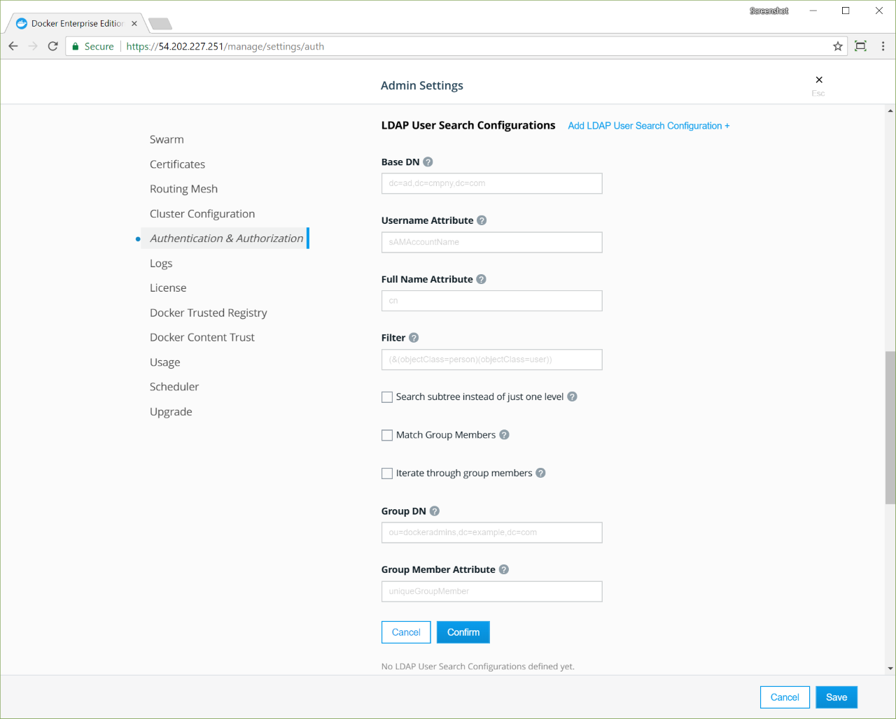

Docker UCP integrates with LDAP directory services, so that you can manage
users and groups from your organization's directory and it will automatically
propagate that information to UCP and DTR.

If you enable LDAP, UCP uses a remote directory server to create users
automatically, and all logins are forwarded to the directory server.

When you switch from built-in authentication to LDAP authentication,
all manually created users whose usernames don't match any LDAP search results
are still available.

When you enable LDAP authentication, you can choose whether UCP creates user
accounts only when users log in for the first time. Select the 
**Just-In-Time User Provisioning** option to ensure that the only LDAP
accounts that exist in UCP are those that have had a user log in to UCP.

## How UCP integrates with LDAP

You control how UCP integrates with LDAP by creating searches for users. 
You can specify multiple search configurations, and you can specify multiple
LDAP servers to integrate with. Searches start with the `Base DN`, which is
the *distinguished name* of the node in the LDAP directory tree where the
search starts looking for users.

Access LDAP settings by navigating to the **Authentication & Authorization**
page in the UCP web UI. There are two sections for controlling LDAP searches
and servers.

- **LDAP user search configurations:** This is the section of the
  **Authentication & Authorization** page where you specify search
  parameters, like `Base DN`, `scope`, `filter`, the `username` attribute,
  and the `full name` attribute. These searches are stored in a list, and
  the ordering may be important, depending on your search configuration.
- **LDAP server:** This is the section where you specify the URL of an LDAP
  server, TLS configuration, and credentials for doing the search requests.
  Also, you provide a domain for all servers but the first one. The first
  server is considered the default domain server. Any others are associated
  with the domain that you specify in the page.

Here's what happens when UCP synchronizes with LDAP: 

1. UCP creates a set of search results by iterating over each of the user
   search configs, in the order that you specify.
2. UCP choses an LDAP server from the list of domain servers by considering the
   `Base DN` from the user search config and selecting the domain server that
   has the longest domain suffix match.
3. If no domain server has a domain suffix that matches the `Base DN` from the
   search config, UCP uses the default domain server.
4. UCP combines the search results into a list of users and creates UCP
   accounts for them. If the **Just-In-Time User Provisioning** option is set,
   user accounts are created only when users first log in.

The domain server to use is determined by the `Base DN` in each search config.
UCP doesn't perform search requests against each of the domain servers, only
the one which has the longest matching domain suffix, or the default if there's
no match.

Here's an example. Let's say we have three LDAP domain servers:

|                 Domain                 |          Server URL          |
| -------------------------------------- | ---------------------------- |
| *default*                              | ldaps://ldap.example.com     |
| `dc=subsidiary1,dc=com`                | ldaps://ldap.subsidiary1.com |
| `dc=subsidiary2,dc=subsidiary1,dc=com` | ldaps://ldap.subsidiary2.com |

Here are three user search configs with the following `Base DNs`:

- baseDN=`ou=people,dc=subsidiary1,dc=com`

  For this search config, `dc=subsidiary1,dc=com` is the only server with a
  domain which is a suffix, so UCP uses the server `ldaps://ldap.subsidiary1.com`
  for the search request.

- baseDN=`ou=product,dc=subsidiary2,dc=subsidiary1,dc=com`

  For this search config, two of the domain servers have a domain which is a
  suffix of this base DN, but `dc=subsidiary2,dc=subsidiary1,dc=com` is the
  longer of the two, so UCP uses the server `ldaps://ldap.subsidiary2.com` 
  for the search request.

- baseDN=`ou=eng,dc=example,dc=com`

  For this search config, there is no server with a domain specified which is
  a suffix of this base DN, so UCP uses the default server, `ldaps://ldap.example.com`,
  for the search request.

If there are `username` collisions for the search results between domains, UCP
uses only the first search result, so the ordering of the user search configs
may be important. For example, if both the first and third user search configs
result in a record with the username `jane.doe`, the first has higher
precedence and the second is ignored. For this reason, it's important to choose
a `username` attribute that's unique for your users across all domains.

Because names may collide, it's a good idea to use something unique to the
subsidiary, like the email address for each person. Users can log in with the
email address, for example, `jane.doe@subsidiary1.com`.

## Configure the LDAP integration

To configure UCP to create and authenticate users by using an LDAP directory,
go to the UCP web UI, navigate to the **Admin Settings** page and click
**Authentication & Authorization** to select the method used to create and
authenticate users.

In the **LDAP Enabled** section, click **Yes** to The LDAP settings appear.
Now configure your LDAP directory integration.

## Default role for all private collections

Use this setting to change the default permissions of new users.

Click the dropdown to select the permission level that UCP assigns by default
to the private collections of new users. For example, if you change the value
to `View Only`, all users who log in for the first time after the setting is
changed have `View Only` access to their private collections, but permissions
remain unchanged for all existing users.
[Learn more about permission levels](../../../authorization/define-roles.md).

## LDAP enabled

Click **Yes** to enable integrating UCP users and teams with LDAP servers.  

## LDAP server

| Field                 | Description                                                                                                                                                               |
| :-------------------- | :------------------------------------------------------------------------------------------------------------------------------------------------------------------------ |
| LDAP server URL       | The URL where the LDAP server can be reached.                                                                                                                             |
| Reader DN             | The distinguished name of the LDAP account used for searching entries in the LDAP server. As a best practice, this should be an LDAP read-only user.                       |
| Reader password       | The password of the account used for searching entries in the LDAP server.                                                                                                |
| Use Start TLS         | Whether to authenticate/encrypt the connection after connecting to the LDAP server over TCP. If you set the LDAP Server URL field with `ldaps://`, this field is ignored. |
| Skip TLS verification | Whether to verify the LDAP server certificate when using TLS. The connection is still encrypted but vulnerable to man-in-the-middle attacks.                              |
| No simple pagination  | If your LDAP server doesn't support pagination.                                                                                                                           |
| Just-In-Time User Provisioning | Whether to create user accounts only when users log in for the first time. The default value of `true` is recommended. If you upgraded from UCP 2.0.x, the default is `false`. |

{: .with-border}

Click **Confirm** to add your LDAP domain.

 To integrate with more LDAP servers, click **Add LDAP Domain**.

## LDAP user search configurations

| Field                                    | Description                                                                                                                                                                                                                                                                                                                                                                                                                                                                                                                                                                                   |                                        |
| :--------------------------------------- | :-------------------------------------------------------------------------------------------------------------------------------------------------------------------------------------------------------------------------------------------------------------------------------------------------------------------------------------------------------------------------------------------------------------------------------------------------------------------------------------------------------------------------------------------------------------------------------------------- | -------------------------------------- |
| Base DN                                  | The distinguished name of the node in the directory tree where the search should start looking for users.                                                                                                                                                                                                                                                                                                                                                                                                                                                                                     |                                        |
| Username attribute                       | The LDAP attribute to use as username on UCP. Only user entries with a valid username will be created. A valid username is no longer than 100 characters and does not contain any unprintable characters, whitespace characters, or any of the following characters: `/` `\` `[` `]` `:` `;` `|` `=` `,` `+` `*` `?` `<` `>` `'` `"`. |
| Full name attribute                      | The LDAP attribute to use as the user's full name for display purposes. If left empty, UCP will not create new users with a full name value.                                                                                                                                                                                                                                                                                                                                                                                                                                                  |                                        |
| Filter                                   | The LDAP search filter used to find users. If you leave this field empty, all directory entries in the search scope with valid username attributes are created as users.                                                                                                                                                                                                                                                                                                                                                                                                                      |                                        |
| Search subtree instead of just one level | Whether to perform the LDAP search on a single level of the LDAP tree, or search through the full LDAP tree starting at the Base DN.                                                                                                                                                                                                                                                                                                                                                                                                                                                          |                                        |
| Match Group Members                     | Whether to further filter users by selecting those who are also members of a specific group on the directory server. This feature is helpful if the LDAP server does not support `memberOf` search filters.                                                                                                                                                                                                                                                                                                                                                                                   |                                        |
| Iterate through group members            | If `Select Group Members` is selected, this option searches for users by first iterating over the target group's membership, making a separate LDAP query for each member. as opposed to first querying for all users which match the above search query and intersecting those with the set of group members. This option can be more efficient in situations where the number of members of the target group is significantly smaller than the number of users which would match the above search filter, or if your directory server does not support simple pagination of search results. |                                        |
| Group DN                                 | If `Select Group Members` is selected, this specifies the distinguished name of the group from which to select users.                                                                                                                                                                                                                                                                                                                                                                                                                                                                         |                                        |
| Group Member Attribute                   | If `Select Group Members` is selected, the value of this group attribute corresponds to the distinguished names of the members of the group.                                                                                                                                                                                                                                                                                                                                                                                                                                                  |                                        |

{: .with-border}

To configure more user search queries, click **Add LDAP User Search Configuration**
again. This is useful in cases where users may be found in multiple distinct
subtrees of your organization's directory. Any user entry which matches at
least one of the search configurations will be synced as a user.

## LDAP test login

| Field    | Description                                                                                                                                                                           |
| :------- | :------------------------------------------------------------------------------------------------------------------------------------------------------------------------------------ |
| Username | An LDAP username for testing authentication to this application. This value corresponds with the **Username Attribute** specified in the **LDAP user search configurations** section. |
| Password | The user's password used to authenticate (BIND) to the directory server.                                                                                                              |

Before you save the configuration changes, you should test that the integration
is correctly configured. You can do this by providing the credentials of an
LDAP user, and clicking the **Test** button.

## LDAP sync configuration

| Field                      | Description                                                                                                                                                                                                                                                              |
| :------------------------- | :----------------------------------------------------------------------------------------------------------------------------------------------------------------------------------------------------------------------------------------------------------------------- |
| Sync interval              | The interval, in hours, to synchronize users between UCP and the LDAP server. When the synchronization job runs, new users found in the LDAP server are created in UCP with the default permission level. UCP users that don't exist in the LDAP server become inactive. |
| Enable sync of admin users | This option specifies that system admins should be synced directly with members of a group in your organization's LDAP directory. The admins will be synced to match the membership of the group. The configured recovery admin user will also remain a system admin.    |

Once you've configured the LDAP integration, UCP synchronizes users based on
the interval you've defined starting at the top of the hour. When the
synchronization runs, UCP stores logs that can help you troubleshoot when
something goes wrong.

You can also manually synchronize users by clicking **Sync Now**.

## Revoke user access

When a user is removed from LDAP, the effect on the user's UCP account depends
on the **Just-In-Time User Provisioning** setting: 

- **Just-In-Time User Provisioning** is `false`: Users deleted from LDAP become
  inactive in UCP after the next LDAP synchronization runs.
- **Just-In-Time User Provisioning** is `true`: Users deleted from LDAP can't
  authenticate, but their UCP accounts remain active. This means that they can
  use their client bundles to run commands. To prevent this, deactivate their
  UCP user accounts.

## Data synced from your organization's LDAP directory

UCP saves a minimum amount of user data required to operate. This includes
the value of the username and full name attributes that you have specified in
the configuration as well as the distinguished name of each synced user.
UCP does not store any additional data from the directory server.

## Sync teams

UCP enables syncing teams with a search query or group in your organization's
LDAP directory.
[Sync team members with your organization's LDAP directory](../../../authorization/create-teams-with-ldap.md).

## Where to go next

- [Create users and teams manually](../../../authorization/create-users-and-teams-manually.md)
- [Create teams with LDAP](../../../authorization/create-teams-with-ldap.md)
- [Enable LDAP integration by using a configuration file](enable-ldap-config-file.md)
