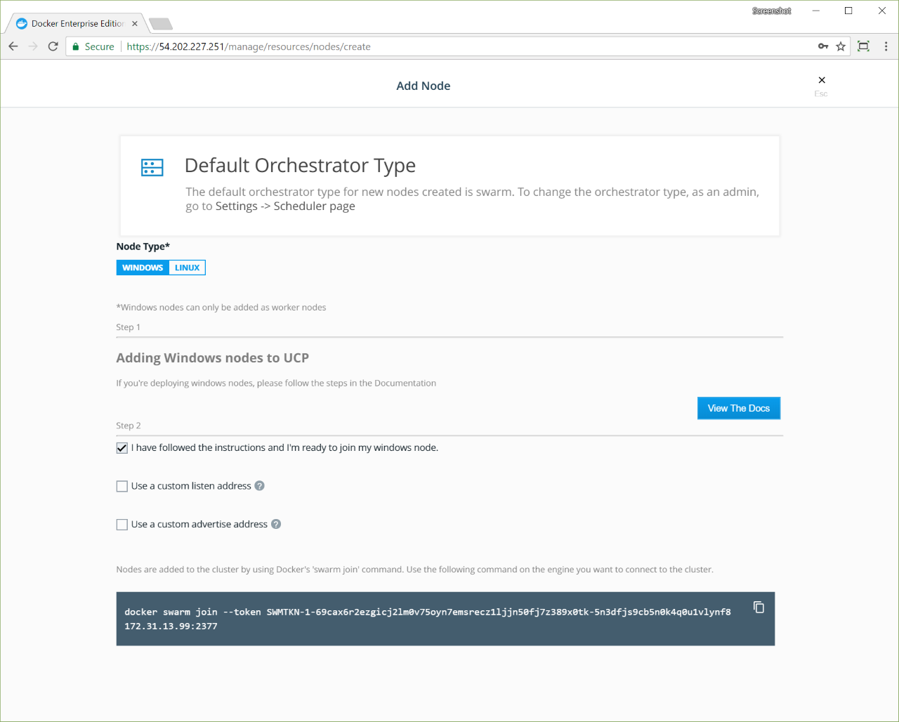

Docker Enterprise Edition supports worker nodes that run on Windows Server 2016.
Only worker nodes are supported on Windows, and all manager nodes in the cluster
must run on Linux.

Follow these steps to enable a worker node on Windows.

1.  Install Docker EE Engine on Windows Server 2016.
2.  Configure the Windows node.
3.  Join the Windows node to the cluster.

## Install Docker EE Engine on Windows Server 2016

[Install Docker EE Engine](/engine/installation/windows/docker-ee/#use-a-script-to-install-docker-ee)
on a Windows Server 2016 instance to enable joining a cluster that's managed by
Docker Enterprise Edition.

## Configure the Windows node

Follow these steps to configure the docker daemon and the Windows environment.

1.  Pull the Windows-specific image of `ucp-agent`, which is named `ucp-agent-win`.
2.  Run the Windows worker setup script provided with `ucp-agent-win`.
3.  Join the cluster with the token provided by the Docker EE web UI or CLI.

### Pull the Windows-specific images

On a manager node, run the following command to list the images that are required
on Windows nodes.

```bash
docker container run --rm {{ page.ucp_org }}/{{ page.ucp_repo }}:{{ page.ucp_version }} images --list --enable-windows
{{ page.ucp_org }}/ucp-agent-win:{{ page.ucp_version }}
{{ page.ucp_org }}/ucp-dsinfo-win:{{ page.ucp_version }}
```

On Windows Server 2016, in a PowerShell terminal running as Administrator,
log in to Docker Hub with the `docker login` command and pull the listed images.

```powershell
docker image pull {{ page.ucp_org }}/ucp-agent-win:{{ page.ucp_version }}
docker image pull {{ page.ucp_org }}/ucp-dsinfo-win:{{ page.ucp_version }}
```

### Run the Windows node setup script

You need to open ports 2376 and 12376, and create certificates
for the Docker daemon to communicate securely. Use this command to run
the Windows node setup script:

```powershell
$script = [ScriptBlock]::Create((docker run --rm {{ page.ucp_org }}/ucp-agent-win:{{ page.ucp_version }} windows-script | Out-String))

Invoke-Command $script
```

> Docker daemon restart
>
> When you run `windows-script`, the Docker service is unavailable temporarily.

The Windows node is ready to join the cluster. Run the setup script on each
instance of Windows Server that will be a worker node.

### Compatibility with daemon.json

The script may be incompatible with installations that use a config file at
`C:\ProgramData\docker\config\daemon.json`. If you use such a file, make sure
that the daemon runs on port 2376 and that it uses certificates located in
`C:\ProgramData\docker\daemoncerts`. If certificates don't exist in this
directory, run `ucp-agent-win generate-certs`, as shown in Step 2 of the
procedure in [Set up certs for the dockerd service](#set-up-certs-for-the-dockerd-service).

In the daemon.json file, set the `tlscacert`, `tlscert`, and `tlskey` options
to the corresponding files in `C:\ProgramData\docker\daemoncerts`:

```json
{
...
		"debug":     true,
		"tls":       true,
		"tlscacert": "C:\ProgramData\docker\daemoncerts\ca.pem",
		"tlscert":   "C:\ProgramData\docker\daemoncerts\cert.pem",
		"tlskey":    "C:\ProgramData\docker\daemoncerts\key.pem",
		"tlsverify": true,
...
}
```

## Join the Windows node to the cluster

Now you can join the cluster by using the `docker swarm join` command that's
provided by the Docker EE web UI and CLI.

1.  Log in to the Docker EE web UI with an administrator account.
2.  Navigate to the **Nodes** page.
3.  Click **Add Node** to add a new node.
4.  In the **Node Type** section, click **Windows**.
5.  In the **Step 2** section, click the checkbox for
    "I'm ready to join my windows node."
6.  Check the **Use a custom listen address** option to specify the address
    and port where new node listens for inbound cluster management traffic.
7.  Check the **Use a custom listen address** option to specify the
    IP address that's advertised to all members of the cluster for API access.

    {: .with-border}

Copy the displayed command. It looks similar to the following:

```powershell
docker swarm join --token <token> <ucp-manager-ip>
```

You can also use the command line to get the join token. Using your
[UCP client bundle](../../../user-access/cli.md), run:

```bash
docker swarm join-token worker
```

Run the `docker swarm join` command on each instance of Windows Server that
will be a worker node.

## Configure a Windows worker node manually

The following sections describe how to run the commands in the setup script
manually to configure the `dockerd` service and the Windows environment.
The script opens ports in the firewall and sets up certificates for `dockerd`.

To see the script, you can run the `windows-script` command without piping
to the `Invoke-Expression` cmdlet.

```powershell
docker container run --rm {{ page.ucp_org }}/ucp-agent-win:{{ page.ucp_version }} windows-script
```

### Open ports in the Windows firewall

Docker EE requires that ports 2376 and 12376 are open for inbound TCP traffic.

In a PowerShell terminal running as Administrator, run these commands
to add rules to the Windows firewall.

```powershell
netsh advfirewall firewall add rule name="docker_local" dir=in action=allow protocol=TCP localport=2376
netsh advfirewall firewall add rule name="docker_proxy" dir=in action=allow protocol=TCP localport=12376
```

### Set up certs for the dockerd service

1.  Create the directory `C:\ProgramData\docker\daemoncerts`.
2.  In a PowerShell terminal running as Administrator, run the following command
    to generate certificates.

    ```powershell
    docker container run --rm -v C:\ProgramData\docker\daemoncerts:C:\certs {{ page.ucp_org }}/ucp-agent-win:{{ page.ucp_version }} generate-certs
    ```

3.  To set up certificates, run the following commands to stop and unregister the
    `dockerd` service, register the service with the certificates, and restart the service.

    ```powershell
    Stop-Service docker
    dockerd --unregister-service
    dockerd -H npipe:// -H 0.0.0.0:2376 --tlsverify --tlscacert=C:\ProgramData\docker\daemoncerts\ca.pem --tlscert=C:\ProgramData\docker\daemoncerts\cert.pem --tlskey=C:\ProgramData\docker\daemoncerts\key.pem --register-service
    Start-Service docker
    ```

The `dockerd` service and the Windows environment are now configured to join a Docker EE cluster.

> TLS certificate setup
>
> If the TLS certificates aren't set up correctly, the Docker EE web UI shows the
> following warning.
>
> ```
> Node WIN-NOOQV2PJGTE is a Windows node that cannot connect to its local Docker daemon.
> ```

## Windows nodes limitations

Some features are not yet supported on Windows nodes:

* Networking
  * The cluster mode routing mesh can't be used on Windows nodes. You can expose
  a port for your service in the host where it is running, and use the HTTP
  routing mesh to make your service accessible using a domain name.
  * Encrypted networks are not supported. If you've upgraded from a previous
  version, you'll also need to recreate the `ucp-hrm` network to make it
  unencrypted.
* Secrets
  * When using secrets with Windows services, Windows stores temporary secret
  files on disk. You can use BitLocker on the volume containing the Docker
  root directory to encrypt the secret data at rest.
  * When creating a service which uses Windows containers, the options to
  specify UID, GID, and mode are not supported for secrets. Secrets are
  currently only accessible by administrators and users with system access
  within the container.
* Mounts
  * On Windows, Docker can't listen on a Unix socket. Use TCP or a named pipe
  instead.
