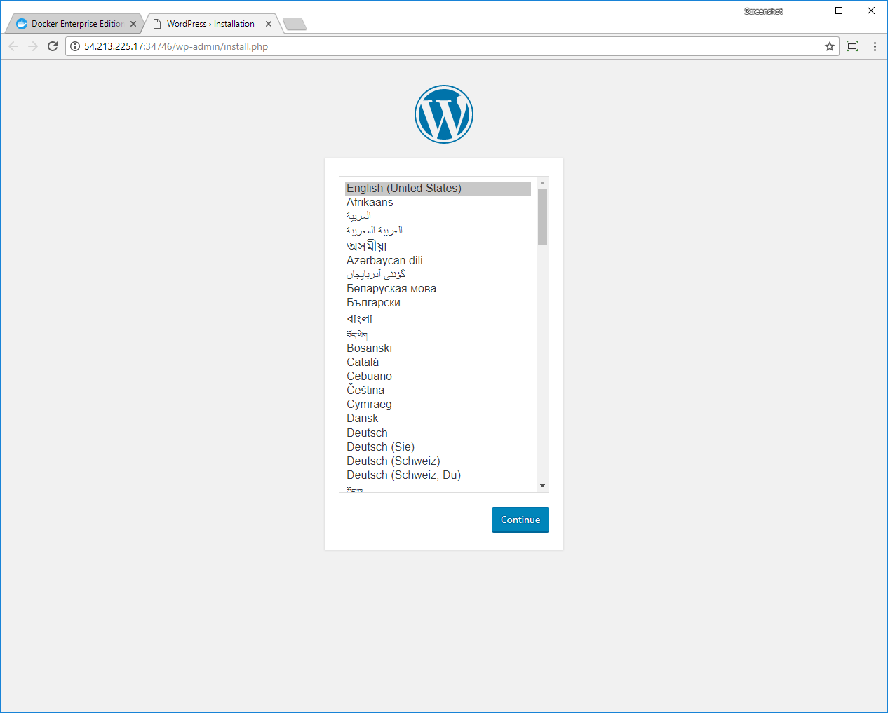

Docker UCP supports Network File System (NFS) persistent volumes for
Kubernetes. To enable this feature on a UCP cluster, you need to set up
an NFS storage volume provisioner.

> Kubernetes storage drivers
>
> Currently, NFS is the only Kubernetes storage driver that UCP supports.
{: important}

## Enable NFS volume provisioning

The following steps enable NFS volume provisioning on a UCP cluster:

1.  Create an NFS server pod.
2.  Create a default storage class.
3.  Create persistent volumes that use the default storage class.
4.  Deploy your persistent volume claims and applications.

The following procedure shows you how to deploy WordPress and a MySQL backend
that use NFS volume provisioning.

[Install the Kubernetes CLI](../../user-access/kubectl.md) to complete the
procedure for enabling NFS provisioning.

## Create the NFS Server 

To enable NFS volume provisioning on a UCP cluster, you need to install
an NFS server. Google provides an image for this purpose.

On any node in the cluster with a [UCP client bundle](../../user-access/cli.md),
copy the following yaml to a file named nfs-server.yaml.

```yaml
apiVersion: v1
kind: Pod
metadata:
  name: nfs-server
  namespace: default
  labels:
    role: nfs-server
spec:
  tolerations:
  - key: node-role.kubernetes.io/master
    effect: NoSchedule
  nodeSelector:
    node-role.kubernetes.io/master: ""
  containers:
  - name: nfs-server
    image: gcr.io/google_containers/volume-nfs:0.8
    securityContext:
      privileged: true
    ports:
      - name: nfs-0
        containerPort: 2049
        protocol: TCP
  restartPolicy: Always
```

Run the following command to create the NFS server pod.

```bash
kubectl create -f nfs-server.yaml
```

The default storage class needs the IP address of the NFS server pod.
Run the following command to get the pod's IP address.

```bash
kubectl describe pod nfs-server | grep IP:
```

The result looks like this:

```
IP:           192.168.106.67
```

## Create the default storage class

To enable NFS provisioning, create a storage class that has the
`storageclass.kubernetes.io/is-default-class` annotation set to `true`.
Also, provide the IP address of the NFS server pod as a parameter.

Copy the following yaml to a file named default-storage.yaml. Replace
`<nfs-server-pod-ip-address>` with the IP address from the previous step.

```yaml
kind: StorageClass
apiVersion: storage.k8s.io/v1beta1
metadata:
  namespace: default
  name: default-storage
  annotations:
    storageclass.kubernetes.io/is-default-class: "true"
  labels:
    kubernetes.io/cluster-service: "true"
provisioner: kubernetes.io/nfs
parameters:
  path: /
  server: <nfs-server-pod-ip-address>
```

Run the following command to create the default storage class.

```bash
kubectl create -f default-storage.yaml
```

Confirm that the storage class was created and that it's assigned as the 
default for the cluster.

```bash
kubectl get storageclass
```

It should look like this:

```
NAME                        PROVISIONER         AGE
default-storage (default)   kubernetes.io/nfs   58s
```

## Create persistent volumes

Create two persistent volumes based on the `default-storage` storage class.
One volume is for the MySQL database, and the other is for WordPress. 

To create an NFS volume, specify `storageClassName: default-storage` in the
persistent volume spec.

Copy the following yaml to a file named local-volumes.yaml.

```yaml
apiVersion: v1
kind: PersistentVolume
metadata:
  name: local-pv-1
  labels:
    type: local
spec:
  storageClassName: default-storage
  capacity:
    storage: 20Gi
  accessModes:
    - ReadWriteOnce
  hostPath:
    path: /tmp/data/pv-1
---
apiVersion: v1
kind: PersistentVolume
metadata:
  name: local-pv-2
  labels:
    type: local
spec:
  storageClassName: default-storage
  capacity:
    storage: 20Gi
  accessModes:
    - ReadWriteOnce
  hostPath:
    path: /tmp/data/pv-2
```

Run this command to create the persistent volumes.

```bash
kubectl create -f local-volumes.yaml
```

Inspect the volumes:

```bash
kubectl get persistentvolumes
```

They should look like this:

```
NAME         CAPACITY   ACCESS MODES   RECLAIM POLICY   STATUS      CLAIM     STORAGECLASS      REASON    AGE
local-pv-1   20Gi       RWO            Retain           Available             default-storage             1m
local-pv-2   20Gi       RWO            Retain           Available             default-storage             1m
```

## Create a secret for the MySQL password

Create a secret for the password that you want to use for accessing the MySQL
database. Use this command to create the secret object:

```bash
kubectl create secret generic mysql-pass --from-literal=password=<mysql-password>
```

## Deploy persistent volume claims and applications

You have two persistent volumes that are available for claims. The MySQL 
deployment uses one volume, and WordPress uses the other.

Copy the following yaml to a file named wordpress-deployment.yaml. 
The claims in this file make no reference to a particular storage class, so
they bind to any available volumes that can satisfy the storage request.
In this example, both claims request `20Gi` of storage.

```yaml
apiVersion: v1
kind: Service
metadata:
  name: wordpress-mysql
  labels:
    app: wordpress
spec:
  ports:
    - port: 3306
  selector:
    app: wordpress
    tier: mysql
  clusterIP: None
---
apiVersion: v1
kind: PersistentVolumeClaim
metadata:
  name: mysql-pv-claim
  labels:
    app: wordpress
spec:
  accessModes:
    - ReadWriteOnce
  resources:
    requests:
      storage: 20Gi
---
apiVersion: apps/v1beta2
kind: Deployment
metadata:
  name: wordpress-mysql
  labels:
    app: wordpress
spec:
  selector:
    matchLabels:
      app: wordpress
      tier: mysql
  strategy:
    type: Recreate
  template:
    metadata:
      labels:
        app: wordpress
        tier: mysql
    spec:
      containers:
      - image: mysql:5.6
        name: mysql
        env:
        - name: MYSQL_ROOT_PASSWORD
          valueFrom:
            secretKeyRef:
              name: mysql-pass
              key: password
        ports:
        - containerPort: 3306
          name: mysql
        volumeMounts:
        - name: mysql-persistent-storage
          mountPath: /var/lib/mysql
      volumes:
      - name: mysql-persistent-storage
        persistentVolumeClaim:
          claimName: mysql-pv-claim
---
apiVersion: v1
kind: Service
metadata:
  name: wordpress
  labels:
    app: wordpress
spec:
  ports:
    - port: 80
  selector:
    app: wordpress
    tier: frontend
  type: LoadBalancer
---
apiVersion: v1
kind: PersistentVolumeClaim
metadata:
  name: wp-pv-claim
  labels:
    app: wordpress
spec:
  accessModes:
    - ReadWriteOnce
  resources:
    requests:
      storage: 20Gi
---
apiVersion: apps/v1beta2
kind: Deployment
metadata:
  name: wordpress
  labels:
    app: wordpress
spec:
  selector:
    matchLabels:
      app: wordpress
      tier: frontend
  strategy:
    type: Recreate
  template:
    metadata:
      labels:
        app: wordpress
        tier: frontend
    spec:
      containers:
      - image: wordpress:4.8-apache
        name: wordpress
        env:
        - name: WORDPRESS_DB_HOST
          value: wordpress-mysql
        - name: WORDPRESS_DB_PASSWORD
          valueFrom:
            secretKeyRef:
              name: mysql-pass
              key: password
        ports:
        - containerPort: 80
          name: wordpress
        volumeMounts:
        - name: wordpress-persistent-storage
          mountPath: /var/www/html
      volumes:
      - name: wordpress-persistent-storage
        persistentVolumeClaim:
          claimName: wp-pv-claim
```

Run the following command to deploy the MySQL and WordPress images.

```bash
kubectl create -f wordpress-deployment.yaml
```

Confirm that the pods are up and running.

```bash
kubectl get pods
```

You should see something like this:

```
NAME                               READY     STATUS    RESTARTS   AGE
nfs-server                         1/1       Running   0          2h
wordpress-f4dcfdf45-4rkgs          1/1       Running   0          1m
wordpress-mysql-7bdd6d857c-fvgqx   1/1       Running   0          1m
```

It may take a few minutes for both pods to enter the `Running` state.

## Inspect the deployment

The WordPress deployment is ready to go. You can see it in action by opening 
a web browser on the URL of the WordPress service. The easiest way to get the
URL is to open the UCP web UI, navigate to the Kubernetes **Load Balancers**
page, and click the **wordpress** service. In the details pane, the URL is
listed in the **Ports** section.

{: .with-border}

Also, you can get the URL by using the command line.

On any node in the cluster, run the following command to get the IP addresses
that are assigned to the current node.

```bash

docker node inspect --format '{{ index .Spec.Labels "com.docker.ucp.SANs" }}' <node-id>

```

You should see a list of IP addresses, like this:

```
172.31.36.167,jg-latest-ubuntu-0,127.0.0.1,172.17.0.1,54.213.225.17
```

One of these corresponds with the external node IP address. Look for an address
that's not in the `192.*`, `127.*`, and `172.*` ranges. In the current example,
the IP address is `54.213.225.17`.

The WordPress web UI is served through a `NodePort`, which you get with this
command: 

```bash
kubectl describe svc wordpress | grep NodePort 
```

Which returns something like this:

```
NodePort:                 <unset>  34746/TCP
```

Put the two together to get the URL for the WordPress service:
`http://<node-ip>:<node-port>`.

For this example, the URL is `http://54.213.225.17:34746`.
 
{: .with-border}

## Write a blog post to use the storage

Open the URL for the WordPress service and follow the instructions for
installing WordPress. In this example, the blog is named "NFS Volumes".

{: .with-border}

Create a new blog post and publish it. 

{: .with-border}

Click the **permalink** to view the site.

{: .with-border}

## Where to go next

- [Example of NFS based persistent volume](https://github.com/kubernetes/examples/tree/master/staging/volumes/nfs#nfs-server-part)
- [Example: Deploying WordPress and MySQL with Persistent Volumes](https://v1-8.docs.kubernetes.io/docs/tutorials/stateful-application/mysql-wordpress-persistent-volume/)