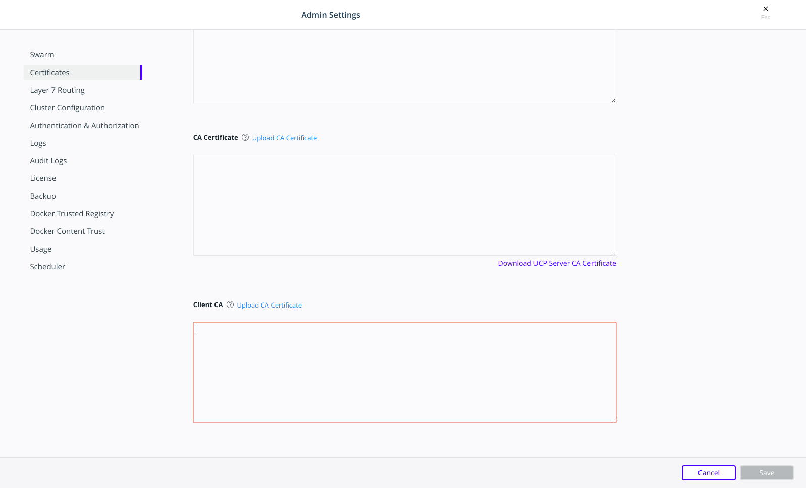

>

All UCP services are exposed using HTTPS, to ensure all communications between
clients and UCP are encrypted. By default, this is done using self-signed TLS
certificates that are not trusted by client tools like web browsers. So when
you try to access UCP, your browser warns that it doesn't trust UCP or that
UCP has an invalid certificate.


The same happens with other client tools.

```none
$ curl https://ucp.example.org

SSL certificate problem: Invalid certificate chain
```

You can configure UCP to use your own TLS certificates, so that it is
automatically trusted by your browser and client tools.

To ensure minimal impact to your business, you should plan for this change to
happen outside business peak hours. Your applications will continue running
normally, but existing UCP client certificates will become invalid, so users
will have to download new ones to [access UCP from the CLI](../../user-access/cli.md).

## Configure UCP to use your own TLS certificates and keys

To configure UCP to use your own TLS certificates and keys:

1. Log into the UCP web UI with administrator credentials and navigate to the **Admin Settings** page.

2. Click **Certificates**.

    
    
3. Upload your certificates and keys based on the following table:

    | Type     | Description |
| ----------- | ----------- |
| Private key      | The unencrypted private key of UCP. This key must correspond to the public key used in the server certificate. Click **Upload Key**.        |
| Server certificate   | The public key certificate of UCP followed by the certificates of any intermediate certificate authorities which establishes a chain of trust up to the root CA certificate. Click **Upload Certificate** to upload a PEM file.        |
| CA certificate      | The public key certificate of the root certificate authority that issued the UCP server certificate. If you don’t have one, use the top-most intermediate certificate instead. Click **Upload CA Certificate** to upload a PEM file.        |
| Client CA   | This field is available in UCP 3.2. This field may contain one or more Root CA certificates which the UCP Controller will use to verify that client certificates are issued by a trusted entity. UCP is automatically configured to trust its internal CAs which issue client certificates as part of generated client bundles, however, you may supply UCP with additional custom root CA certificates here so that UCP may trust client certificates issued by your corporate or trusted third-party certificate authorities. Note that your custom root certificates will be appended to UCP’s internal root CA certificates. Click **Upload CA Certificate** to upload a PEM file. Click **Download UCP Server CA Certificate** to download the certificate as a PEM file.        |

4. Click **Save**.

After replacing the TLS certificates, your users will not be able to authenticate
with their old client certificate bundles. Ask your users to access the UCP
web UI and [download new client certificate bundles](../../user-access/cli.md).

If you deployed Docker Trusted Registry (DTR), you'll also need to reconfigure it
to trust the new UCP TLS certificates.
[Learn how to configure DTR](/reference/dtr/2.7/cli/reconfigure.md).

## Where to go next

- [Access UCP from the CLI](../../user-access/cli.md)
