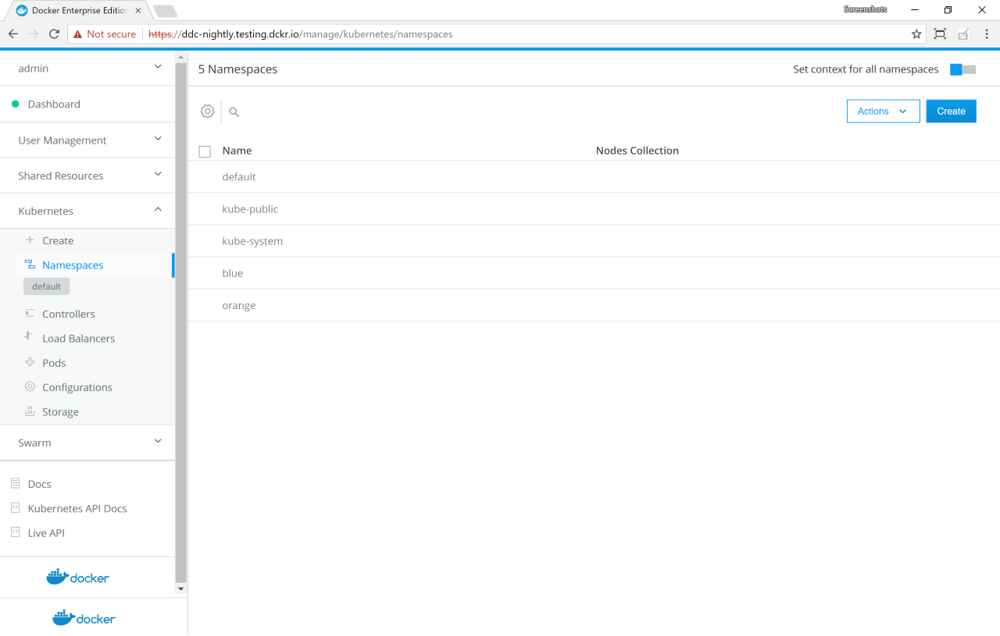
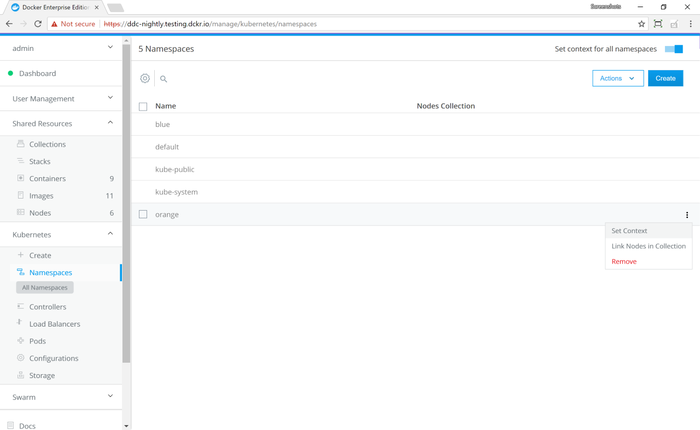

With Docker Enterprise Edition, administrators can filter the view of
Kubernetes objects by the namespace the objects are assigned to. You can
specify a single namespace, or you can specify all available namespaces.

## Create two namespaces

In this example, you create two Kubernetes namespaces and deploy a service
to both of them.

1.  Log in to the UCP web UI with an administrator account.
2.  In the left pane, click **Kubernetes**.
3.  Click **Create** to open the **Create Kubernetes Object** page.
4.  In the **Object YAML** editor, paste the following YAML.

    ```yaml
    apiVersion: v1
    kind: Namespace
    metadata:
     name: blue
    ---
     apiVersion: v1
     kind: Namespace
     metadata:
      name: green
    ```

5.  Click **Create** to create the `blue` and `green` namespaces.

{: .with-border}

## Deploy services

Create a `NodePort` service in the `blue` namespace.

1.  Navigate to the **Create Kubernetes Object** page.
2.  In the **Namespace** dropdown, select **blue**.
3.  In the **Object YAML** editor, paste the following YAML.

    ```yaml
    apiVersion: v1
    kind: Service
    metadata:
      name: app-service-blue
      labels:
        app: app-blue
    spec:
      type: NodePort
      ports:
        - port: 80
          nodePort: 32768
      selector:
        app: app-blue
    ```

4.  Click **Create** to deploy the service in the `blue` namespace.

5.  Repeat the previous steps with the following YAML, but this time,
    select `green` from the **Namespace** dropdown.

    ```yaml
    apiVersion: v1
    kind: Service
    metadata:
      name: app-service-green
      labels:
        app: app-green
    spec:
      type: NodePort
      ports:
        - port: 80
          nodePort: 32769
      selector:
        app: app-green
    ```

## View services

Currently, the **Namespaces** view is set to the **default** namespace, so the
**Load Balancers** page doesn't show your services.

1.  In the left pane, click **Namespaces** to open the list of namespaces.
2.  In the upper-right corner, click the **Set context for all namespaces**
    toggle and click **Confirm**. The indicator in the left pane changes to **All Namespaces**.
3.  Click **Load Balancers** to view your services.

{: .with-border}

## Filter the view by namespace

With the **Set context for all namespaces** toggle set, you see all of the
Kubernetes objects in every namespace. Now filter the view to show only
objects in one namespace.  

1.  In the left pane, click **Namespaces** to open the list of namespaces.
2.  In the **green** namespace, click the **More options** icon and in the
    context menu, select **Set Context**.

    {: .with-border}

3.  Click **Confirm** to set the context to the `green` namespace.
    The indicator in the left pane changes to **green**.
4.  Click **Load Balancers** to view your `app-service-green` service.
    The `app-service-blue` service doesn't appear.

{: .with-border}

To view the `app-service-blue` service, repeat the previous steps, but this
time, select **Set Context** on the **blue** namespace.

{: .with-border}
