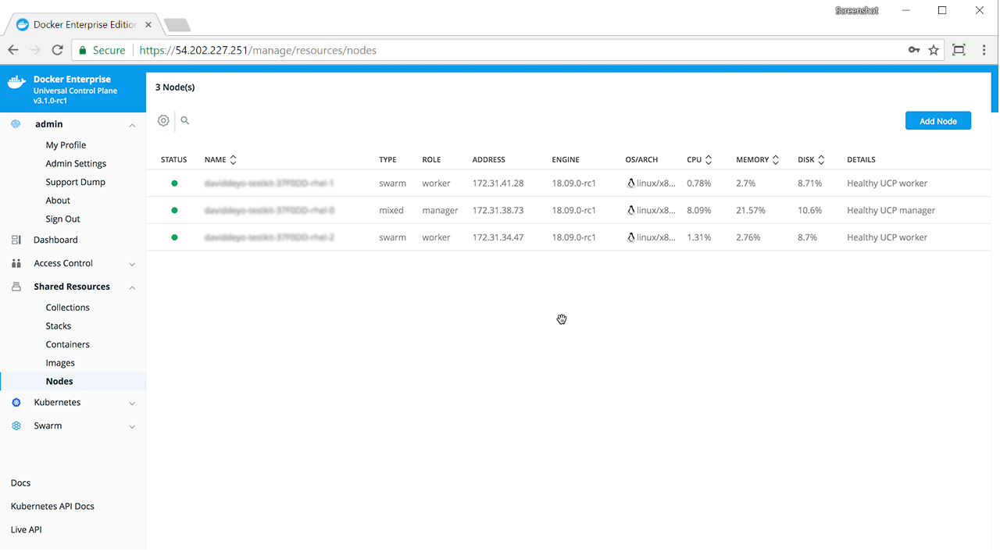

Docker Universal Control Plane (UCP) is a containerized application that you
can install on-premise or on a cloud infrastructure.

## Step 1: Validate the system requirements

The first step to installing UCP is ensuring that your infrastructure has all
of the [requirements UCP needs to run](system-requirements.md).
Also, you need to ensure that all nodes, physical and virtual, are running
the same version of Docker Enterprise Edition.

## Step 2: Install Docker EE on all nodes

UCP is a containerized application that requires the commercially supported
Docker Engine to run.

Install Docker EE on each host that you plan to manage with UCP.
View the [supported platforms](/engine/installation/#supported-platforms)
and click on your platform to get platform-specific instructions for installing
Docker EE.

Make sure you install the same Docker EE version on all the nodes. Also,
if you're creating virtual machine templates with Docker EE already
installed, make sure the `/etc/docker/key.json` file is not included in the
virtual machine image. When provisioning the virtual machine, restart the Docker
daemon to generate a new `/etc/docker/key.json` file.

## Step 3: Customize named volumes

Skip this step if you want to use the defaults provided by UCP.

Docker UCP uses named volumes to persist data. If you want
to customize the drivers used to manage these volumes, you can create the
volumes before installing UCP. When you install UCP, the installer
will notice that the volumes already exist, and it will start using them.
[Learn about the named volumes used by UCP](../../ucp-architecture.md).

If these volumes don't exist, they'll be automatically created when installing
UCP.

## Step 4: Install UCP

To install UCP, you use the `docker/ucp` image, which has commands to install
and manage UCP.

Make sure you follow the [UCP System requirements](system-requirements.md)
for opening networking ports. Ensure that your hardware or software firewalls
are open appropriately or disabled.

> Ubuntu 14.04 mounts
> 
> For UCP to install correctly on Ubuntu 14.04, `/mnt` and other mounts
> must be shared:
> ```
> sudo mount --make-shared /mnt
> sudo mount --make-shared / 
> sudo mount --make-shared /run 
> ```

To install UCP:

1. Use ssh to log in to the host where you want to install UCP.

2.  Run the following command:

    ```none
    # Pull the latest version of UCP
    docker image pull {{ page.ucp_org }}/{{ page.ucp_repo }}:{{ page.ucp_version }}

    # Install UCP
    docker container run --rm -it --name ucp \
      -v /var/run/docker.sock:/var/run/docker.sock \
      {{ page.ucp_org }}/{{ page.ucp_repo }}:{{ page.ucp_version }} install \
      --host-address <node-ip-address> \
      --interactive
    ```

    This runs the install command in interactive mode, so that you're
    prompted for any necessary configuration values.
    To find what other options are available in the install command, check the
    [reference documentation](/reference/ucp/3.0/cli/install.md).

> Custom CNI plugins
>
> If you want to use a third-party Container Networking Interface (CNI) plugin,
> like Flannel or Weave, modify the previous command line to include the 
> `--cni-installer-url` option. Learn how to
> [install a CNI plugin](../../kubernetes/install-cni-plugin.md).
{: important}

## Step 5: License your installation

Now that UCP is installed, you need to license it.

1.  Go to the
    [Docker Store](https://www.docker.com/enterprise-edition)
    and buy a Docker EE subscription, or get a free trial license.  

2.  In your browser, navigate to the UCP web UI, log in with your
    administrator credentials and upload your license. Navigate to the
    **Admin Settings** page and in the left pane, click **License**.

    {: .with-border}

3.  Click **Upload License** and navigate to your license (.lic) file.
    When you're finished selecting the license, UCP updates with the new
    settings.  

## Step 6: Join manager nodes

Skip this step if you don't want UCP to be highly available.

To make your Docker swarm and UCP fault-tolerant and highly available, you can
join more manager nodes to it. Manager nodes are the nodes in the swarm
that perform the orchestration and swarm management tasks, and dispatch tasks
for worker nodes to execute.

To join manager nodes to the swarm,  

1.  In the UCP web UI, navigate to the **Nodes** page, and click the
    **Add Node** button to add a new node.

    {: .with-border}

2.  In the **Add Node** page, check **Add node as a manager** to turn this node
    into a manager and replicate UCP for high-availability.

3.  If you want to customize the network and port where the new node listens
    for swarm management traffic, click **Use a custom listen address**. Enter
    the IP address and port for the node to listen for inbound cluster
    management traffic. The format is `interface:port` or `ip:port`.
    The default is `0.0.0.0:2377`.

4.  If you want to customize the network and port that the new node advertises
    to other swarm members for API access, click
    **Use a custom advertise address** and enter the IP address and port.
    By default, this is also the outbound address used by the new node to
    contact UCP. The joining node should be able to contact itself at this
    address. The format is `interface:port` or `ip:port`.

    Click the copy icon  to copy the
    `docker swarm join` command that nodes use to join the swarm.

    {: .with-border}

5.  For each manager node that you want to join to the swarm, log in using
    ssh and run the join command that you copied. After the join command
    completes, the node appears on the **Nodes** page in the UCP web UI.

## Step 7: Join worker nodes

Skip this step if you don't want to add more nodes to run and scale your apps.

To add more computational resources to your swarm, you can join worker nodes.
These nodes execute tasks assigned to them by the manager nodes. Follow the
same steps as before, but don't check the **Add node as a manager** option.

## Where to go next

- [Join nodes to your cluster](../configure/join-nodes.md)
- [Use your own TLS certificates](../configure/use-your-own-tls-certificates.md)
