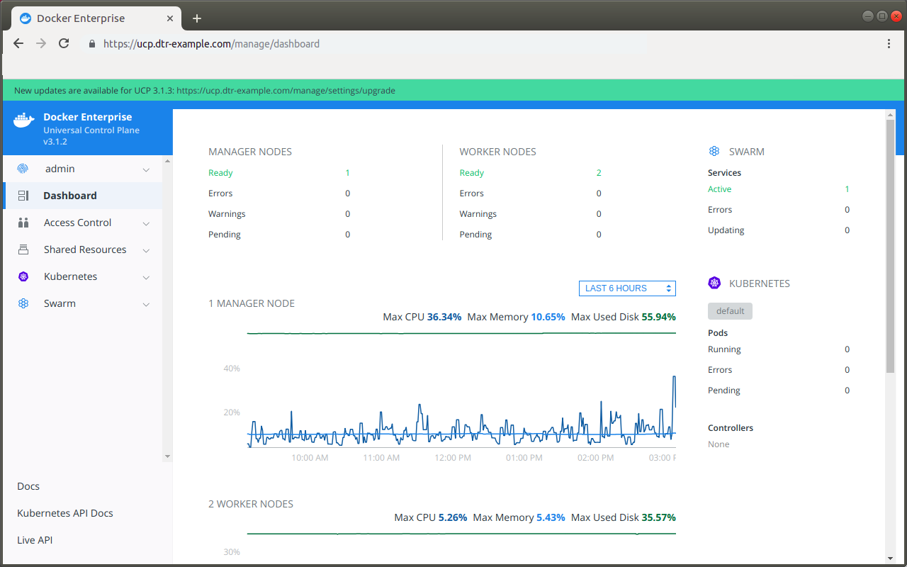
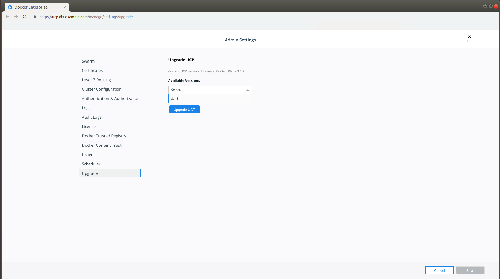

This page guides you in upgrading Docker Universal Control Plane (UCP) to
version {{ page.ucp_version }}.

Before upgrading to a new version of UCP, check the
[release notes](../../release-notes/index.md) for this version.
There you'll find information about the new features, breaking changes, and
other relevant information for upgrading to a particular version.

## Plan the upgrade

As part of the upgrade process, you'll upgrade the Docker EE Engine
installed on each node of the cluster to version 17.06.2-ee-8.
You should plan for the upgrade to take place outside of business hours,
to ensure there's minimal impact to your users.

Also, don't make changes to UCP configurations while you're upgrading it.
This can lead to misconfigurations that are difficult to troubleshoot.

Ensure that your cluster nodes meet the minimum requirements for memory and
disk space. In particular, manager nodes must have at least 4GB of memory.
Learn about [UCP system requirements](system-requirements.md).  

## Back up your cluster

Before starting an upgrade, make sure that your cluster is healthy. If a problem
occurs, this makes it easier to find and troubleshoot it.

[Create a backup](../backups-and-disaster-recovery.md) of your cluster.
This allows you to recover if something goes wrong during the upgrade process.

> Upgrading and backup archives
>
> The backup archive is version-specific, so you can't use it during the
> upgrade process. For example, if you create a backup archive for a UCP 2.2
> cluster, you can't use the archive file after you upgrade to UCP 3.0.

## Upgrade Docker Engine

For each node that is part of your cluster, upgrade the Docker Engine
installed on that node to Docker Engine version 17.06 or higher. Be sure
to install the Docker Enterprise Edition.

Starting with the manager nodes, and then worker nodes:

1. Log into the node using ssh.
2. Upgrade the Docker Engine to version 17.06 or higher. See [Upgrade Docker EE](https://docs.docker.com/ee/upgrade/).
3. Make sure the node is healthy.

    In your browser, navigate to the **Nodes** page in the UCP web UI,
    and check that the node is healthy and is part of the cluster.

## Upgrade UCP

You can upgrade UCP from the web UI or the CLI.

### Use the UI to perform an upgrade

When an upgrade is available for a UCP installation, a banner appears.

{: .with-border}

Clicking this message takes an admin user directly to the upgrade process.
It can be found under the **Upgrade** tab of the **Admin Settings** section.

{: .with-border}

In the **Available Versions** dropdown, select **3.0.0** and click
**Upgrade UCP**.

During the upgrade, the UI will be unavailable, and you should wait
until completion before continuing to interact with it. When the upgrade
completes, you'll see a notification that a newer version of the UI
is available and a browser refresh is required to see the latest UI.

### Use the CLI to perform an upgrade

To upgrade from the CLI, log into a UCP manager node using ssh, and run:

```
# Get the latest version of UCP
docker image pull {{ page.ucp_org }}/{{ page.ucp_repo }}:{{ page.ucp_version }}

docker container run --rm -it \
  --name ucp \
  -v /var/run/docker.sock:/var/run/docker.sock \
  {{ page.ucp_org }}/{{ page.ucp_repo }}:{{ page.ucp_version }} \
  upgrade --interactive
```

This runs the upgrade command in interactive mode, so that you are prompted
for any necessary configuration values.

Once the upgrade finishes, navigate to the UCP web UI and make sure that
all the nodes managed by UCP are healthy.

## Where to go next

- [UCP release notes](../../release-notes.md)
