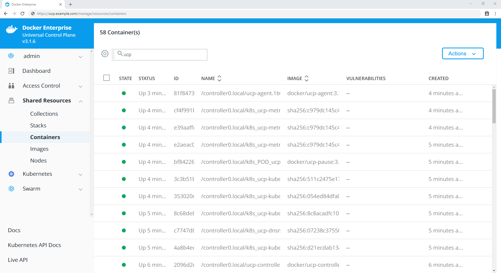
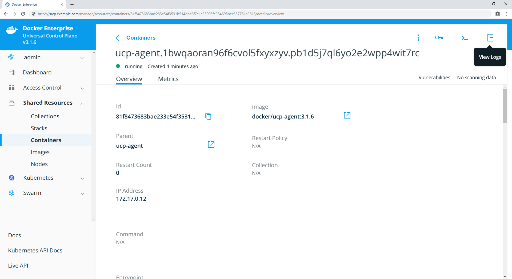

If you detect problems in your UCP cluster, you can start your troubleshooting
session by checking the logs of the
[individual UCP components](../../ucp-architecture.md). Only administrator users can
see information about UCP system containers.

## Check the logs from the UI

To see the logs of the UCP system containers, navigate to the **Containers**
page of UCP. By default, the UCP system containers are hidden. Click
the Settings icon and check **Show system resources** for the UCP system
containers to be listed as well.

{: .with-border}

Click on a container to see more details, like its configurations and logs.


## Check the logs from the CLI

You can also check the logs of UCP system containers from the CLI. This is
specially useful if the UCP web application is not working.

1. Get a client certificate bundle.

    When using the Docker CLI client, you need to authenticate using client
    certificates.
    [Learn how to use client certificates](../../user-access/cli.md).
    If your client certificate bundle is for a non-admin user, you won't have
    permissions to see the UCP system containers.

2.  Check the logs of UCP system containers. By default, system containers
    aren't displayed. Use the `-a` flag to display them.

    ```bash
    $ docker ps -a
    CONTAINER ID        IMAGE                                     COMMAND                  CREATED             STATUS                     PORTS                                                                             NAMES
    8b77cfa87889        docker/ucp-agent:latest             "/bin/ucp-agent re..."   3 hours ago         Exited (0) 3 hours ago                                                                                       ucp-reconcile
    b844cf76a7a5        docker/ucp-agent:latest             "/bin/ucp-agent agent"   3 hours ago         Up 3 hours                 2376/tcp                                                                          ucp-agent.tahzo3m4xjwhtsn6l3n8oc2bf.xx2hf6dg4zrphgvy2eohtpns9
    de5b45871acb        docker/ucp-controller:latest        "/bin/controller s..."   3 hours ago         Up 3 hours (unhealthy)     0.0.0.0:443->8080/tcp                                                             ucp-controller
    ...
    ```

 3. Get the log from a UCP container by using the `docker logs <ucp container ID>`
    command. For example, the following command emits the log for the
    `ucp-controller` container listed above.  

    ```bash
    $ docker logs de5b45871acb

    {"level":"info","license_key":"PUagrRqOXhMH02UgxWYiKtg0kErLY8oLZf1GO4Pw8M6B","msg":"/v1.22/containers/ucp/ucp-controller/json",
    "remote_addr":"192.168.10.1:59546","tags":["api","v1.22","get"],"time":"2016-04-25T23:49:27Z","type":"api","username":"dave.lauper"}
    {"level":"info","license_key":"PUagrRqOXhMH02UgxWYiKtg0kErLY8oLZf1GO4Pw8M6B","msg":"/v1.22/containers/ucp/ucp-controller/logs",
    "remote_addr":"192.168.10.1:59546","tags":["api","v1.22","get"],"time":"2016-04-25T23:49:27Z","type":"api","username":"dave.lauper"}
    ```

## Get a support dump

Before making any changes to UCP, download a [support dump](../../get-support.md).
This allows you to troubleshoot problems which were already happening before
changing UCP configurations.

Then you can increase the UCP log level to debug, making it easier to understand
the status of the UCP cluster. Changing the UCP log level restarts all UCP
system components and introduces a small downtime window to UCP. Your
applications won't be affected by this.

To increase the UCP log level, navigate to the UCP web UI, go to the
**Admin Settings** tab, and choose **Logs**.

{: .with-border}

Once you change the log level to **Debug** the UCP containers restart.
Now that the UCP components are creating more descriptive logs, you can
download a support dump and use it to troubleshoot the component causing the
problem.

Depending on the problem you're experiencing, it's more likely that you'll
find related messages in the logs of specific components on manager nodes:

* If the problem occurs after a node was added or removed, check the logs
  of the `ucp-reconcile` container.
* If the problem occurs in the normal state of the system, check the logs
  of the `ucp-controller` container.
* If you are able to visit the UCP web UI but unable to log in, check the
  logs of the `ucp-auth-api` and `ucp-auth-store` containers.

It's normal for the `ucp-reconcile` container to be in a stopped state. This
container starts only when the `ucp-agent` detects that a node needs to
transition to a different state. The `ucp-reconcile` container is responsible
for creating and removing containers, issuing certificates, and pulling
missing images.

## Where to go next

- [Troubleshoot configurations](troubleshoot-configurations.md)
