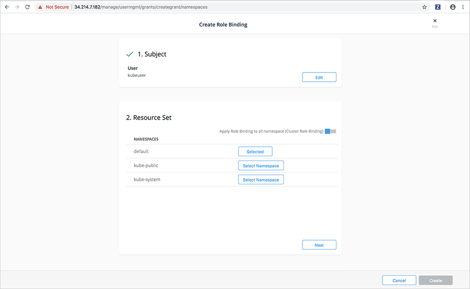
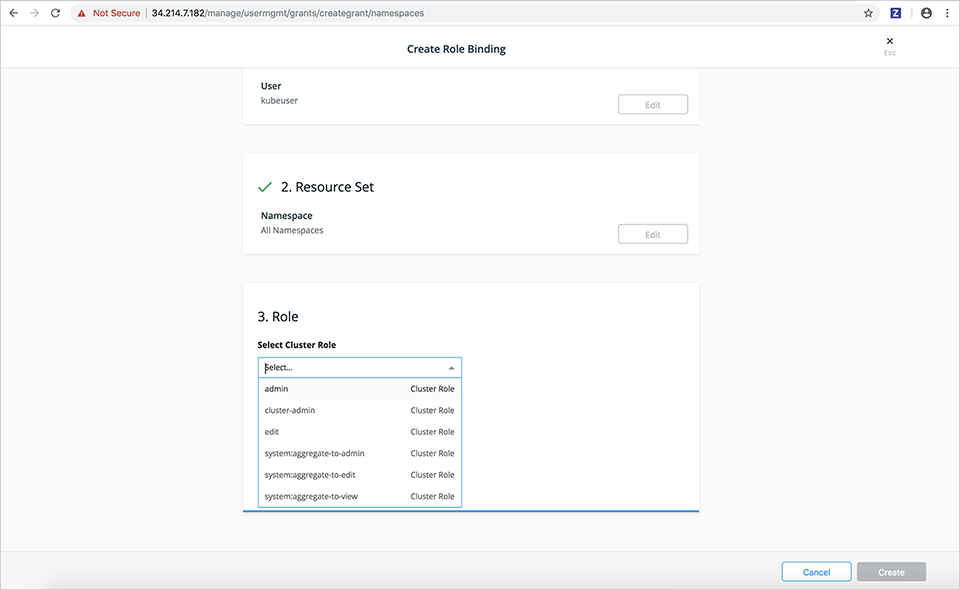

UCP 3.0 used its own role-based asccess control (RBAC) for Kubernetes clusters. New in UCP 3.1 is the ability to use Kube RBAC. The benefits of doing this are:

- Many ecosystem applications and integrations expect Kube RBAC as a part of their YAML files to provide access to service accounts. - Organizations planning to run UCP both on-premesis as well as in hosted cloud services want to run Kubernetes applications on both sets of environments, without manually changing RBAC for their YAML file.

Kubernetes RBAC is turned on by default when customers upgrade to UCP 3.1. See [RBAC authorization in Kubernetes](https://v1-8.docs.kubernetes.io/docs/admin/authorization/rbac/) for more information about Kubernetes.

Starting with UCP 3.1, Kubernetes & Swarm roles have separate views. You can view all the roles for a particular cluster under **Access Control** then **Users**. Select Kubernetes or Swarm to view the specific roles for each.

## Creating roles

Kubernetes provides 2 types of roles:

- `ClusterRoleBinding` which applies to all namespaces
- `RoleBinding1` which applies to a specific namespace

You create Kubernetes roles either through the CLI using `kubectl` or through the UCP web interface.

## Creating grants

To create a Kuberenetes grant in the UCP web interface:

1. 1 Go to the UCP web UI.
2. Navigate to the **Access Control**.
3. In the lefthand menu, select  **Grants**.

4. Select the **Kubernetes** tab at the top of the window.
5. Select **Create New Grant** to start the Create Role Binding wizard and create a new grant for a given user, team or service.

6. Select the subject type. Your choices are:
-  **All Users**
-  **Organizations**
-  **Service account**
7. To creat a user role binding, select a username from the **Users** dropdown list then select **Next**.
8. Select a resource set for the subject. The **default** namespace is automatically selected. To use a different namespace, select the **Select Namespace** button next to the desired namespace. For `Cluster Role Binding`, slide the **Apply Role Binding to all namespace** selector to the right.

9. Select **Next** to continue.
10. Select the **Cluster Role** from the dropdown list.

