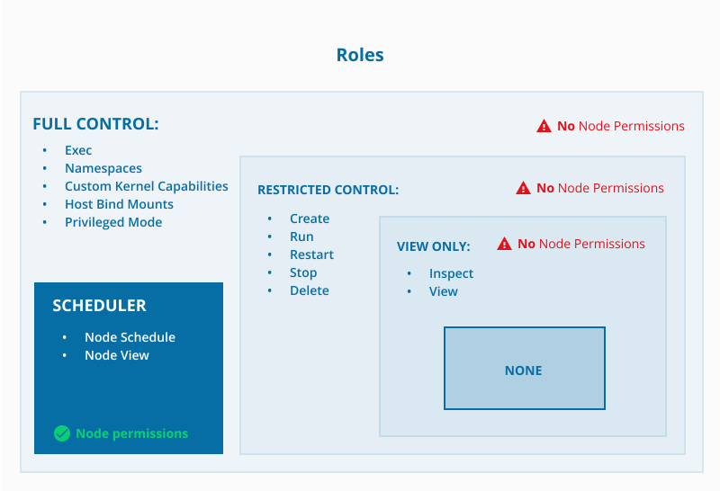
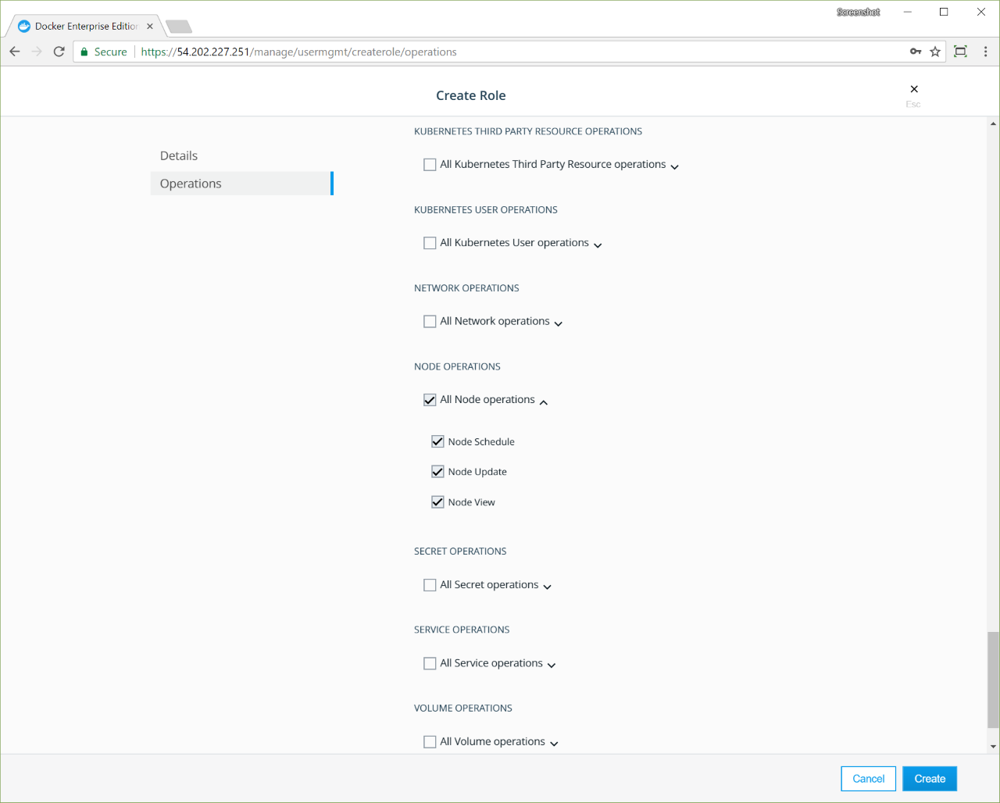

>

A role defines a set of API operations permitted against a resource set.
You apply roles to users and teams by creating grants.

> **Some important rules regarding roles**:
> - Roles are always enabled.
> - Roles can't be edited. To edit a role, you must delete and recreate it.
> - Roles used within a grant can be deleted only after first deleting the grant.
> - Only administrators can create and delete roles.

## Default roles

You can define custom roles or use the following built-in roles:

| Built-in role        | Description                                                                                                                                                                                                                                                           |
|:---------------------|:----------------------------------------------------------------------------------------------------------------------------------------------------------------------------------------------------------------------------------------------------------------------|
| `None`               | Users have no access to Swarm or Kubernetes resources. Maps to `No Access` role in UCP 2.1.x.                                                                                                                                                                         |
| `View Only`          | Users can view resources but can't create them.                                                                                                                                                                                                                       |
| `Restricted Control` | Users can view and edit resources but can't run a service or container in a way that affects the node where it's running. Users _cannot_ mount a node directory, `exec` into containers, or run containers in privileged mode or with additional kernel capabilities. |
| `Scheduler`          | Users can view nodes (worker and manager) and schedule (not view) workloads on these nodes. By default, all users are granted the `Scheduler` role against the `/Shared` collection. (To view workloads, users need permissions such as `Container View`).            |
| `Full Control`       | Users can view and edit all granted resources. They can create containers without any restriction, but can't see the containers of other users.                                                                                                                       |

## Create a custom role for Swarm

When creating custom roles to use with Swarm, the **Roles** page lists all default and custom roles applicable in the
organization.

You can give a role a global name, such as "Remove Images", which might enable the
**Remove** and **Force Remove** operations for images. You can apply a role with
the same name to different resource sets.

1. Click **Roles** under **User Management**.
2. Click **Create Role**.
3. Enter the role name on the **Details** page.
4. Click **Operations**. All available API operations are displayed. See [Swarm operations roles](#swarm-operations-roles) for a description of the available API operations.
5. Select the permitted operations per resource type.
6. Click **Create**.

{: .with-border}

### Swarm operations roles

This section describes the set of operations (calls) that can be executed to the Swarm resources. Be aware that each permission corresponds to a CLI command and enables the user to execute that command.

| Operation | Command  | Description |
|-----------|----------|-------------|
| Config | `docker config` | Manage Docker configurations. See [child commands](https://docs.docker.com/engine/reference/commandline/config/#child-commands) for specific examples.|
| Container | `docker container` | Manage containers. See [child commands](https://docs.docker.com/engine/reference/commandline/container/#child-commands) for more information.            |
| Container | `docker container create` | Create a new container. See [extended description](https://docs.docker.com/engine/reference/commandline/create/#extended-description) and [examples](https://docs.docker.com/engine/reference/commandline/create/#examples) for more information.|
| Container | `docker create [OPTIONS] IMAGE [COMMAND] [ARG...]` | Create new containers. See [extended description](https://docs.docker.com/engine/reference/commandline/create/#extended-description) and [examples](https://docs.docker.com/engine/reference/commandline/create/#examples) for more information. |
| Container | `docker update [OPTIONS] CONTAINER [CONTAINER...]`| Update configuration of one or more containers. Using this command can also prevent containers from consuming too many resources from their Docker host. See [extended description](https://docs.docker.com/engine/reference/commandline/update/#extended-description) and [examples](https://docs.docker.com/engine/reference/commandline/update/#examples) for more information. |
| Container | `docker rm [OPTIONS] CONTAINER [CONTAINER...]` | Remove one or more containers. See [options](https://docs.docker.com/engine/reference/commandline/rm/#options) and [examples](https://docs.docker.com/engine/reference/commandline/rm/#examples) for more information. |
| Image | `docker image COMMAND` | Manage images. See [child commands](https://docs.docker.com/engine/reference/commandline/image/#child-commands) for examples. |
| Image| `docker image remove` | Remove one or more images. See [child commands](https://docs.docker.com/engine/reference/commandline/image/#child-commands) for examples. |
| Network | `docker network` | Manage networks. You can use [child commands](https://docs.docker.com/engine/reference/commandline/network/#child-commands) to create, inspect, list, remove, prune, connect, and disconnect networks. |
| Node | `docker node COMMAND` | Manage Swarm nodes. See [child commands](https://docs.docker.com/engine/reference/commandline/node/#child-commands) for examples. |
| Secret | `docker secret COMMAND` | Manage Docker secrets. See [child commands](https://docs.docker.com/engine/reference/commandline/secret/#child-commands) for sample usage and options. |
| Service | `docker service COMMAND` | Manage services. See [child commands](https://docs.docker.com/engine/reference/commandline/service/#extended-description) for sample usage and options.|
| Volume | `docker volume create [OPTIONS] [VOLUME]` | Create a new volume that containers can consume and store data in. See [examples](https://docs.docker.com/engine/reference/commandline/volume_create/#examples) for more information. |
| Volume | `docker volume rm [OPTIONS] VOLUME [VOLUME...]`| Remove one or more volumes. Users cannot remove a volume that is in use by a container. See [related commands](https://docs.docker.com/engine/reference/commandline/volume_rm/#related-commands) for more information. |

## Where to go next

- [Create and configure users and teams](create-users-and-teams-manually.md)
- [Group and isolate cluster resources](group-resources.md)
- [Grant role-access to cluster resources](grant-permissions.md)
- [Use the Docker command line](https://docs.docker.com/engine/reference/commandline/cli/)
