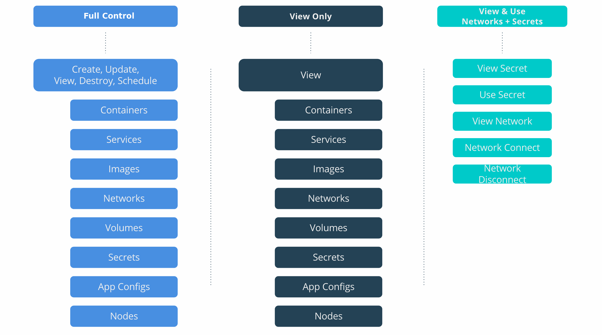

[Collections and grants](index.md) are strong tools that can be used to control
access and visibility to resources in UCP.

This tutorial describes a fictitious company named OrcaBank that needs to
configure an  architecture in UCP with role-based access control (RBAC) for
their application engineering group.

## Team access requirements

OrcaBank reorganized their application teams by product with each team providing
shared services as necessary. Developers at OrcaBank do their own DevOps and
deploy and manage the lifecycle of their applications.

OrcaBank has four teams with the following resource needs:

- `security` should have view-only access to all applications in the cluster.
- `db` should have full access to all database applications and resources. See
  [DB Team](#db-team).
- `mobile` should have full access to their mobile applications and limited
  access to shared `db` services. See [Mobile Team](#mobile-team).
- `payments` should have full access to their payments applications and limited
  access to shared `db` services.

## Role composition

To assign the proper access, OrcaBank is employing a combination of default
and custom roles:

- `View Only` (default role) allows users to see all resources (but not edit or use).
- `Ops` (custom role) allows users to perform all operations against configs,
  containers, images, networks, nodes, secrets, services, and volumes.
- `View & Use Networks + Secrets` (custom role) enables users to view/connect to
  networks and view/use secrets used by `db` containers, but prevents them from
  seeing or impacting the `db` applications themselves.


{: .with-border}

## Collection architecture

OrcaBank is also creating collections of resources to mirror their team
structure.

Currently, all OrcaBank applications share the same physical resources, so all
nodes and applications are being configured in collections that nest under the
built-in collection, `/Shared`.

Other collections are also being created to enable shared `db` applications.

> **Note:** For increased security with node-based isolation, use Docker
> Enterprise Advanced.

- `/Shared/mobile` hosts all Mobile applications and resources.
- `/Shared/payments` hosts all Payments applications and resources.
- `/Shared/db` is a top-level collection for all `db` resources.
- `/Shared/db/payments` is a collection of `db` resources for Payments applications.
- `/Shared/db/mobile` is a collection of `db` resources for Mobile applications.

The collection architecture has the following tree representation:

```
/
├── System
└── Shared
    ├── mobile
    ├── payments
    └── db
        ├── mobile
        └── payments
```

OrcaBank's [Grant composition](#grant-composition) ensures that their collection
architecture gives the `db` team access to _all_ `db` resources and  restricts
app teams to _shared_ `db` resources.

## LDAP/AD integration

OrcaBank has standardized on LDAP for centralized authentication to help their
identity team scale across all the platforms they manage.

To implement LDAP authentication in UCP, OrcaBank is using UCP's native LDAP/AD
integration to map LDAP groups directly to UCP teams. Users can be added to or
removed from UCP teams via LDAP which can be managed centrally by OrcaBank's
identity team.

The following grant composition shows how LDAP groups are mapped to UCP teams.

## Grant composition

OrcaBank is taking advantage of the flexibility in UCP's grant model by applying
two grants to each application team. One grant allows each team to fully
manage the apps in their own collection, and the second grant gives them the
(limited) access they need to networks and secrets within the `db` collection.

{: .with-border}

## OrcaBank access architecture

OrcaBank's resulting access architecture shows applications connecting across
collection boundaries. By assigning multiple grants per team, the Mobile and
Payments applications teams can connect to dedicated Database resources through
a secure and controlled interface, leveraging Database networks and secrets.

> **Note:** In Docker Enterprise Standard, all resources are deployed across the
> same  group of UCP worker nodes. Node segmentation is provided in Docker
> Enterprise Advanced and discussed in the [next tutorial](ee-advanced.md).

{: .with-border}

### DB team

The `db` team is responsible for deploying and managing the full lifecycle
of the databases used by the application teams. They can execute the full set of
operations against all database resources.

{: .with-border}

### Mobile team

The `mobile` team is responsible for deploying their own application stack,
minus the database tier that is managed by the `db` team.

{: .with-border}

## Where to go next

- [Access control design with Docker EE Advanced](ee-advanced.md)