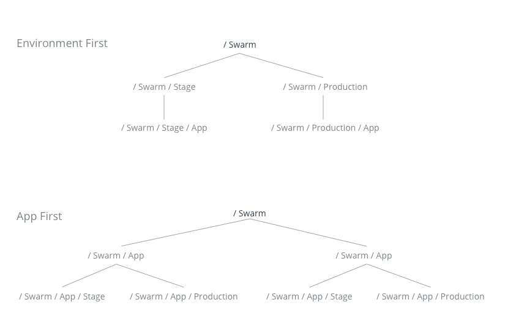

Docker EE enables access control to cluster resources by grouping resources
into **resource sets**. Combine resource sets with [grants](grant-permissions)
to give users permission to access specific cluster resources.

A resource set can be:

* A **Kubernetes namespace** for Kubernetes workloads.
* A **UCP collection** for Swarm workloads.

## Kubernetes namespaces

A namespace allows you to group resources like Pods, Deployments, Services, or
any other Kubernetes-specific resources. You can then enforce RBAC policies
and resource quotas for the namespace.

Each Kubernetes resources can only be in one namespace, and namespaces cannot
be nested inside one another.

[Learn more about Kubernetes namespaces](https://v1-11.docs.kubernetes.io/docs/concepts/overview/working-with-objects/namespaces/).

## Swarm collections

A Swarm collection is a directory of cluster resources like nodes, services,
volumes, or other Swarm-specific resources.

{: .with-border}

Each Swarm resource can only be in one collection at a time, but collections
can be nested inside one another, to create hierarchies.

### Nested collections

You can nest collections inside one another. If a user is granted permissions
for one collection, they'll have permissions for its child collections,
pretty much like a directory structure. As of UCP `3.1`, the ability to create a nested 
collection of more than 2 layers deep within the root `/Swarm/` collection has been deprecated. 

The following image provides two examples of nested collections with the recommended maximum 
of two nesting layers. The first example illustrates an environment-oriented collection, and the second 
example illustrates an application-oriented collection.

{: .with-border}

For a child collection, or for a user who belongs to more than one team, the
system concatenates permissions from multiple roles into an "effective role" for
the user, which specifies the operations that are allowed against the target.

### Built-in collections

Docker EE provides a number of built-in collections.

{: .with-border}

| Default collection | Description                                                                                                                                                                                                                                |
|:-------------------|:-------------------------------------------------------------------------------------------------------------------------------------------------------------------------------------------------------------------------------------------|
| `/`                | Path to all resources in the Swarm cluster. Resources not in a collection are put here.                                                                                                                                                    |
| `/System`          | Path to UCP managers, DTR nodes, and UCP/DTR system services. By default, only admins have access, but this is configurable.                                                                                                               |
| `/Shared`          | Default path to all worker nodes for scheduling. In Docker EE Standard, all worker nodes are located here. In [Docker EE Advanced](https://www.docker.com/enterprise-edition), worker nodes can be moved and [isolated](isolate-nodes.md). |
| `/Shared/Private/` | Path to a user's private collection. Note that private collections are not created until the user logs in for the first time. |
| `/Shared/Legacy`   | Path to the access control labels of legacy versions (UCP 2.1 and lower). |

### Default collections

Each user has a default collection which can be changed in UCP preferences.

Users can't deploy a resource without a collection. When a user deploys a
resource without an access label, Docker EE automatically places the resource in
the user's default collection. [Learn how to add labels to nodes](../admin/configure/add-labels-to-cluster-nodes.md).

With Docker Compose, the system applies default collection labels across all
resources in the stack unless `com.docker.ucp.access.label` has been explicitly
set.

> Default collections and collection labels
>
> Default collections are good for users who work only on a well-defined slice of
> the system, as well as users who deploy stacks and don't want to edit the
> contents of their compose files. A user with more versatile roles in the
> system, such as an administrator, might find it better to set custom labels for
> each resource.

### Collections and labels

Resources are marked as being in a collection by using labels. Some resource
types don't have editable labels, so you can't move them across collections.

> Can edit labels: services, nodes, secrets, and configs
> Cannot edit labels: containers, networks, and volumes

For editable resources, you can change the `com.docker.ucp.access.label` to move
resources to different collections. For example, you may need deploy resources
to a collection other than your default collection.

The system uses the additional labels, `com.docker.ucp.collection.*`, to enable
efficient resource lookups. By default, nodes have the
`com.docker.ucp.collection.root`, `com.docker.ucp.collection.shared`, and
`com.docker.ucp.collection.swarm` labels set to `true`. UCP
automatically controls these labels, and you don't need to manage them.

Collections get generic default names, but you can give them meaningful names,
like "Dev", "Test", and "Prod".

A *stack* is a group of resources identified by a label. You can place the
stack's resources in multiple collections. Resources are placed in the user's
default collection unless you specify an explicit `com.docker.ucp.access.label`
within the stack/compose file.

## Where to go next

- [Create and configure users and teams](create-users-and-teams-manually.md)
- [Define roles with authorized API operations](define-roles.md)
- [Grant role-access to cluster resources](grant-permissions.md)
