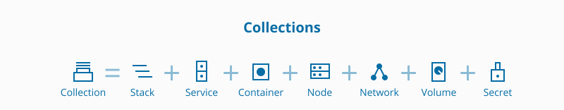
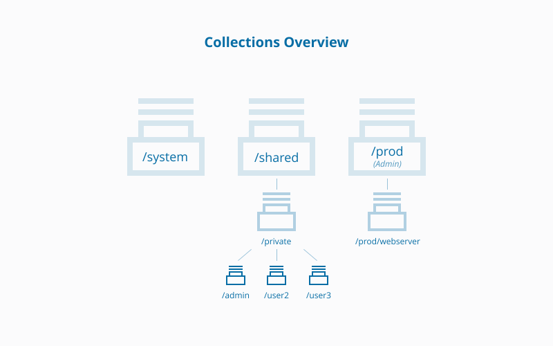

Docker EE enables access control to cluster resources by grouping resources
into *resource sets*. Combine resource sets with [grants](grant-permissions)
to give users permission to access specific cluster resources.

A resource set can be a UCP collection or a Kubernetes namespace, depending 
on the orchestrator. Use collections for Swarm workloads, and use namespaces
for Kubernetes workloads. 

## Kubernetes namespace

A
[namespace](https://v1-8.docs.kubernetes.io/docs/concepts/overview/working-with-objects/namespaces/)
is a logical area for a Kubernetes cluster. Kubernetes comes with a `default`
namespace for your cluster objects (plus two more for system and public
resources). You can create custom namespaces, but unlike Swarm collections,
namespaces _cannot be nested_.

> Resource types that can be placed into a Kubernetes namespace include: Pods,
> Deployments, NetworkPolicies, Nodes, Services, Secrets, and many more.

Resources are placed into a namespace when you create a Kubernetes object. A
drop down displays all available namespaces and one must be selected.

## Swarm collection

A collection is a directory of grouped resources, such as services, containers,
volumes, networks, and secrets. To authorize access, administrators create
grants against these directory branches.

{: .with-border}

### Access label

Access to a collection is granted with a path defined in an access label.

For example, each user has a private collection with the path,
`/Shared/Private/<username>`. The  private collection for user "molly" would have
the access label: `com.docker.ucp.access.label = /Shared/Private/molly`.

To deploy applications into a custom collection, you must define the collection
first. For an example, see [Deploy stateless app with RBAC](deploy-stateless-app.md).
When a user deploys a resource without an access label, Docker EE automatically
places the resource in the user's default collection.

### Nested collections

You can nest collections. If a user has a grant against a collection, the grant
applies to all of its child collections.

For a child collection, or for a user who belongs to more than one team, the
system concatenates permissions from multiple roles into an "effective role" for
the user, which specifies the operations that are allowed against the target.

### Built-in collections

Docker EE provides a number of built-in collections.

| Default collection | Description                                                                                                                                                                                                                                |
|:-------------------|:-------------------------------------------------------------------------------------------------------------------------------------------------------------------------------------------------------------------------------------------|
| `/`                | Path to all resources in the Swarm cluster. Resources not in a collection are put here.                                                                                                                                                    |
| `/System`          | Path to UCP managers, DTR nodes, and UCP/DTR system services. By default, only admins have access, but this is configurable.                                                                                                               |
| `/Shared`          | Default path to all worker nodes for scheduling. In Docker EE Standard, all worker nodes are located here. In [Docker EE Advanced](https://www.docker.com/enterprise-edition), worker nodes can be moved and [isolated](isolate-nodes.md). |
| `/Shared/Private/` | Path to a user's private collection.                                                                                                                                                                                                       |
| `/Shared/Legacy`   | Path to the access control labels of legacy versions (UCP 2.1 and lower).                                                                                                                                                                  |

This diagram shows the `/System` and `/Shared` collections created by Docker EE.
User private collections are children of the `/Shared/private` collection. Here,
the Docker EE  administrator user created a `/prod` collection and a child
collection, `/webserver`.

{: .with-border}

### Default collections

Each user has a default collection which can be changed in UCP preferences.

Users can't deploy a resource without a collection. When a user deploys a
resource without an access label, Docker EE automatically places the resource in
the user's default collection. [Learn how to add labels to nodes](../admin/configure/add-labels-to-cluster-nodes.md).

With Docker Compose, the system applies default collection labels across all
resources in the stack unless `com.docker.ucp.access.label` has been explicitly
set.

> Default collections and collection labels
>
> Default collections are good for users who work only on a well-defined slice of
> the system, as well as users who deploy stacks and don't want to edit the
> contents of their compose files. A user with more versatile roles in the
> system, such as an administrator, might find it better to set custom labels for
> each resource.

### Collections and labels

Resources are marked as being in a collection by using labels. Some resource
types don't have editable labels, so you can't move them across collections.

> Can edit labels: services, nodes, secrets, and configs
> Cannot edit labels: containers, networks, and volumes

For editable resources, you can change the `com.docker.ucp.access.label` to move
resources to different collections. For example, you may need deploy resources
to a collection other than your default collection.

The system uses the additional labels, `com.docker.ucp.collection.*`, to enable
efficient resource lookups. By default, nodes have the
`com.docker.ucp.collection.root`, `com.docker.ucp.collection.shared`, and
`com.docker.ucp.collection.swarm` labels set to `true`. UCP
automatically controls these labels, and you don't need to manage them.

Collections get generic default names, but you can give them meaningful names,
like "Dev", "Test", and "Prod".

A *stack* is a group of resources identified by a label. You can place the
stack's resources in multiple collections. Resources are placed in the user's
default collection unless you specify an explicit `com.docker.ucp.access.label`
within the stack/compose file.

### Control access to nodes

The Docker EE Advanced license enables access control on worker nodes. Admin
users can move worker nodes from the default `/Shared` collection into other
collections and create corresponding grants for scheduling tasks.

Also, you can [isolate a Kubernetes workload](isolate-nodes.md##deploy-a-Kubernetes-application)
to specific worker nodes, based on a Kubernetes namespace.

In this example, an administrator has moved worker nodes to a `/prod`
collection:

When you deploy a resource with a collection, Docker EE sets a constraint
implicitly based on what nodes the collection, and any ancestor collections, can
access. The `Scheduler` role allows users to deploy resources on a node. By
default, all users have the `Scheduler` role against the `/Shared` collection.

When deploying a resource that isn't global, like local volumes, bridge
networks, containers, and services, the system identifies a set of "schedulable
nodes" for the user. The system identifies the target collection of the
resource, like `/Shared/Private/molly`, and it tries to find the parent that's
closest to the root that the user has the `Node Schedule` permission on.

For example, when a user with a default configuration runs `docker container run
nginx`, the system interprets this to mean, "Create an NGINX container under the
user's default collection, which is at `/Shared/Private/molly`, and deploy it on
one of the nodes under `/Shared`.

If you want to isolate nodes against other teams, place these nodes in new
collections, and assign the `Scheduler` role, which contains the `Node Schedule`
permission, to the team. [Isolate swarm nodes to a specific team](isolate-nodes.md).

## Where to go next

- [Create and configure users and teams](create-users-and-teams-manually.md)
- [Define roles with authorized API operations](define-roles.md)
- [Grant role-access to cluster resources](grant-permissions.md)
