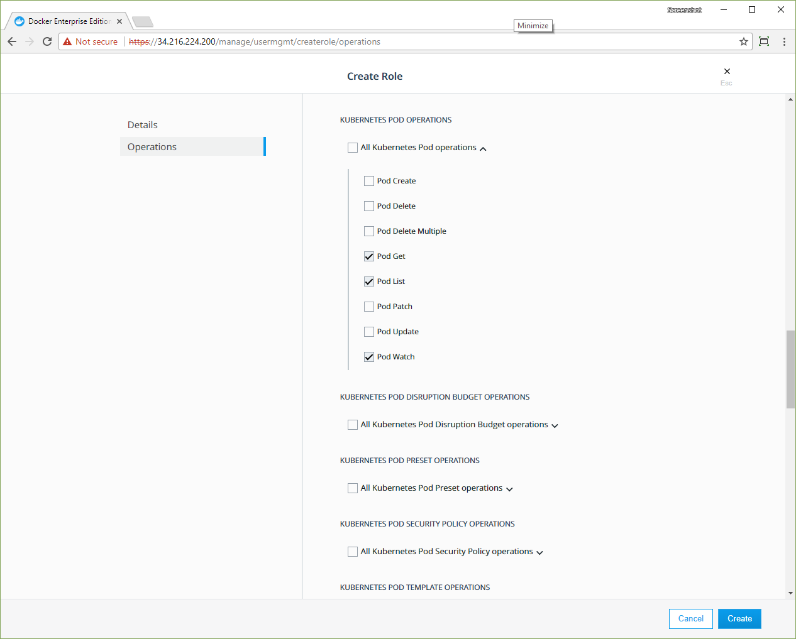
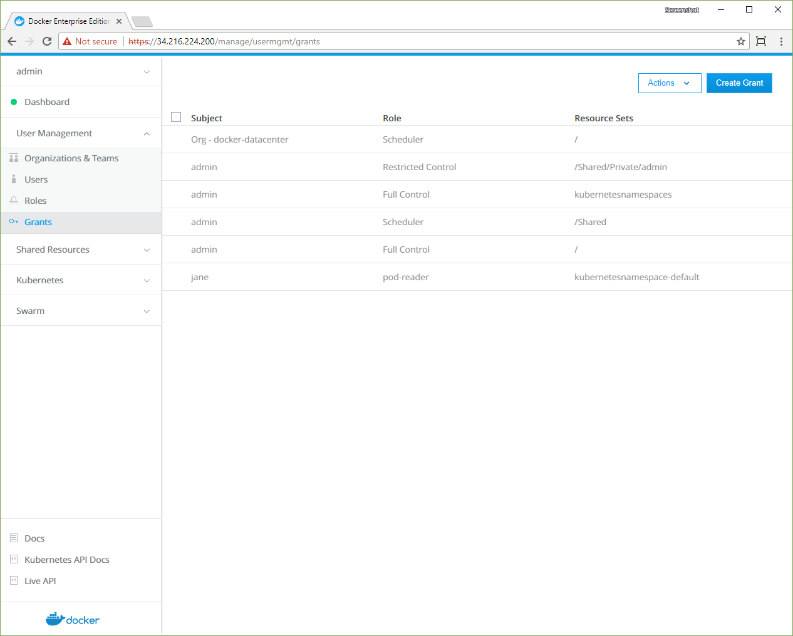

With Docker Enterprise Edition, you can create roles and grants
that implement the permissions that are defined in your Kubernetes apps.
Learn about [RBAC authorization in Kubernetes](https://v1-8.docs.kubernetes.io/docs/admin/authorization/rbac/).

Docker EE has its own implementation of role-based access control, so you
can't use Kubernetes RBAC objects directly. Instead, you create UCP roles
and grants that correspond with the role objects and bindings in your
Kubernetes app.

- Kubernetes `Role` and `ClusterRole` objects become UCP roles.
- Kubernetes `RoleBinding` and `ClusterRoleBinding` objects become UCP grants.  

Learn about [UCP roles and grants](grant-permissions.md).

> Kubernetes yaml in UCP
> 
> Docker EE has its own RBAC system that's distinct from the Kubernetes
> system, so you can't create any objects that are returned by the
> `/apis/rbac.authorization.k8s.io` endpoints. If the yaml for your Kubernetes
> app contains definitions for `Role`, `ClusterRole`, `RoleBinding` or
> `ClusterRoleBinding` objects, UCP returns an error.
{: .important}

## Migrate a Kubernetes Role to a custom UCP role

If you have `Role` and `ClusterRole` objects defined in the yaml for your
Kubernetes app, you can realize the same authorization model by creating
custom roles by using the UCP web UI.

The following Kubernetes yaml defines a `pod-reader` role, which gives users
access to the read-only `pods` resource APIs, `get`, `watch`, and `list`.

```yaml
kind: Role
apiVersion: rbac.authorization.k8s.io/v1
metadata:
  namespace: default
  name: pod-reader
rules:
- apiGroups: [""]
  resources: ["pods"]
  verbs: ["get", "watch", "list"]
```

Create a corresponding custom role by using the **Create Role** page in the 
UCP web UI.

1.  Log in to the UCP web UI with an administrator account.
2.  Click **Roles** under **User Management**.
3.  Click **Create Role**.
4.  In the **Role Details** section, name the role "pod-reader".
5.  In the left pane, click **Operations**.
6.  Scroll to the **Kubernetes pod operations** section and expand the
    **All Kubernetes Pod operations** dropdown. 
7.  Select the **Pod Get**, **Pod List**, and **Pod Watch** operations.
    {: .with-border}
8.  Click **Create**.

The `pod-reader` role is ready to use in grants that control access to 
cluster resources.

## Migrate a Kubernetes RoleBinding to a UCP grant

If your Kubernetes app defines `RoleBinding` or `ClusterRoleBinding`
objects for specific users, create corresponding grants by using the UCP web UI.

The following Kubernetes yaml defines a `RoleBinding` that grants user "jane"
read-only access to pods in the `default` namespace.

```yaml
kind: RoleBinding
apiVersion: rbac.authorization.k8s.io/v1
metadata:
  name: read-pods
  namespace: default
subjects:
- kind: User
  name: jane
  apiGroup: rbac.authorization.k8s.io
roleRef:
  kind: Role
  name: pod-reader
  apiGroup: rbac.authorization.k8s.io
```  

Create a corresponding grant by using the **Create Grant** page in the 
UCP web UI.

1.  Create a non-admin user named "jane". [Learn to create users and teams](create-users-and-teams-manually.md). 
1.  Click **Grants** under **User Management**.
2.  Click **Create Grant**.
3.  In the **Type** section, click **Namespaces** and ensure that **default** is selected.
4.  In the left pane, click **Roles**, and in the **Role** dropdown, select **pod-reader**.
5.  In the left pane, click **Subjects**, and click **All Users**.
6.  In the **User** dropdown, select **jane**.
7.  Click **Create**. 

{: .with-border}

User "jane" has access to inspect pods in the `default` namespace.

## Kubernetes limitations

There are a few limitations that you should be aware of when creating
Kubernetes workloads:

* Docker EE has its own RBAC system, so it's not possible to create
  `ClusterRole` objects, `ClusterRoleBinding` objects, or any other object that is
  created by using the `/apis/rbac.authorization.k8s.io` endpoints.
* To make sure your cluster is secure, only admin users can deploy pods with
  privileged options. These are options like `PodSpec.hostIPC`, `PodSpec.hostNetwork`,
  `PodSpec.hostPID`, `SecurityContext.allowPrivilegeEscalation`,
  `SecurityContext.capabilities`, `SecurityContext.privileged`, and
  `Volume.hostPath`.