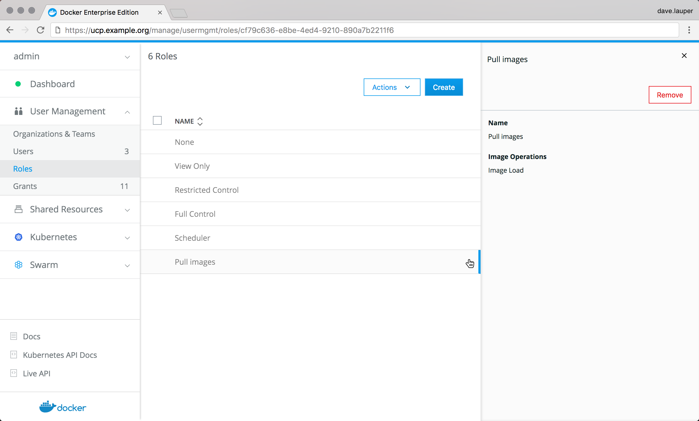

By default only admin users can pull images into a cluster managed by UCP.

Images are a shared resource, as such they are always in the `swarm` collection.
To allow users access to pull images, you need to grant them the `image load`
permission for the `swarm` collection.

As an admin user, go to the **UCP web UI**, navigate to the **Roles** page,
and create a **new role** named `Pull images`.

{: .with-border}

Then go to the **Grants** page, and create a new grant with:

* Subject: the user you want to be able to pull images.
* Roles: the "Pull images" role you created.
* Resource set: the `swarm` collection.

{: .with-border}

Once you click **Create** the user is able to pull images from the UCP web UI
or the CLI.

## Where to go next

* [Docker EE Standard use case](ee-standard.md)
* [Docker EE Advanced use case](ee-advanced.md)
