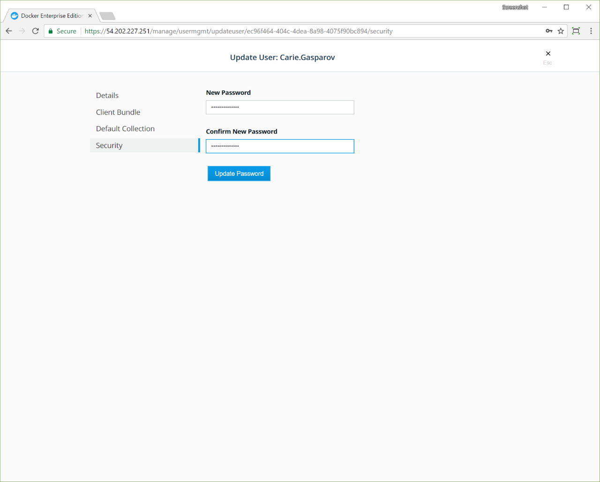

Docker EE administrators can reset user passwords managed in UCP:

1. Log in to UCP with administrator credentials.
2. Click **Users** under **User Management**.
3. Select the user whose password you want to change.
4. Select **Configure** and select **Security**.
5. Enter the new password, confirm, and click **Update Password**.

Users passwords managed with an LDAP service must be changed on the LDAP server.

{: .with-border}

## Change administrator passwords

Administrators who need a password change can ask another administrator for help
or use **ssh** to log in to a manager node managed by Docker EE and run:

```none

docker run --net=host -v ucp-auth-api-certs:/tls -it "$(docker inspect --format '{{ .Spec.TaskTemplate.ContainerSpec.Image }}' ucp-auth-api)" "$(docker inspect --format '{{ index .Spec.TaskTemplate.ContainerSpec.Args 0 }}' ucp-auth-api)" passwd -i

```


