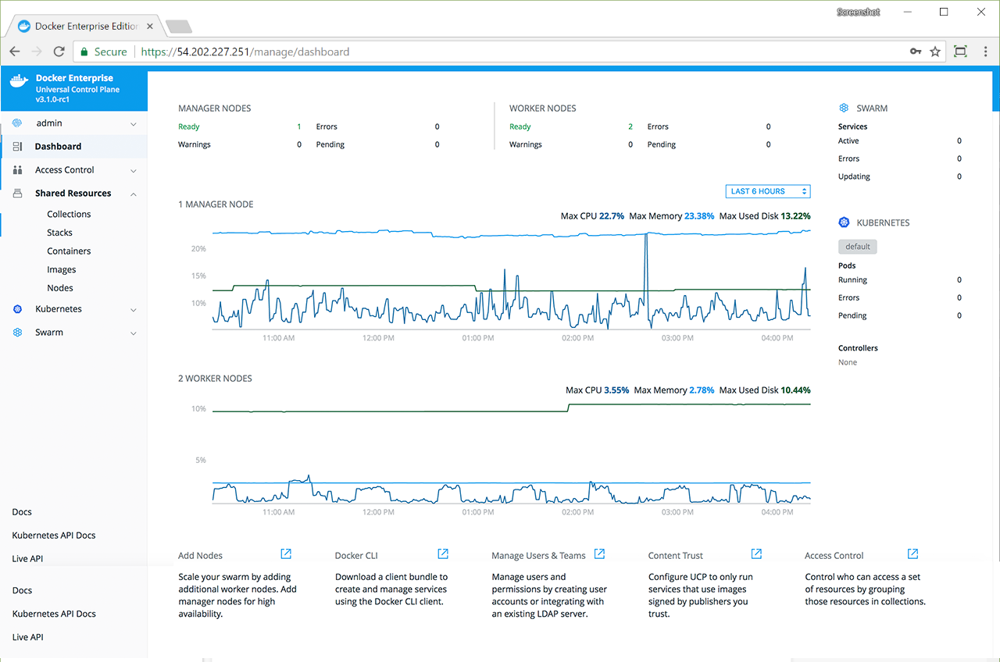
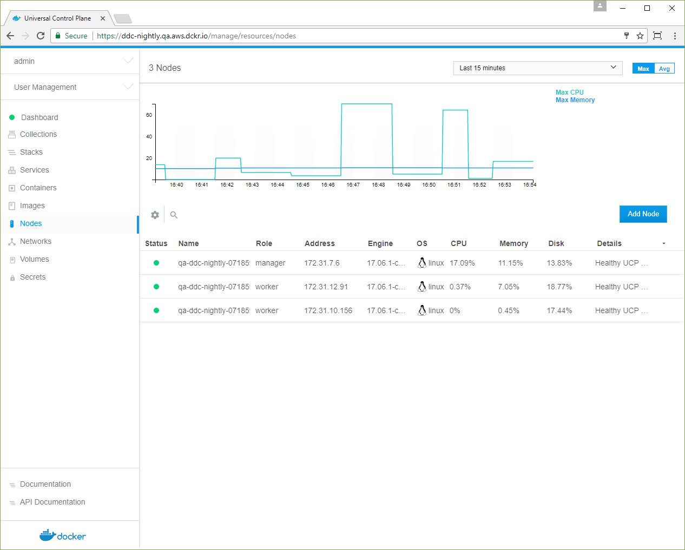
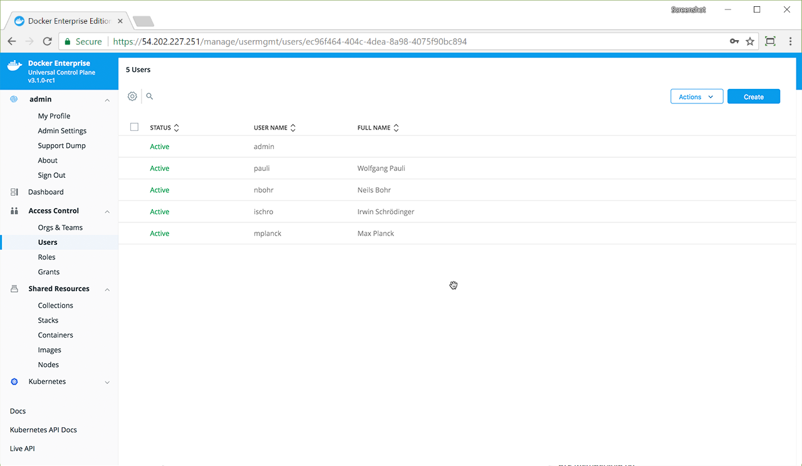

Docker Universal Control Plane (UCP) is the enterprise-grade cluster management
solution from Docker. You install it on-premises or in your virtual private
cloud, and it helps you manage your Docker cluster and applications through a
single interface.

{: .with-border}

## Centralized cluster management

With Docker, you can join up to thousands of physical or virtual machines
together to create a container cluster that allows you to deploy your
applications at scale. Docker Universal Control Plane extends the
functionality provided by Docker to make it easier to manage your cluster
from a centralized place.

You can manage and monitor your container cluster using a graphical UI.

{: .with-border}

## Deploy, manage, and monitor

With Docker UCP, you can manage from a centralized place all of the computing
resources you have available, like nodes, volumes, and networks.

You can also deploy and monitor your applications and services.

## Built-in security and access control

Docker UCP has its own built-in authentication mechanism and integrates with
LDAP services. It also has role-based access control (RBAC), so that you can
control who can access and make changes to your cluster and applications.
[Learn about role-based access control](access-control/index.md).

{: .with-border}

Docker UCP integrates with Docker Trusted Registry so that you can keep the
Docker images you use for your applications behind your firewall, where they
are safe and can't be tampered with.

You can also enforce security policies and only allow running applications
that use Docker images you know and trust.

## Use the Docker CLI client

Because UCP exposes the standard Docker API, you can continue using the tools
you already know, including the Docker CLI client, to deploy and manage your
applications.

For example, you can use the `docker info` command to check the status of a
cluster that's managed by UCP:

```bash
docker info
```

This command produces the output that you expect from the Docker EE Engine:

```bash
Containers: 38
Running: 23
Paused: 0
Stopped: 15
Images: 17
Server Version: 17.06
...
Swarm: active
NodeID: ocpv7el0uz8g9q7dmw8ay4yps
Is Manager: true
ClusterID: tylpv1kxjtgoik2jnrg8pvkg6
Managers: 1
…
```

## Where to go next

- [Install UCP](admin/install/index.md)
- [Docker EE Platform 2.0 architecture](/ee/docker-ee-architecture.md)