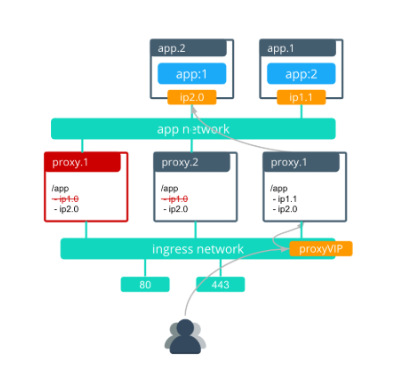

This document covers the following considerations:

- **Interlock default architecture**
- **Single Interlock deployment** (default)
    A single interlock deployment creates a /24 ingress network to be used by all applications in a Docker Enterprise cluster
- **Service clusters**
    An interlock Service Cluster creates separate interlock proxies that are assigned to specific applications.
- **Application optimization for Interlock**
    Interlock has several configuration options so that it can be deployed in a manner that best matches the application and infrastructure requirements of a deployment. 

A good understanding of this content is necessary for the successful deployment and use of Interlock.  

### Interlock default architecture

### Single Interlock deployment

When an application image is updated, the following actions occur:

1. The service is updated with a new version of the application.
2. The default “stop-first” policy stops the first replica before scheduling the second. The interlock proxies remove ip1.0 out of the backend pool as the app.1 task is removed.
3. The first application task is rescheduled with the new image after the first task stops. 

The interlock proxy.1 is then rescheduled with the new nginx configuration that contains the update for the new app.1 task.

After proxy.1 is complete, proxy.2 redeploys with the updated ngix configuration for the app.1 task.

In this scenario, the amount of time that the service is unavailable is less than 30 seconds.
 
### Service clusters

### Optimizing Interlock for applications

#### Application update order
Swarm provides control over the order in which old tasks are removed while new ones are created. This is controlled on the service-level with `--update-order`.

- `stop-first` (default)- Configures the currently updating task to stop before the new task is scheduled.
- `start-first` - Configures the current task to stop after the new task has scheduled. This guarantees that the new task is running before the old task has shut down.

Use `start-first` if …

- You have a single application replica and you cannot have service interruption. Both the old and new tasks run simultaneously during the update, but this ensurse that there is no gap in service during the update.

Use `stop-first` if …

- Old and new tasks of your service cannot serve clients simultaneously.
- You do not have enough cluster resourcing to run old and new replicas simultaneously.

In most cases,  `start-first` is the best choice because it optimizes for high availability during updates. 

#### Application update delay
Swarm services use `update-delay` to control the speed at which a service is updated. This adds a timed delay between application tasks as they are updated. The delay controls the time from when the first task of a service transitions to healthy state and the time that the second task begins its update. The default is 0 seconds, which means that a replica task begins updating as soon as the previous updated task transitions in to a healthy state. 

Use `update-delay` if …

- You are optimizing for the least number of dropped connections and a longer update cycle is an acceptable tradeoff.
- Interlock update convergence takes a long time in your environment (can occur when having large amount of overlay networks). 

Do not use `update-delay` if …

- Service updates must occur rapidly.
 - Old and new tasks of your service cannot serve clients simultaneously.

#### Use application health checks
Swarm uses application health checks extensively to ensure that its updates do not cause service interruption. `health-cmd` can be configured in a Dockerfile or compose file to define a method for health checking an application. Without health checks, Swarm cannot determine when an application is truly ready to service traffic and will mark it as healthy as soon as the container process is running. This can potentially send traffic to an application before it is capable of serving clients, leading to dropped connections.

#### Application stop grace period
`stop-grace-period` configures a time period for which the task will continue to run but will not accept new connections. This allows connections to drain before the task is stopped, reducing the possibility of terminating requests in-flight. The default value is 10 seconds. This means that a task continues to run for 10 seconds after starting its shutdown cycle, which also removes it from the load balancer to prevent it from accepting new connections. Applications that receive long-lived connections can benefit from longer shut down cycles so that connections can terminate normally.

### Interlock optimizations

#### Use service clusters for Interlock segmentation
Interlock service clusters allow Interlock to be segmented into multiple logical instances called “service clusters”, which have independently managed proxies. Application traffic only uses the proxies for a specific service cluster, allowing the full segmentation of traffic. Each service cluster only connects to the networks using that specific service cluster, which reduces the number of overlay networks to which proxies connect. Because service clusters also deploy separate proxies, this also reduces the amount of churn in LB configs when there are service updates.

#### Minimizing number of overlay networks
Interlock proxy containers connect to the overlay network of every Swarm service. Having many networks connected to Interlock adds incremental delay when Interlock updates its load balancer configuration. Each network connected to Interlock generally adds 1-2 seconds of update delay. With many networks, the Interlock update delay causes the LB config to be out of date for too long, which can cause traffic to be dropped. 

Minimizing the number of overlay networks that Interlock connects to can be accomplished in two ways:

- Reduce the number of networks. If the architecture permits it, applications can be grouped together to use the same networks.
- Use Interlock service clusters. By segmenting Interlock, service clusters also segment which networks are connected to Interlock, reducing the number of networks to which each proxy is connected.

#### Use Interlock VIP Mode
VIP Mode can be used to reduce the impact of application updates on the Interlock proxies. It utilizes the Swarm L4 load balancing VIPs instead of individual task IPs to load balance traffic to a more stable internal endpoint. This prevents the proxy LB configs from changing for most kinds of app service updates reducing churn for Interlock. The following features are not supported in VIP mode:

- Sticky sessions
- Websockets
- Canary deployments

The following features are supported in VIP mode:

- Host & context routing
- Context root rewrites
- Interlock TLS termination
- TLS passthrough
- Service clusters

## Next steps

- [Deploy Interlock](deploy/index.md)
- [Configure Interlock](config/index.md)
