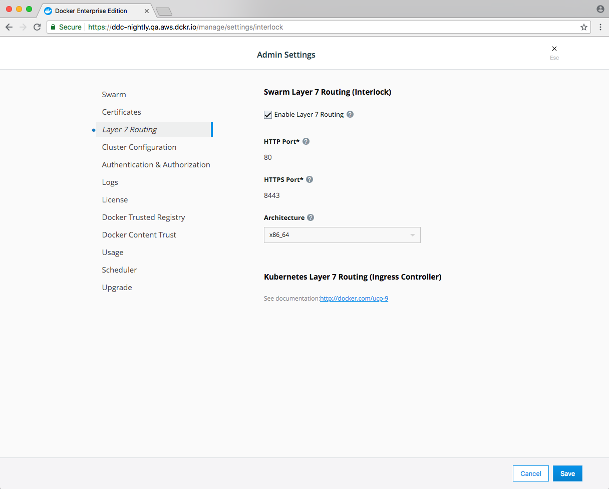

This topic covers deploying a layer 7 routing solution into a Docker Swarm to route traffic to Swarm services. Layer 7 routing is also referred to as an HTTP routing mesh.

1. [Prerequisites](#prerequisites)
2. [Enable layer 7 routing](#enable-layer-7-routing)
3. [Work with the core service configuration file](#work-with-the-core-service-configuration-file)
4. [Create a dedicated network for Interlock and extensions](#create-a-dedicated-network-for-Interlock-and-extensions)
5. [Create the Interlock service](#create-the-interlock-service)

## Prerequisites

- [Docker](https://www.docker.com) version 17.06 or later
- Docker must be running in [Swarm mode](/engine/swarm/)
- Internet access (see [Offline installation](./offline-install.md) for installing without internet access)

## Enable layer 7 routing
By default, layer 7 routing is disabled, so you must first
enable this service from the UCP web UI.

1. Log in to the UCP web UI as an administrator.
2. Navigate to **Admin Settings**
3. Select **Layer 7 Routing** and then select **Enable Layer 7 Routing**

{: .with-border}

By default, the routing mesh service listens on port 8080 for HTTP and port
8443 for HTTPS. Change the ports if you already have services that are using
them.

When 7 routing is enabled:

1. UCP creates the `ucp-interlock` overlay network.
2. UCP deploys the `ucp-interlock` service and attaches it both to the Docker
socket and the overlay network that was created. This allows the Interlock
service to use the Docker API. That's also the reason why this service needs to
run on a manger node.
3. The `ucp-interlock` service starts the `ucp-interlock-extension` service
and attaches it to the `ucp-interlock` network. This allows both services
to communicate.
4. The `ucp-interlock-extension` generates a configuration to be used by
the proxy service. By default the proxy service is NGINX, so this service
generates a standard NGINX configuration.
( Is this valid here????) UCP creates the `com.docker.ucp.interlock.conf-1` configuration file and uses it to configure all
the internal components of this service. 
5. The `ucp-interlock` service takes the proxy configuration and uses it to
start the `ucp-interlock-proxy` service.

At this point everything is ready for you to start using the layer 7 routing
service with your swarm workloads.


The following code sample provides a default UCP configuration:

```toml
ListenAddr = ":8080"
DockerURL = "unix:///var/run/docker.sock"
AllowInsecure = false
PollInterval = "3s"

[Extensions]
  [Extensions.default]
    Image = "{{ page.ucp_org }}/ucp-interlock-extension:{{ page.ucp_version }}"
    ServiceName = "ucp-interlock-extension"
    Args = []
    Constraints = ["node.labels.com.docker.ucp.orchestrator.swarm==true", "node.platform.os==linux"]
    ProxyImage = "{{ page.ucp_org }}/ucp-interlock-proxy:{{ page.ucp_version }}"
    ProxyServiceName = "ucp-interlock-proxy"
    ProxyConfigPath = "/etc/nginx/nginx.conf"
    ProxyReplicas = 2
    ProxyStopSignal = "SIGQUIT"
    ProxyStopGracePeriod = "5s"
    ProxyConstraints = ["node.labels.com.docker.ucp.orchestrator.swarm==true", "node.platform.os==linux"]
    PublishMode = "ingress"
    PublishedPort = 80
    TargetPort = 80
    PublishedSSLPort = 8443
    TargetSSLPort = 443
    [Extensions.default.Labels]
      "com.docker.ucp.InstanceID" = "fewho8k85kyc6iqypvvdh3ntm"
    [Extensions.default.ContainerLabels]
      "com.docker.ucp.InstanceID" = "fewho8k85kyc6iqypvvdh3ntm"
    [Extensions.default.ProxyLabels]
      "com.docker.ucp.InstanceID" = "fewho8k85kyc6iqypvvdh3ntm"
    [Extensions.default.ProxyContainerLabels]
      "com.docker.ucp.InstanceID" = "fewho8k85kyc6iqypvvdh3ntm"
    [Extensions.default.Config]
      Version = ""
      User = "nginx"
      PidPath = "/var/run/proxy.pid"
      MaxConnections = 1024
      ConnectTimeout = 600
      SendTimeout = 600
      ReadTimeout = 600
      IPHash = false
      AdminUser = ""
      AdminPass = ""
      SSLOpts = ""
      SSLDefaultDHParam = 1024
      SSLDefaultDHParamPath = ""
      SSLVerify = "required"
      WorkerProcesses = 1
      RLimitNoFile = 65535
      SSLCiphers = "HIGH:!aNULL:!MD5"
      SSLProtocols = "TLSv1.2"
      AccessLogPath = "/dev/stdout"
      ErrorLogPath = "/dev/stdout"
      MainLogFormat = "'$remote_addr - $remote_user [$time_local] \"$request\" '\n\t\t    '$status $body_bytes_sent \"$http_referer\" '\n\t\t    '\"$http_user_agent\" \"$http_x_forwarded_for\"';"
      TraceLogFormat = "'$remote_addr - $remote_user [$time_local] \"$request\" $status '\n\t\t    '$body_bytes_sent \"$http_referer\" \"$http_user_agent\" '\n\t\t    '\"$http_x_forwarded_for\" $request_id $msec $request_time '\n\t\t    '$upstream_connect_time $upstream_header_time $upstream_response_time';"
      KeepaliveTimeout = "75s"
      ClientMaxBodySize = "32m"
      ClientBodyBufferSize = "8k"
      ClientHeaderBufferSize = "1k"
      LargeClientHeaderBuffers = "4 8k"
      ClientBodyTimeout = "60s"
      UnderscoresInHeaders = false
      HideInfoHeaders = false
```

### Work with the core service configuration file
Interlock uses the TOML file for the core service configuration. The following example utilizes Swarm deployment and recovery features by creating a Docker Config object:

```bash
$> cat << EOF | docker config create service.interlock.conf -
ListenAddr = ":8080"
DockerURL = "unix:///var/run/docker.sock"
PollInterval = "3s"

[Extensions]
  [Extensions.default]
    Image = "{{ page.ucp_org }}/ucp-interlock-extension:{{ page.ucp_version }}"
    Args = ["-D"]
    ProxyImage = "{{ page.ucp_org }}/ucp-interlock-proxy:{{ page.ucp_version }}"
    ProxyArgs = []
    ProxyConfigPath = "/etc/nginx/nginx.conf"
    ProxyReplicas = 1
    ProxyStopGracePeriod = "3s"
    ServiceCluster = ""
    PublishMode = "ingress"
    PublishedPort = 80
    TargetPort = 80
    PublishedSSLPort = 443
    TargetSSLPort = 443
    [Extensions.default.Config]
      User = "nginx"
      PidPath = "/var/run/proxy.pid"
      WorkerProcesses = 1
      RlimitNoFile = 65535
      MaxConnections = 2048
EOF
oqkvv1asncf6p2axhx41vylgt
```

### Create a dedicated network for Interlock and extensions

Next, create a dedicated network for Interlock and the extensions:

```bash
$> docker network create -d overlay interlock
```

### Create the Interlock service
Now you can create the Interlock service. Note the requirement to constrain to a manager. The
Interlock core service must have access to a Swarm manager, however the extension and proxy services
are recommended to run on workers.  See the [Production](./production.md) section for more information
on setting up for an production environment.

```bash
$> docker service create \
    --name interlock \
    --mount src=/var/run/docker.sock,dst=/var/run/docker.sock,type=bind \
    --network interlock \
    --constraint node.role==manager \
    --config src=service.interlock.conf,target=/config.toml \
    {{ page.ucp_org }}/ucp-interlock:{{ page.ucp_version }} -D run -c /config.toml
sjpgq7h621exno6svdnsvpv9z
```

At this point, there should be three (3) services created: one for the Interlock service,
one for the extension service, and one for the proxy service:

```bash
$> docker service ls
ID                  NAME                MODE                REPLICAS            IMAGE                                                       PORTS
lheajcskcbby        modest_raman        replicated          1/1                 nginx:alpine                                                *:80->80/tcp *:443->443/tcp
oxjvqc6gxf91        keen_clarke         replicated          1/1                 {{ page.ucp_org }}/ucp-interlock-extension:{{ page.ucp_version }}
sjpgq7h621ex        interlock           replicated          1/1                 {{ page.ucp_org }}/ucp-interlock:{{ page.ucp_version }}
```

The Interlock traffic layer is now deployed. 

## Next steps

- [Configure Interlock](../config/index.md) 
- [Deploy applications](../usage/index.md)
- [Production deployment information](./production.md)
- [Offline installation](./offline-install.md)
