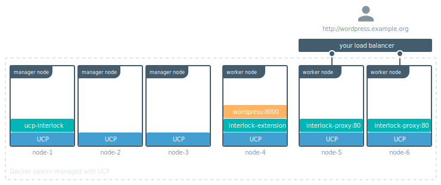

The layer 7 solution that ships out of the box with UCP is highly available
and fault tolerant. It is also designed to work independently of how many
nodes you're managing with UCP.



For a production-grade deployment, you should tune the default deployment to
have two nodes dedicated for running the two replicas of the
`ucp-interlock-proxy` service. This ensures:

* The proxy services have dedicated resources to handle user requests. You
can configure these nodes with higher performance network interfaces.
* No application traffic can be routed to a manager node. This makes your
deployment secure.
* The proxy service is running on two nodes. If one node fails, layer 7 routing
continues working.

To achieve this you need to:

1. Enable layer 7 routing. [Learn how](index.md).
2. Pick two nodes that are going to be dedicated to run the proxy service.
3. Apply labels to those nodes, so that you can constrain the proxy service to
only run on nodes with those labels.
4. Update the `ucp-interlock` service to deploy proxies using that constraint.
5. Configure your load balancer to route traffic to the dedicated nodes only.

## Apply labels to nodes

In this example, we chose node-5 and node-6 to be dedicated just for running
the proxy service. To apply labels to those nodes run:

```bash
docker node update --label-add nodetype=loadbalancer <node>
```

To make sure the label was successfully applied, run:


```bash
docker node inspect --format '{{ index .Spec.Labels "nodetype" }}' <node>
```


The command should print "loadbalancer".

## Configure the ucp-interlock service

Now that your nodes are labelled, you need to update the `ucp-interlock`
service configuration to deploy the proxy service with the correct constraints.

Add another constraint to the `ProxyConstraints` array:

```toml
[Extensions]
  [Extensions.default]
    ProxyConstraints = ["node.labels.com.docker.ucp.orchestrator.swarm==true", "node.labels.nodetype==loadbalancer"]
```

[Learn how to configure ucp-interlock](configure.md).

> Known issue
>
> In UCP 3.0.0 the `ucp-interlock` service won't redeploy the proxy replicas
> when you update the configuration. As a workaround,
> [deploy a demo service](../usage/index.md). Once you do that, the proxy
services are redeployed and scheduled on the correct nodes.
{: .important}

Once you reconfigure the `ucp-interlock` service, you can check if the proxy
service is running on the dedicated nodes:

```bash
docker service ps ucp-interlock-proxy
```

## Configure your load balancer

Once the proxy service is running on dedicated nodes, configure your upstream
load balancer with the domain names or IP addresses of those nodes.

This makes sure all traffic is directed to these nodes.

