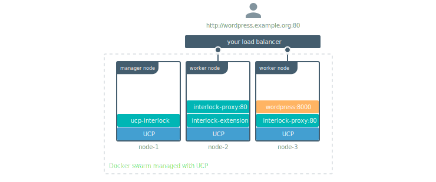

Application-layer (Layer 7) routing is the application routing and load balancing (ingress routing) system included with Docker Enterprise for Swarm orchestration. Interlock architecture takes advantage of the underlying Swarm components to provide scalable Layer 7 routing and Layer 4 VIP mode functionality.

Interlock is specific to the Swarm orchestrator. If you're trying to route
traffic to your Kubernetes applications, check
[layer 7 routing with Kubernetes.](../kubernetes/layer-7-routing.md)

Interlock uses the Docker Remote API to automatically configure extensions such as NGINX or HAProxy for application traffic. Interlock is designed for:

- Full integration with Docker (Swarm, Services, Secrets, Configs)
- Enhanced configuration (context roots, TLS, zero downtime deploy, rollback)
- Support for external load balancers (nginx, haproxy, F5, etc) via extensions
- Least privilege for extensions (no Docker API access)

Docker Engine running in swarm mode has a routing mesh, which makes it easy
to expose your services to the outside world. Since all nodes participate
in the routing mesh, users can access a service by contacting any node.

For example, a WordPress service is listening on port 8000 of the routing
mesh. Even though the service is running on a single node, users can access
WordPress using the domain name or IP of any of the nodes that are part of
the swarm.

UCP extends this one step further with layer 7 layer routing (also known as
application layer 7), allowing users to access Docker services using domain names
instead of IP addresses. This functionality is made available through the Interlock component.

Using Interlock in the previous example, users can access the WordPress service using
`http://wordpress.example.org`. Interlock takes care of routing traffic to
the right place.

## Terminology

- Cluster: A group of compute resources running Docker
- Swarm: A Docker cluster running in Swarm mode
- Upstream: An upstream container that serves an application
- Proxy Service: A service that provides load balancing and proxying (such as Nginx)
- Extension Service: A helper service that configures the proxy service
- Service Cluster: A service cluster is an Interlock extension+proxy service
- gRPC: A high-performance RPC framework

## Interlock services
Interlock has
three primary services:

* **Interlock**: This is the central piece of the layer 7 routing solution.
The core service is responsible for interacting with the Docker Remote API and building
an upstream configuration for the extensions. It uses the Docker API to monitor events, and manages the extension and
proxy services. This is served on a gRPC API that the
extensions are configured to access.
* **Interlock-extension**: This is a helper service that queries the Interlock gRPC API for the
upstream configuration. The extension service uses this to configure
the proxy service.  For proxy services that use files such as Nginx or HAProxy, the
extension service generates the file and sends it to Interlock using the gRPC API. Interlock
then updates the corresponding Docker Config object for the proxy service.
* **Interlock-proxy**: This is a proxy/load-balancing service that handles requests for the upstream application services.  These
are configured using the data created by the corresponding extension service. By default, this service is a containerized
NGINX deployment.

Interlock manages both extension and proxy service updates for both configuration changes
and application service deployments.  There is no intervention from the operator required.

The following image shows the default Interlock configuration, once you enable layer 7
routing in UCP:

The Interlock service starts a single replica on a manager node. The
Interlock-extension service runs a single replica on any available node, and
the Interlock-proxy service starts two replicas on any available node.

If you don't have any worker nodes in your cluster, then all Interlock
components run on manager nodes.

## Features and benefits

Layer 7 routing in UCP supports:

* **High availability**: All the components used for layer 7 routing leverage
Docker swarm for high availability, and handle failures gracefully.
* **Automatic configuration**: Interlock uses the Docker API for configuration. You do not have to manually
update or restart anything to make services available. UCP monitors your services and automatically
reconfigures proxy services. 
* **Scalability**: Interlock uses a modular design with a separate proxy service. This allows an
operator to individually customize and scale the proxy layer to handle user requests and meet services demands, with transparency and no downtime for users.
* **TLS**: You can leverage Docker secrets to securely manage TLS Certificates
and keys for your services. Both TLS termination and TCP passthrough are supported.
* **Context-based routing**: Interlock supports advanced application request routing by context or path.
* **Host mode networking**: By default, layer 7 routing leverages the Docker Swarm
routing mesh, but Interlock supports running proxy and application services in "host" mode networking, allowing
you to bypass the routing mesh completely. This is beneficial if you want
maximum performance for your applications.
* **Security**: The layer 7 routing components that are exposed to the outside
world run on worker nodes. Even if they are compromised, your cluster aren't.
* **SSL**: Interlock leverages Docker Secrets to securely store and use SSL certificates for services.  Both
SSL termination and TCP passthrough are supported.
* **Blue-Green and Canary Service Deployment**: Interlock supports blue-green service deployment allowing an operator to deploy a new application while the current version is serving.  Once traffic is verified to the new application, the operator
can scale the older version to zero.  If there is a problem, the operation is easily reversible.
* **Service Cluster Support**: Interlock supports multiple extension+proxy combinations allowing for operators to partition load
balancing resources for uses such as region or organization based load balancing.
* **Least Privilege**: Interlock supports (and recommends) being deployed where the load balancing
proxies do not need to be colocated with a Swarm manager.  This makes the
deployment more secure by not exposing the Docker API access to the extension or proxy services.

## Next steps

- [Interlock architecture](architecture.md)
- [Deploy Interlock](deploy/index.md)
