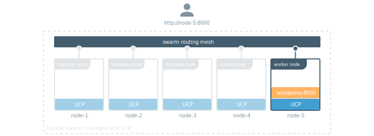
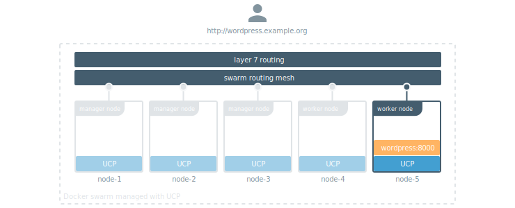

Docker Engine running in swarm mode has a routing mesh, which makes it easy
to expose your services to the outside world. Since all nodes participate
in the routing mesh, users can access your service by contacting any node.

In this example the WordPress service is listening on port 8000 of the routing
mesh. Even though the service is running on a single node, users can access
WordPress using the domain name or IP of any of the nodes that are part of
the swarm.

UCP extends this one step further with application layer routing (also known
as layer 7 routing), allowing users to access Docker services using domain names
instead of IP addresses.

In this example, users can access the WordPress service using
`http://wordpress.example.org`. UCP and Docker Engine take care of routing
the traffic to the right service.

## Features and benefits

Layer 7 routing in UCP supports:

* **High availability**: All the components used for layer 7 routing leverage
Docker swarm for high availability, and handle failures gracefully.
* **Automatic configuration**: UCP monitors your services and automatically
reconfigures the proxy services so that everything handled for you.
* **Scalability**: You can customize and tune the proxy services that handle
user-facing requests to meet whatever demand your services have.
* **TLS**: You can leverage Docker secrets to securely manage TLS Certificates
and keys for your services. Both TLS termination and TCP passthrough are supported.
* **Context-based routing**: You can define where to route the request based on
context or path.
* **Host mode networking**: By default layer 7 routing leverages the Docker Swarm
routing mesh, but you don't have to. You can use host mode networking for maximum
performance.
* **Security**: The layer 7 routing components that are exposed to the outside
world run on worker nodes. Even if they get compromised, your cluster won't.

