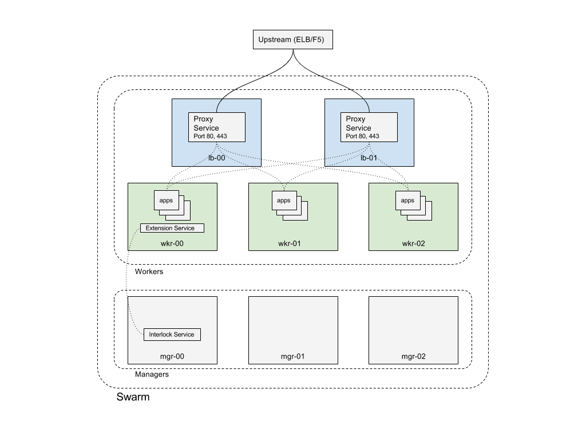



## Production Deployment
In this section you will find documentation on configuring Interlock
for a production environment.  If you have not yet deployed Interlock please
see the [Getting Started](index.md) section as this information builds upon the
basic deployment.  This example will not cover the actual deployment of infrastructure.
It assumes you have a vanilla Swarm cluster (`docker init` and `docker swarm join` from the nodes).
See the [Swarm](https://docs.docker.com/engine/swarm/) documentation if you need help
getting a Swarm cluster deployed.

In this example we will configure an eight (8) node Swarm cluster.  There are three (3) managers
and five (5) workers.  Two of the workers are configured with node labels to be dedicated
ingress cluster load balancer nodes.  These will receive all application traffic.
There is also an upstream load balancer (such as an Elastic Load Balancer or F5).  The upstream
load balancers will be statically configured for the two load balancer worker nodes.

This configuration has several benefits.  The management plane is both isolated and redundant.
No application traffic hits the managers and application ingress traffic can be routed
to the dedicated nodes.  These nodes can be configured with higher performance network interfaces
to provide more bandwidth for the user services.



## Node Labels
We will configure the load balancer worker nodes (`lb-00` and `lb-01`) with node labels in order to pin the Interlock Proxy
service.  Once you are logged into one of the Swarm managers run the following to add node labels
to the dedicated ingress workers:

```bash
$> docker node update --label-add nodetype=loadbalancer lb-00
lb-00
$> docker node update --label-add nodetype=loadbalancer lb-01
lb-01
```

You can inspect each node to ensure the labels were successfully added:

```bash

$> docker node inspect -f '{{ .Spec.Labels  }}' lb-00
map[nodetype:loadbalancer]
$> docker node inspect -f '{{ .Spec.Labels  }}' lb-01
map[nodetype:loadbalancer]

```

## Configure Proxy Service
Once we have the node labels we can re-configure the Interlock Proxy service to be constrained to those
workers.  Again, from a manager run the following to pin the proxy service to the ingress workers:

```bash
$> docker service update --replicas=2 \
    --constraint-add node.labels.nodetype==loadbalancer \
    --stop-signal SIGTERM \
    --stop-grace-period=5s \
    $(docker service ls -f 'label=type=com.docker.interlock.core.proxy' -q)
```

This updates the proxy service to have two (2) replicas and ensure they are constrained to
the workers with the label `nodetype==loadbalancer` as well as configure the stop signal for the tasks
to be a `SIGTERM` with a grace period of five (5) seconds.  This will ensure that Nginx closes the connections
before exiting to ensure the client request is finished.

Inspect the service to ensure the replicas have started on the desired nodes:

```bash
$> docker service ps $(docker service ls -f 'label=type=com.docker.interlock.core.proxy' -q)
ID                  NAME                    IMAGE               NODE                DESIRED STATE       CURRENT STATE                     ERROR               PORTS
o21esdruwu30        interlock-proxy.1       nginx:alpine        lb-01               Running             Preparing 3 seconds ago
n8yed2gp36o6         \_ interlock-proxy.1   nginx:alpine        mgr-01              Shutdown            Shutdown less than a second ago
aubpjc4cnw79        interlock-proxy.2       nginx:alpine        lb-00               Running             Preparing 3 seconds ago
```

Once configured you can update the settings in the upstream load balancer (ELB, F5, etc) with the
addresses of the dedicated ingress workers.  This will direct all traffic to these nodes.

You have now configured Interlock for a dedicated ingress production environment.  See the [Configuration](/config/interlock/) section
if you want to continue tuning.


