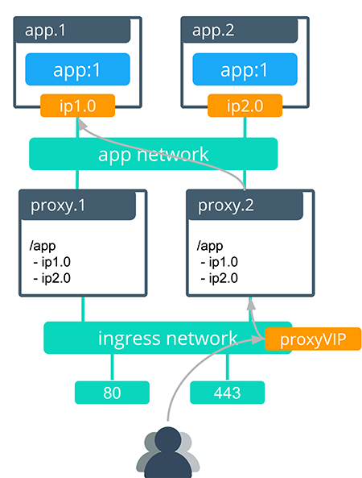
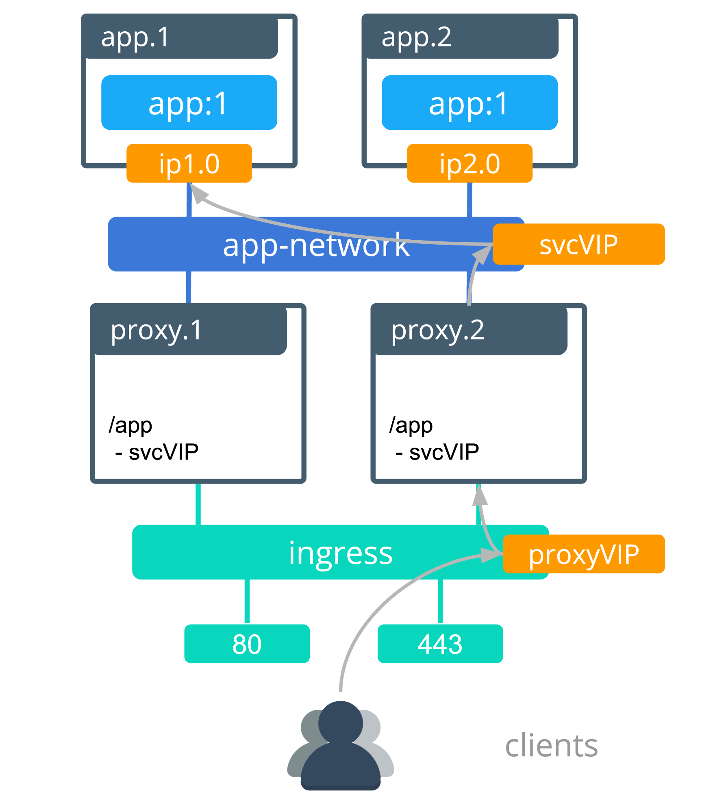

You can publish services using "vip" and "task" backend routing modes.

## Task routing mode

Task routing is the default Interlock behavior and the default backend mode if one is not specified.
In task routing mode, Interlock uses backend task IPs to route traffic from the proxy to each container.
Traffic to the frontend route is L7 load balanced directly to service tasks.
This allows for per-container routing functionality such as sticky sessions.
Task routing mode applies L7 routing and then sends packets directly to a container.



## VIP routing mode

VIP mode is an alternative mode of routing in which Interlock uses the Swarm service VIP as the backend IP instead of container IPs.
Traffic to the frontend route is L7 load balanced to the Swarm service VIP, which L4 load balances to backend tasks.
VIP mode can be useful to reduce the amount of churn in Interlock proxy service configuration, which can be an advantage in highly dynamic environments.

VIP mode optimizes for fewer proxy updates in a tradeoff for a reduced feature set.
Most application updates do not require configuring backends in VIP mode.

In VIP routing mode Interlock uses the service VIP (a persistent endpoint that exists from service creation to service deletion) as the proxy backend.
VIP routing mode was introduced in Universal Control Plane (UCP) 3.0 version 3.0.3 and 3.1 version 3.1.2.
VIP routing mode applies L7 routing and then sends packets to the Swarm L4 load balancer which routes traffic service containers.



While VIP mode provides endpoint stability in the face of application churn, it cannot support sticky sessions because sticky sessions depend on routing directly to container IPs.
Sticky sessions are therefore not supported in VIP mode.

Because VIP mode routes by service IP rather than by task IP it also affects the behavior of canary deployments.
In task mode a canary service with one task next to an existing service with four tasks represents one out of five total tasks, so the canary will receive 20% of incoming requests.
By contrast the same canary service in VIP mode will receive 50% of incoming requests, because it represents one out of two total services.

### Usage
You can set the backend mode on a per-service basis, which means that some applications can be deployed in task mode, while others are deployed in VIP mode.

The default backend mode is `task`. If a label is set to `task` or a label does not exist, then Interlock uses the `task` routing mode.

To use Interlock VIP mode, the following label must be applied:

```
com.docker.lb.backend_mode=vip
```

In VIP mode, the following non-exhaustive list of application events does not require proxy reconfiguration:

- Service replica increase/decrease
- New image deployment
- Config or secret updates
- Add/Remove labels
- Add/Remove environment variables
- Rescheduling a failed application task

The following two updates still require a proxy reconfiguration (because these actions create or destroy a service VIP):

- Add/Remove a network on a service
- Deployment/Deletion of a service

#### Publish a default host service

The following example publishes a service to be a default host. The service responds
whenever there is a request to a host that is not configured.

First, create an overlay network so that service traffic is isolated and secure:

```bash
$> docker network create -d overlay demo
1se1glh749q1i4pw0kf26mfx5
```

Next, create the initial service:

```bash
$> docker service create \
    --name demo-default \
    --network demo \
    --detach=false \
    --replicas=1 \
    --label com.docker.lb.default_backend=true \
    --label com.docker.lb.port=8080 \
    ehazlett/interlock-default-app
```

Interlock detects when the service is available and publishes it. After tasks are running
and the proxy service is updated, the application is available via any url that is not
configured:


#### Publish a service using "vip" backend mode.

1. Create an overlay network so that service traffic is isolated and secure:

```bash
$> docker network create -d overlay demo
1se1glh749q1i4pw0kf26mfx5
```

2. Create the initial service:

```bash
$> docker service create \
    --name demo \
    --network demo \
    --detach=false \
    --replicas=4 \
    --label com.docker.lb.hosts=demo.local \
    --label com.docker.lb.port=8080 \
    --label com.docker.lb.backend_mode=vip \
    --env METADATA="demo-vip-1" \
    ehazlett/docker-demo
```

Interlock detects when the service is available and publishes it. After tasks are running
and the proxy service is updated, the application should be available via `http://demo.local`:

```bash
$> curl -vs -H "Host: demo.local" http://127.0.0.1/ping
*   Trying 127.0.0.1...
* TCP_NODELAY set
* Connected to demo.local (127.0.0.1) port 80 (#0)
> GET /ping HTTP/1.1
> Host: demo.local
> User-Agent: curl/7.54.0
> Accept: */*
>
< HTTP/1.1 200 OK
< Server: nginx/1.13.6
< Date: Wed, 08 Nov 2017 20:28:26 GMT
< Content-Type: text/plain; charset=utf-8
< Content-Length: 120
< Connection: keep-alive
< Set-Cookie: session=1510172906715624280; Path=/; Expires=Thu, 09 Nov 2017 20:28:26 GMT; Max-Age=86400
< x-request-id: f884cf37e8331612b8e7630ad0ee4e0d
< x-proxy-id: 5ad7c31f9f00
< x-server-info: interlock/2.0.0-development (147ff2b1) linux/amd64
< x-upstream-addr: 10.0.2.9:8080
< x-upstream-response-time: 1510172906.714
<
{"instance":"df20f55fc943","version":"0.1","metadata":"demo","request_id":"f884cf37e8331612b8e7630ad0ee4e0d"}
```

Instead of using each task IP for load balancing, configuring VIP mode causes Interlock to use
the Virtual IPs of the service instead. Inspecting the service shows the VIPs:

```
"Endpoint": {
	"Spec": {
                "Mode": "vip"

	},
	"VirtualIPs": [
		{
        	    "NetworkID": "jed11c1x685a1r8acirk2ylol",
        	    "Addr": "10.0.2.9/24"
		}
	]
}

```

In this case, Interlock configures a single upstream for the host using the IP "10.0.2.9". Interlock
 skips further proxy updates as long as there is at least 1 replica for the service because the only upstream is the VIP.

Swarm routes requests for the VIP in a round robin fashion at L4. This means that the following Interlock features are
incompatible with VIP mode:

- Sticky sessions
