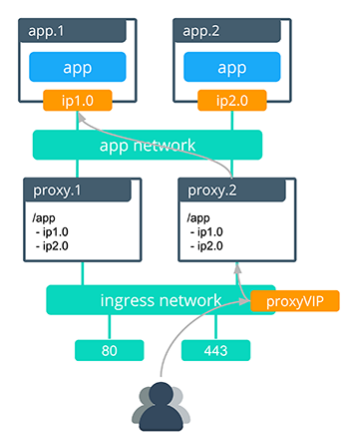
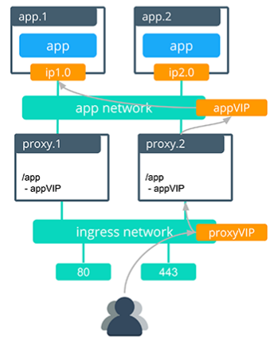

## VIP Mode
VIP mode is an alternative mode of routing in which Interlock uses the Swarm service VIP as the backend IP instead of the container IPs. Traffic to the frontend route is L7 load balanced to the Swarm service VIP which L4 load balances to the backend tasks.

VIP mode can be useful to reduce the amount of churn in the proxy configuration, which can be advantageous in very dynamic environments. It optimizes for fewer updates to the proxy as a tradeoff for a limited feature set. Most kinds of application updates do not require a proxy configuration in VIP mode. 

#### Default Routing Mode
In the default routing mode, Interlock uses the backend container IPs to route traffic from the proxy to the container. Traffic to the frontend route is L7 load balanced directly to the service tasks. This allows for per-container routing functionality like sticky sessions. The default routing mode applies L7 routing and then sends packets directly to the container.




#### VIP Routing Mode
In VIP routing mode Interlock uses the service VIP (a persistent endpoint that exists from service creation to service deletion) for the proxy backend. VIP routing mode applies L7 routing and then sends packets to the Swarm L4 load balancer which routes traffic to service containers.




While VIP mode guarantees a more stable endpoint despite application churn, it does not support some features which require routing directly to the container IPs to function. The following Interlock functionality is **not** supported in VIP mode:

- Sticky sessions
- Web sockets
- Canary deployments

#### Usage

VIP mode can be used on a per-service basis, which means that some applications can be deployed in VIP mode, while others are deployed in default. The following label must be applied to services that use Interlock VIP mode:

```
com.docker.lb.backend_mode=vip
```

If the label is `default` or does not exist then Interlock will use the default routing mode.

In VIP mode the following non-exhaustive list of application changes will not require any proxy reconfiguration:

- Service replica increase/decrease
- New image deployment
- Config or secret updates
- Add/Remove labels
- Add/Remove environment variables
- ...

The following two updates still require a proxy reconfiguration (because these actions will create or destroy a service VIP):

- Add/Remove a network to the service
- Deployment/Deletion of a service
