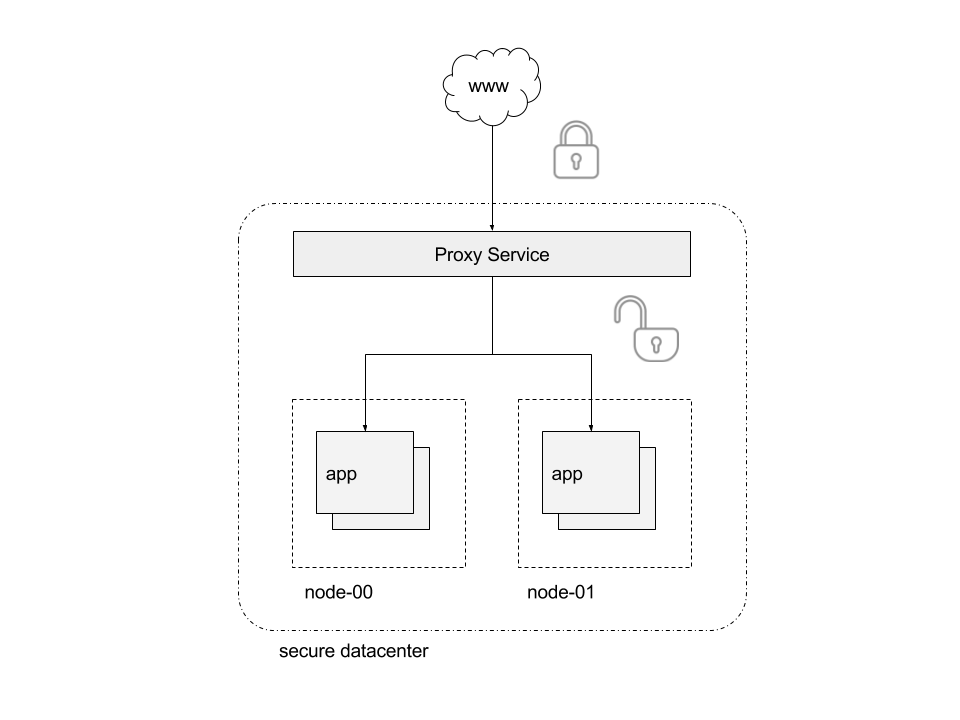

>

# Implementing SSL
This topic covers implementing Swarm services with SLL:

- SSL termination
- SSL passthrough

## SSL termination
In the following example, Docker [Secrets](https://docs.docker.com/engine/swarm/secrets/)
are used to centrally and securely store SSL certificates in order to terminate SSL at the proxy service.
Application traffic is encrypted in transport to the proxy service, which terminates SSL and then
uses unencrypted traffic inside the secure datacenter.



First, certificates are generated:

```bash
$> openssl req \
    -new \
    -newkey rsa:4096 \
    -days 3650 \
    -nodes \
    -x509 \
    -subj "/C=US/ST=SomeState/L=SomeCity/O=Interlock/CN=demo.local" \
    -keyout demo.local.key \
    -out demo.local.cert
```

Two files are created: `demo.local.cert` and `demo.local.key`.  Next, we
 use these to create Docker Secrets.

```bash
$> docker secret create demo.local.cert demo.local.cert
ywn8ykni6cmnq4iz64um1pj7s
$> docker secret create demo.local.key demo.local.key
e2xo036ukhfapip05c0sizf5w
```

Next, we create an overlay network so that service traffic is isolated and secure:

```bash
$> docker network create -d overlay demo
1se1glh749q1i4pw0kf26mfx5
```

```bash
$> docker service create \
    --name demo \
    --network demo \
    --label com.docker.lb.hosts=demo.local \
    --label com.docker.lb.port=8080 \
    --label com.docker.lb.ssl_cert=demo.local.cert \
    --label com.docker.lb.ssl_key=demo.local.key \
    ehazlett/docker-demo
6r0wiglf5f3bdpcy6zesh1pzx
```

Interlock detects when the service is available and publishes it. After tasks are running
and the proxy service is updated, the application should be available via `https://demo.local`.

Note: You must have an entry for `demo.local` in your local hosts (i.e. `/etc/hosts`) file.
You cannot use a host header as shown in other examples due to the way [SNI](https://tools.ietf.org/html/rfc3546#page-8) works.

```bash
$> curl -vsk https://demo.local/ping
*   Trying 127.0.0.1...
* TCP_NODELAY set
* Connected to demo.local (127.0.0.1) port 443 (#0)
* ALPN, offering http/1.1
* Cipher selection: ALL:!EXPORT:!EXPORT40:!EXPORT56:!aNULL:!LOW:!RC4:@STRENGTH
* successfully set certificate verify locations:
*   CAfile: /etc/ssl/certs/ca-certificates.crt
  CApath: none
* TLSv1.2 (OUT), TLS handshake, Client hello (1):
* TLSv1.2 (IN), TLS handshake, Server hello (2):
* TLSv1.2 (IN), TLS handshake, Certificate (11):
* TLSv1.2 (IN), TLS handshake, Server key exchange (12):
* TLSv1.2 (IN), TLS handshake, Server finished (14):
* TLSv1.2 (OUT), TLS handshake, Client key exchange (16):
* TLSv1.2 (OUT), TLS change cipher, Client hello (1):
* TLSv1.2 (OUT), TLS handshake, Finished (20):
* TLSv1.2 (IN), TLS change cipher, Client hello (1):
* TLSv1.2 (IN), TLS handshake, Finished (20):
* SSL connection using TLSv1.2 / ECDHE-RSA-AES256-GCM-SHA384
* ALPN, server accepted to use http/1.1
* Server certificate:
*  subject: C=US; ST=SomeState; L=SomeCity; O=Interlock; CN=demo.local
*  start date: Nov  8 16:23:03 2017 GMT
*  expire date: Nov  6 16:23:03 2027 GMT
*  issuer: C=US; ST=SomeState; L=SomeCity; O=Interlock; CN=demo.local
*  SSL certificate verify result: self signed certificate (18), continuing anyway.
> GET /ping HTTP/1.1
> Host: demo.local
> User-Agent: curl/7.54.0
> Accept: */*
>
< HTTP/1.1 200 OK
< Server: nginx/1.13.6
< Date: Wed, 08 Nov 2017 16:26:55 GMT
< Content-Type: text/plain; charset=utf-8
< Content-Length: 92
< Connection: keep-alive
< Set-Cookie: session=1510158415298009207; Path=/; Expires=Thu, 09 Nov 2017 16:26:55 GMT; Max-Age=86400
< x-request-id: 4b15ab2aaf2e0bbdea31f5e4c6b79ebd
< x-proxy-id: a783b7e646af
< x-server-info: interlock/2.0.0-development (147ff2b1) linux/amd64
< x-upstream-addr: 10.0.2.3:8080

{"instance":"c2f1afe673d4","version":"0.1",request_id":"7bcec438af14f8875ffc3deab9215bc5"}
```

Because the certificate and key are stored securely in Swarm, you can safely scale this service, as well as the proxy
service, and Swarm handles granting access to the credentials as needed.

## SSL passthrough
In the following example, SSL passthrough is used to ensure encrypted communication from the request to the application
service. This ensures maximum security because there is no unencrypted transport.


First, generate certificates for the application:

```bash
$> openssl req \
    -new \
    -newkey rsa:4096 \
    -days 3650 \
    -nodes \
    -x509 \
    -subj "/C=US/ST=SomeState/L=SomeCity/O=Interlock/CN=demo.local" \
    -keyout app.key \
    -out app.cert
```

Two files are created: `app.cert` and `app.key`.  Next, we
 use these to create Docker Secrets.

```bash
$> docker secret create app.cert app.cert
ywn8ykni6cmnq4iz64um1pj7s
$> docker secret create app.key app.key
e2xo036ukhfapip05c0sizf5w
```

Now create an overlay network to isolate and secure service traffic:

```bash
$> docker network create -d overlay demo
1se1glh749q1i4pw0kf26mfx5
```

```bash
$> docker service create \
    --name demo \
    --network demo \
    --detach=false \
    --secret source=app.cert,target=/run/secrets/cert.pem \
    --secret source=app.key,target=/run/secrets/key.pem \
    --label com.docker.lb.hosts=demo.local \
    --label com.docker.lb.port=8080 \
    --label com.docker.lb.ssl_passthrough=true \
    --env METADATA="demo-ssl-passthrough" \
    ehazlett/docker-demo --tls-cert=/run/secrets/cert.pem --tls-key=/run/secrets/key.pem
```

Interlock detects when the service is available and publishes it. When tasks are running
and the proxy service is updated, the application is available via `https://demo.local`.

Note: You must have an entry for `demo.local` in your local hosts (i.e. `/etc/hosts`) file.
You cannot use a host header as in other examples due to the way [SNI](https://tools.ietf.org/html/rfc3546#page-8) works.

```bash
$> curl -vsk https://demo.local/ping
*   Trying 127.0.0.1...
* TCP_NODELAY set
* Connected to demo.local (127.0.0.1) port 443 (#0)
* ALPN, offering http/1.1
* Cipher selection: ALL:!EXPORT:!EXPORT40:!EXPORT56:!aNULL:!LOW:!RC4:@STRENGTH
* successfully set certificate verify locations:
*   CAfile: /etc/ssl/certs/ca-certificates.crt
  CApath: none
* TLSv1.2 (OUT), TLS handshake, Client hello (1):
* TLSv1.2 (IN), TLS handshake, Server hello (2):
* TLSv1.2 (IN), TLS handshake, Certificate (11):
* TLSv1.2 (IN), TLS handshake, Server key exchange (12):
* TLSv1.2 (IN), TLS handshake, Server finished (14):
* TLSv1.2 (OUT), TLS handshake, Client key exchange (16):
* TLSv1.2 (OUT), TLS change cipher, Client hello (1):
* TLSv1.2 (OUT), TLS handshake, Finished (20):
* TLSv1.2 (IN), TLS change cipher, Client hello (1):
* TLSv1.2 (IN), TLS handshake, Finished (20):
* SSL connection using TLSv1.2 / ECDHE-RSA-AES128-GCM-SHA256
* ALPN, server accepted to use http/1.1
* Server certificate:
*  subject: C=US; ST=SomeState; L=SomeCity; O=Interlock; CN=demo.local
*  start date: Nov  8 16:39:45 2017 GMT
*  expire date: Nov  6 16:39:45 2027 GMT
*  issuer: C=US; ST=SomeState; L=SomeCity; O=Interlock; CN=demo.local
*  SSL certificate verify result: self signed certificate (18), continuing anyway.
> GET /ping HTTP/1.1
> Host: demo.local
> User-Agent: curl/7.54.0
> Accept: */*
>
< HTTP/1.1 200 OK
< Connection: close
< Set-Cookie: session=1510159255159600720; Path=/; Expires=Thu, 09 Nov 2017 16:40:55 GMT; Max-Age=86400
< Date: Wed, 08 Nov 2017 16:40:55 GMT
< Content-Length: 78
< Content-Type: text/plain; charset=utf-8
<
{"instance":"327d5a26bc30","version":"0.1","metadata":"demo-ssl-passthrough"}
```

Application traffic travels securely, fully encrypted from the request to the application service.
Notice that Interlock cannot add the metadata response headers (version info, request ID, etc), because this is using
TCP passthrough and cannot add the metadata.
