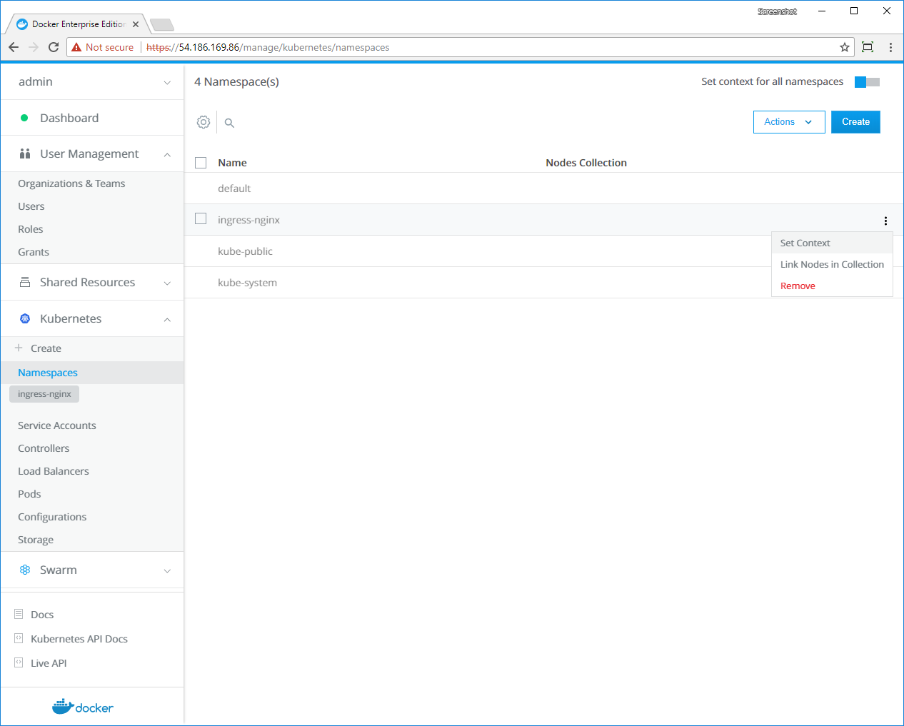
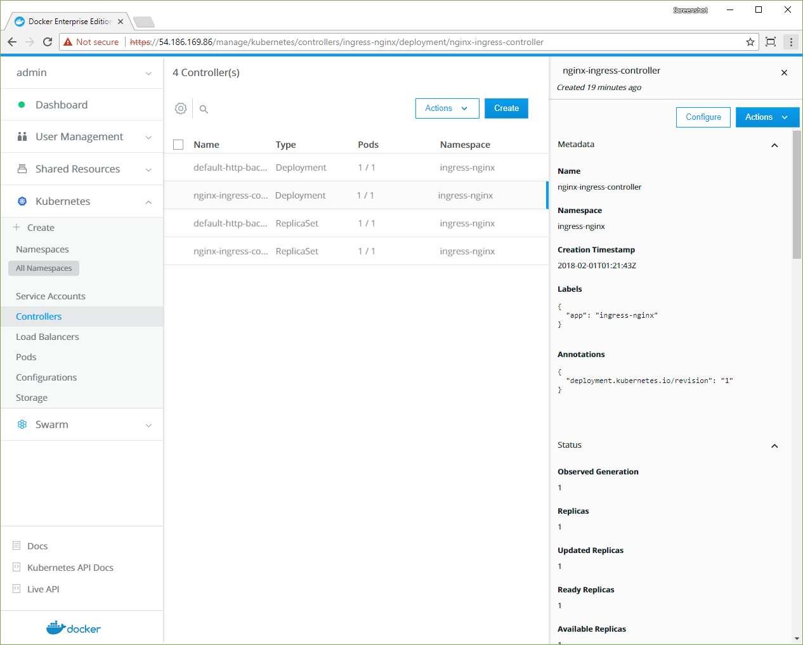
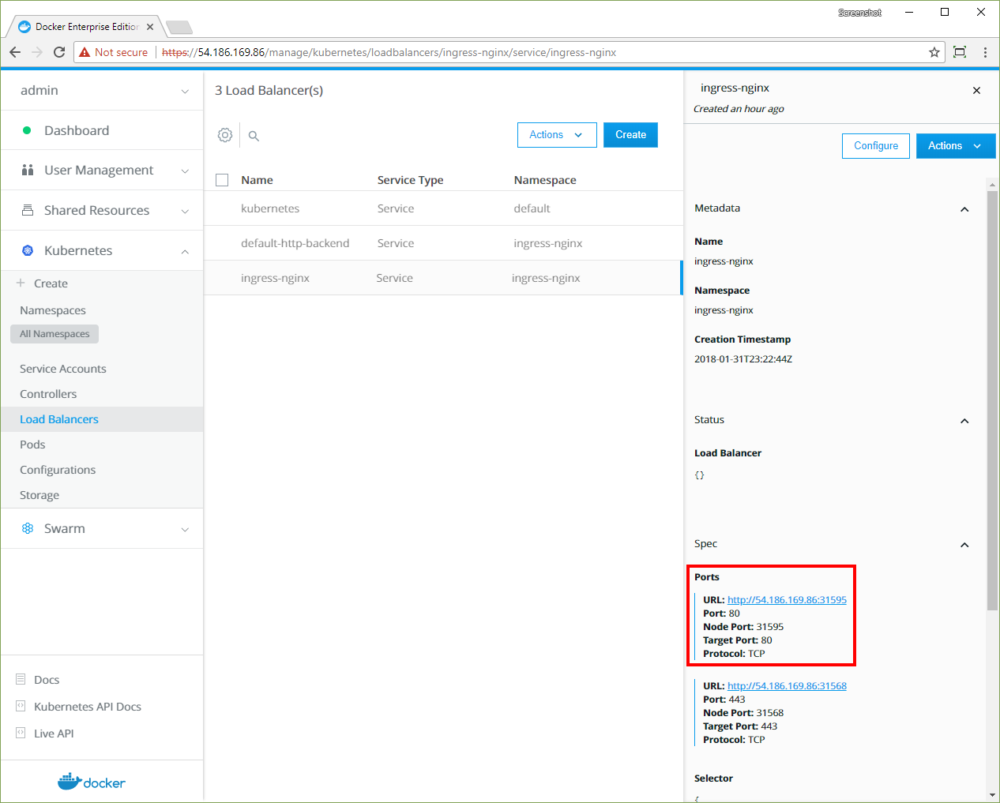

When you deploy your Kubernetes app on a Docker EE cluster, you may want to
expose a service that enables external users to connect to it. Also, you may
want network communication to reference named hosts, instead of IP addresses.
Kubernetes provides *ingress controllers* to enable these functions. 

Use an ingress controller when you want to: 

- give your Kubernetes app an externally-reachable URL,
- load-balance traffic to your app, or
- offer name-based hosting.

Kubernetes provides an NGINX ingress controller that you can use in a Docker EE
cluster, without modifications. 
Learn about [ingress in Kubernetes](https://v1-8.docs.kubernetes.io/docs/concepts/services-networking/ingress/).

> Routing for Swarm apps
>
> To enable similar features for Swarm apps, see [Layer 7 routing](../interlock/index.md).
{: .important}

## Create the Kubernetes namespace for the ingress controller

1.  Navigate to the **Namespaces** page and click **Create**.
2.  In the **Object YAML** editor, append the following text.
    ```yaml
    metadata:
      name: ingress-nginx
    ```

    The finished YAML should look like this. 

    ```yaml
    apiVersion: v1
    kind: Namespace
    metadata:
      name: ingress-nginx
    ```
3.  Click **Create**.
4.  In the **ingress-nginx** namespace, click the **More options** icon,
    and in the context menu, select **Set Context**.

    {: .with-border}

## Create a grant

The default service account that's associated with the `ingress-nginx`
namespace needs access to Kubernetes resources, so create a grant with
`Restricted Control` permissions.

1.  Navigate to the **Grants** page and click **Create Grant**.
2.  In the left pane, click **Resource Sets**, and in the **Type** section,
    click **Namespaces**.
3.  Enable the **Apply grant to all existing and new namespaces** option.
4.  In the left pane, click **Roles**. In the **Role** dropdown, select
    **Restricted Control**.
5.  In the left pane, click **Subjects**, and select **Service Account**.
6.  In the **Namespace** dropdown, select **ingress-nginx**, and in the
    **Service Account** dropdown., select **default**.
7.  Click **Create**.

> Ingress and role-based access control
>
> Docker EE has an access control system that differs from Kubernetes RBAC.
> If your ingress controller has access control requirements, you need to 
> create corresponding UCP grants. Learn to
> [migrate Kubernetes roles to Docker EE authorization](../authorization/migrate-kubernetes-roles.md).
{: .important}

## Install the NGINX ingress controller

The cluster is ready for the ingress controller deployment, which has three
main components:

- a simple HTTP server, named `default-http-backend`,
- an ingress controller, named `nginx-ingress-controller`, and
- a service that exposes the app, named `ingress-nginx`.

Navigate to the **Create Kubernetes Object** page, and in the **Object YAML** 
editor, paste the following YAML.

```yaml
apiVersion: extensions/v1beta1
kind: Deployment
metadata:
  name: default-http-backend
  labels:
    app: default-http-backend
  namespace: ingress-nginx
spec:
  replicas: 1
  template:
    metadata:
      labels:
        app: default-http-backend
    spec:
      terminationGracePeriodSeconds: 60
      containers:
      - name: default-http-backend
        # Any image is permissable as long as:
        # 1. It serves a 404 page at /
        # 2. It serves 200 on a /healthz endpoint
        image: gcr.io/google_containers/defaultbackend:1.4
        livenessProbe:
          httpGet:
            path: /healthz
            port: 8080
            scheme: HTTP
          initialDelaySeconds: 30
          timeoutSeconds: 5
        ports:
        - containerPort: 8080
        resources:
          limits:
            cpu: 10m
            memory: 20Mi
          requests:
            cpu: 10m
            memory: 20Mi
---
apiVersion: v1
kind: Service
metadata:
  name: default-http-backend
  namespace: ingress-nginx
  labels:
    app: default-http-backend
spec:
  ports:
  - port: 80
    targetPort: 8080
  selector:
    app: default-http-backend
---
kind: ConfigMap
apiVersion: v1
metadata:
  name: nginx-configuration
  namespace: ingress-nginx
  labels:
    app: ingress-nginx
---
kind: ConfigMap
apiVersion: v1
metadata:
  name: tcp-services
  namespace: ingress-nginx
---
kind: ConfigMap
apiVersion: v1
metadata:
  name: udp-services
  namespace: ingress-nginx
---
apiVersion: extensions/v1beta1
kind: Deployment
metadata:
  name: nginx-ingress-controller
  namespace: ingress-nginx 
spec:
  replicas: 1
  selector:
    matchLabels:
      app: ingress-nginx
  template:
    metadata:
      labels:
        app: ingress-nginx
      annotations:
        prometheus.io/port: '10254'
        prometheus.io/scrape: 'true' 
    spec:
      initContainers:
      - command:
        - sh
        - -c
        - sysctl -w net.core.somaxconn=32768; sysctl -w net.ipv4.ip_local_port_range="1024 65535"
        image: alpine:3.6
        imagePullPolicy: IfNotPresent
        name: sysctl
        securityContext:
          privileged: true
      containers:
        - name: nginx-ingress-controller
          image: quay.io/kubernetes-ingress-controller/nginx-ingress-controller:0.10.2
          args:
            - /nginx-ingress-controller
            - --default-backend-service=$(POD_NAMESPACE)/default-http-backend
            - --configmap=$(POD_NAMESPACE)/nginx-configuration
            - --tcp-services-configmap=$(POD_NAMESPACE)/tcp-services
            - --udp-services-configmap=$(POD_NAMESPACE)/udp-services
            - --annotations-prefix=nginx.ingress.kubernetes.io
          env:
            - name: POD_NAME
              valueFrom:
                fieldRef:
                  fieldPath: metadata.name
            - name: POD_NAMESPACE
              valueFrom:
                fieldRef:
                  fieldPath: metadata.namespace
          ports:
          - name: http
            containerPort: 80
          - name: https
            containerPort: 443
          livenessProbe:
            failureThreshold: 3
            httpGet:
              path: /healthz
              port: 10254
              scheme: HTTP
            initialDelaySeconds: 10
            periodSeconds: 10
            successThreshold: 1
            timeoutSeconds: 1
          readinessProbe:
            failureThreshold: 3
            httpGet:
              path: /healthz
              port: 10254
              scheme: HTTP
            periodSeconds: 10
            successThreshold: 1
            timeoutSeconds: 1
---
apiVersion: v1
kind: Service
metadata:
  name: ingress-nginx
  namespace: ingress-nginx
spec:
  type: NodePort
  ports:
  - name: http
    port: 80
    targetPort: 80
    protocol: TCP
  - name: https
    port: 443
    targetPort: 443
    protocol: TCP
  selector:
    app: ingress-nginx
```

## Inspect the installation

The `default-http-backend` provides a simple service that serves a 404 page
at `/` and serves 200 on the `/healthz` endpoint.

1.  Navigate to the **Controllers** page and confirm that the
    **default-http-backend** and **nginx-ingress-controller** objects are
    scheduled. 

    > Scheduling latency
    >
    > It may take several seconds for the HTTP backend and the ingress controller's
    > `Deployment` and `ReplicaSet` objects to be scheduled.
    {: .important}

    {: .with-border}

2.  When the workload is running, navigate to the **Load Balancers** page
    and click the **ingress-nginx** service.

    {: .with-border}

3.  In the details pane, click the first URL in the **Ports** section.

    A new page opens, displaying `default backend - 404`.

## Inspect the installation in the CLI

From the command line, confirm that the deployment is running by using
`curl` with the URL that's shown on the details pane of the **ingress-nginx**
service.

```bash
curl -I http://<ucp-ip>:<ingress port>/
```

This command returns the following result.

```
HTTP/1.1 404 Not Found
Server: nginx/1.13.8
```

Test the server's health ping service by appending `/healthz` to the URL.

```bash
curl -I http://<ucp-ip>:<ingress port>/healthz
```

This command returns the following result.

```
HTTP/1.1 200 OK
Server: nginx/1.13.8
```
