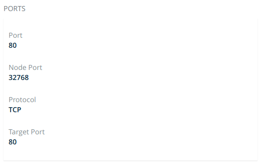

Docker Enterprise Edition enables deploying [Docker Compose](/compose/overview.md/)
files to Kubernetes clusters. Starting in Compose file version 3.3, you use the
same `docker-compose.yml` file that you use for Swarm deployments, but you
specify **Kubernetes workloads** when you deploy the stack. The result is a
true Kubernetes app.

## Get access to a Kubernetes namespace

To deploy a stack to Kubernetes, you need a namespace for the app's resources.
Contact your Docker EE administrator to get access to a namespace. In this
example, the namespace is called `labs`.
[Learn how to grant access to a Kubernetes namespace](../authorization/grant-permissions/#kubernetes-grants).

## Create a Kubernetes app from a Compose file

In this example, you create a simple app, named "lab-words", by using a Compose
file. This assumes you are deploying onto a cloud infrastructure. The following YAML defines the stack:

```yaml
version: '3.3'

services:
  web:
    build: web
    image: dockersamples/k8s-wordsmith-web
    ports:
     - "8080:80"

  words:
    build: words
    image: dockersamples/k8s-wordsmith-api
    deploy:
      replicas: 5

  db:
    build: db
    image: dockersamples/k8s-wordsmith-db
```

1.  In your browser, log in to `https://<ucp-url>`. Navigate to **Shared Resources > Stacks**.
2.  Click **Create Stack** to open up the "Create Application" page.
3.  Under "Configure Application", type "lab-words" for the application name.
4.  Select **Kubernetes Workloads** for **Orchestrator Mode**.
5.  In the **Namespace** drowdown, select "labs".
6.  Under "Application File Mode", leave **Compose File** selected and click **Next**.
7.  Paste the previous YAML, then click **Create** to deploy the stack.
    {: .with-border}


## Inspect the deployment

After a few minutes have passed, all of the pods in the `lab-words` deployment
are running.

1.  Navigate to **Kubernetes > Pods**. Confirm that there are seven pods and
    that their status is **Running**. If any pod has a status of **Pending**,
    wait until every pod is running.
2.  Next, select **Kubernetes > Load balancers** and find the **web-published** service.
4.  Click the **web-published** service, and scroll down to the
    **Ports** section.
5.  Under **Ports**, grab the Node Port information.

    {: .with-border}

6.  In a new tab or window, enter your cloud instance public IP Address and append `:<NodePort>` from the previous step. For example, to find the public IP address of an EC2 instance, refer to [Amazon EC2 Instance IP Addressing](https://docs.aws.amazon.com/AWSEC2/latest/WindowsGuide/using-instance-addressing.html#concepts-public-addresses). The app is displayed. 

    {: .with-border}
