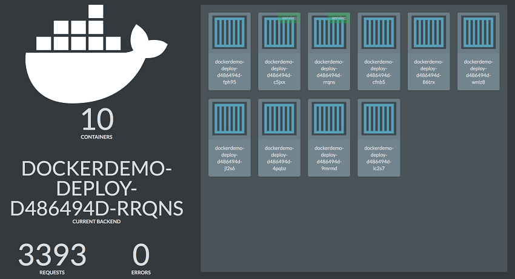

## Overview

When you deploy a Kubernetes application, you may want to make it accessible
to users using hostnames instead of IP addresses.

Kubernetes provides **ingress controllers** for this. This functionality is
specific to Kubernetes. If you're trying to route traffic to Swarm-based
applications, check [layer 7 routing with Swarm](../interlock/index.md).

Use an ingress controller when you want to:

* Give your Kubernetes app an externally-reachable URL.
* Load-balance traffic to your app.

Ingress is an API object that manages external access to the services in a cluster, typically HTTP. In UCP 3.1, Ingress must be deployed separately. There are a variety of ingress controllers, but for UCP, the supported one is the [NGINX Ingress Controller](https://github.com/kubernetes/ingress-nginx). The following instructions provide highly-available production deployment of this controller. 

## Prerequisites

- UCP deployed and properly configured
- Two or three dedicated infrae nodes deployed as UCP worker nodes
- An external load-balancer fronting these nodes with an associated VIP that resolves the application DNS (for example, `*.app.docker.mycompany.com`)

### Step 1: Labeling infrastructure nodes

To deploy the NGINX controller on the infra nodes, the nodes must be labeled. Identify 2 or 3 nodes as the infra nodes to host the ingress controller. The following example uses three nodes: `dockeree-worker-linux-1`, `dockeree-worker-linux-2`, and `dockeree-worker-linux-3`:

```
 🐳  → kubectl get nodes
NAME                           STATUS    ROLES     AGE       VERSION
dockeree-worker-linux-1    Ready     <none>    5d        v1.8.11-docker-8d637ae
dockeree-worker-linux-2    Ready     <none>    5d        v1.8.11-docker-8d637ae
dockeree-worker-linux-3    Ready     <none>    5d        v1.8.11-docker-8d637ae

```

For this example, the label `infra.role=ingress` is used to label the nodes:

```
🐳  → kubectl label node dockeree-worker-linux-1 infra.role=ingress
node "dockeree-worker-linux-1" labeled
🐳  → kubectl label node dockeree-worker-linux-2 infra.role=ingress
node "dockeree-worker-linux-2" labeled
🐳  → kubectl label node dockeree-worker-linux-3 infra.role=ingress
node "dockeree-worker-linux-3" labeled

```

### Step 2: Create a Dedicated Namespace

A dedicated namespace, for example, `infra`, is needed for all infrastructure deployment activities. You also need a service account to enable the ingress controller to work with the Kubernetes API. After creating a namespace and a service account, you must create an RBAC policy to only allow infrastructure deployments on the dedicated nodes that were labelled in the previous example.

To create a namespace and a service account, simply use the following [YAML file](config/ns-and-sa.yaml) and apply it via the CLI or the UI:

```
🐳  → cat ns-and-sa.yaml
apiVersion: v1
kind: Namespace
metadata:
  name: infra
---
apiVersion: v1
kind: ServiceAccount
metadata:
  name: nginx-ingress-service-account
  namespace: infra
```

Then apply the namespace and service account via `kubectl`:

```
🐳  → kubectl apply -f ns-and-sa.yaml
namespace "infra" created
serviceaccount "nginx-ingress-service-account" created

```

### Step 3: Create an RBAC Policy

Apply an RBAC role-binding for NGINX controller access to the API Server, as shown in the following example:


```
🐳  → cat ingress-rbac.yaml
## Source: https://github.com/nginxinc/kubernetes-ingress/blob/master/deployments/rbac/rbac.yaml
kind: ClusterRole
apiVersion: rbac.authorization.k8s.io/v1beta1
metadata:
  name: nginx-ingress-cluster-role
rules:
- apiGroups:
  - ""
  resources:
  - services
  - endpoints
  verbs:
  - get
  - list
  - watch
- apiGroups:
  - ""
  resources:
  - secrets
  verbs:
  - get
  - list
  - watch
- apiGroups:
  - ""
  resources:
  - configmaps
  verbs:
  - get
  - list
  - watch
  - update
  - create
- apiGroups:
  - ""
  resources:
  - pods
  verbs:
  - list
- apiGroups:
  - ""
  resources:
  - events
  verbs:
  - create
  - patch
- apiGroups:
  - extensions
  resources:
  - ingresses
  verbs:
  - list
  - watch
  - get
- apiGroups:
  - "extensions"
  resources:
  - ingresses/status
  verbs:
  - update
---
kind: ClusterRoleBinding
apiVersion: rbac.authorization.k8s.io/v1beta1
metadata:
  name: nginx-ingress-cluster-rb
subjects:
- kind: ServiceAccount
  name: nginx-ingress-service-account
  namespace: infra
roleRef:
  kind: ClusterRole
  name: nginx-ingress-cluster-role
  apiGroup: rbac.authorization.k8s.io
```

Then apply it with `kubectl`:

```
🐳  → kubectl apply -f ingress-rbac.yaml
```

### Step 4: Deploy NGINX Controller

Note that following example uses hostPorts for controller ports. This exposes the host port ( selected in a high range using `hostPort: 38080`) directly into the nodes. Port 38080 is used for HTTP and port 38443 is used for HTTPS. Make sure that your loadbalancer forwards to the applicable ports on the nodes. You can change them as needed.


```
🐳  → cat nginx-ingress-deployment.yaml
apiVersion: extensions/v1beta1
kind: Deployment
metadata:
  name: default-http-backend
  labels:
    app: default-http-backend
  namespace: infra
spec:
  replicas: 3
  template:
    metadata:
      labels:
        app: default-http-backend
    spec:
      terminationGracePeriodSeconds: 60
      containers:
      - name: default-http-backend
        image: gcr.io/google_containers/defaultbackend:1.4
        livenessProbe:
          httpGet:
            path: /healthz
            port: 8080
            scheme: HTTP
          initialDelaySeconds: 30
          timeoutSeconds: 5
        ports:
        - containerPort: 8080
        resources:
          limits:
            cpu: 10m
            memory: 20Mi
          requests:
            cpu: 10m
            memory: 20Mi
      nodeSelector:
       infra.role: ingress
---
apiVersion: v1
kind: Service
metadata:
  name: default-http-backend
  namespace: infra
  labels:
    app: default-http-backend
spec:
  ports:
  - port: 80
    targetPort: 8080
  selector:
    app: default-http-backend
---
kind: ConfigMap
apiVersion: v1
metadata:
  name: nginx-configuration
  namespace: infra
  labels:
    app: ingress-nginx
---
kind: ConfigMap
apiVersion: v1
metadata:
  name: tcp-services
  namespace: infra
---
kind: ConfigMap
apiVersion: v1
metadata:
  name: udp-services
  namespace: infra
---
apiVersion: extensions/v1beta1
kind: Deployment
metadata:
  name: nginx-ingress-controller
  namespace: infra
spec:
  replicas: 3
  selector:
    matchLabels:
      app: ingress-nginx
  template:
    metadata:
      labels:
        app: ingress-nginx
      annotations:
        prometheus.io/port: '10254'
        prometheus.io/scrape: 'true'
    spec:
      initContainers:
      - command:
        - sh
        - -c
        - sysctl -w net.core.somaxconn=32768; sysctl -w net.ipv4.ip_local_port_range="1024 65535"
        image: alpine:3.6
        imagePullPolicy: IfNotPresent
        name: sysctl
        securityContext:
          privileged: true
      serviceAccountName: nginx-ingress-service-account 
      containers:
        - name: nginx-ingress-controller
          image: quay.io/kubernetes-ingress-controller/nginx-ingress-controller:0.21.0
          args:
            - /nginx-ingress-controller
            - --default-backend-service=$(POD_NAMESPACE)/default-http-backend
            - --configmap=$(POD_NAMESPACE)/nginx-configuration
            - --tcp-services-configmap=$(POD_NAMESPACE)/tcp-services
            - --udp-services-configmap=$(POD_NAMESPACE)/udp-services
            - --annotations-prefix=nginx.ingress.kubernetes.io
          env:
            - name: POD_NAME
              valueFrom:
                fieldRef:
                  fieldPath: metadata.name
            - name: POD_NAMESPACE
              valueFrom:
                fieldRef:
                  fieldPath: metadata.namespace
          ports:
          - name: http
            containerPort: 80
            hostPort: 38443
            protocol: TCP
          - name: https
            containerPort: 443
            hostPort: 38443
            protocol: TCP
          livenessProbe:
            failureThreshold: 3
            httpGet:
              path: /healthz
              port: 10254
              scheme: HTTP
            initialDelaySeconds: 10
            periodSeconds: 10
            successThreshold: 1
            timeoutSeconds: 1
          readinessProbe:
            failureThreshold: 3
            httpGet:
              path: /healthz
              port: 10254
              scheme: HTTP
            periodSeconds: 10
            successThreshold: 1
            timeoutSeconds: 1
      nodeSelector:
        infra.role: ingress
```

Deploy the controller using `kubectl` and verify pods are deployed successfully:

```
🐳  → kubectl apply -f nginx-ingress-deployment.yaml
deployment.extensions "default-http-backend" created
service "default-http-backend" created
configmap "nginx-configuration" created
configmap "tcp-services" created
configmap "udp-services" created
deployment.extensions "nginx-ingress-controller" created

 🐳  → kubectl get pod -n infra -o wide
NAME                                        READY     STATUS    RESTARTS   AGE       IP                NODE
default-http-backend-7ff9774865-hsj46       1/1       Running   0          1m        192.168.145.6     dockeree-worker-linux-1
default-http-backend-7ff9774865-kcqhj       1/1       Running   0          1m        192.168.116.145   dockeree-worker-linux-3
default-http-backend-7ff9774865-xq566       1/1       Running   0          1m        192.168.247.210   dockeree-worker-linux-2
nginx-ingress-controller-6b987cbbc6-4qqz8   1/1       Running   0          1m        192.168.145.7     dockeree-worker-linux-1
nginx-ingress-controller-6b987cbbc6-h6rmg   1/1       Running   0          1m        192.168.116.146   dockeree-worker-linux-3
nginx-ingress-controller-6b987cbbc6-hkw86   1/1       Running   0          1m        192.168.247.211   dockeree-worker-linux-2
```

### Step 5: Deploy an application and its ingress rule

After the controller is successfully deployed, you can create ingress objects to expose applications externally. The following example application deployment uses deployment yaml consisting of `Service` and `Deployment` objects that deploy the application with the Docker image `ehazlett/docker-demo` and create a service associated with it.


```
🐳  → cat dockerdemo.yaml

kind: Service
apiVersion: v1
metadata:
  namespace: default
  name: docker-demo-svc
spec:
  selector:
    app: dockerdemo
  ports:
  - protocol: TCP
    port: 8080
    targetPort: 8080
---
apiVersion: apps/v1beta2
kind: Deployment
metadata:
  namespace: default
  name: dockerdemo-deploy
  labels:
    app: dockerdemo
spec:
  selector:
    matchLabels:
      app: dockerdemo
  strategy:
    type: Recreate
  template:
    metadata:
      labels:
        app: dockerdemo
    spec:
      containers:
      - image: ehazlett/docker-demo
        name: docker-demo-container
        env:
        - name: app
          value: dockerdemo
        ports:
        - containerPort: 8080
```


To expose this application with a valid URL, for example, `dockerdemo.app.docker.example.com`, you must create an `Ingress` rule. The ingress rule is used by the NGINX controller to generate the proper NGINX configuration for proper load-balancing. For example:

```
🐳  → cat dockerdemo.ingress.yaml

apiVersion: extensions/v1beta1
kind: Ingress
metadata:
  name: dockerdemo-ingress
  namespace: default
  annotations:
    kubernetes.io/ingress.class: "nginx"
spec:
  rules:
  - host: dockerdemo.app.docker.example.com
    http:
      paths:
      - path: /
        backend:
          serviceName: docker-demo-svc
          servicePort: 8080
```

```
 🐳  → kubectl apply -f dockerdemo.ingress.yaml
```

You can apply ingress rules separately or combine them with the application deployment yaml file.

```

 🐳  → kubectl get ingress
NAME                          HOSTS                                          ADDRESS   PORTS     AGE
dockerdemo-ingress   dockerdemo.app.docker.example.com             80        7d
```

Assuming you have already registered a DNS record for your application pointing to the external load-balancer fronting the `infra` nodes, you should be able to access your application using the URL.You can also scale the docker demo deployment to test how ingress correctly routes traffic to all the backend pods!


