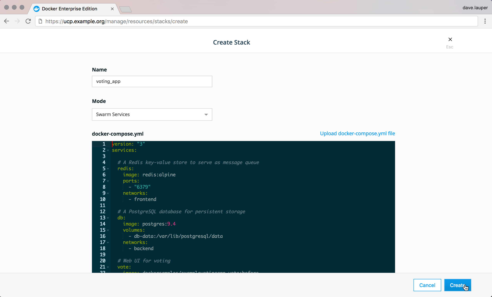
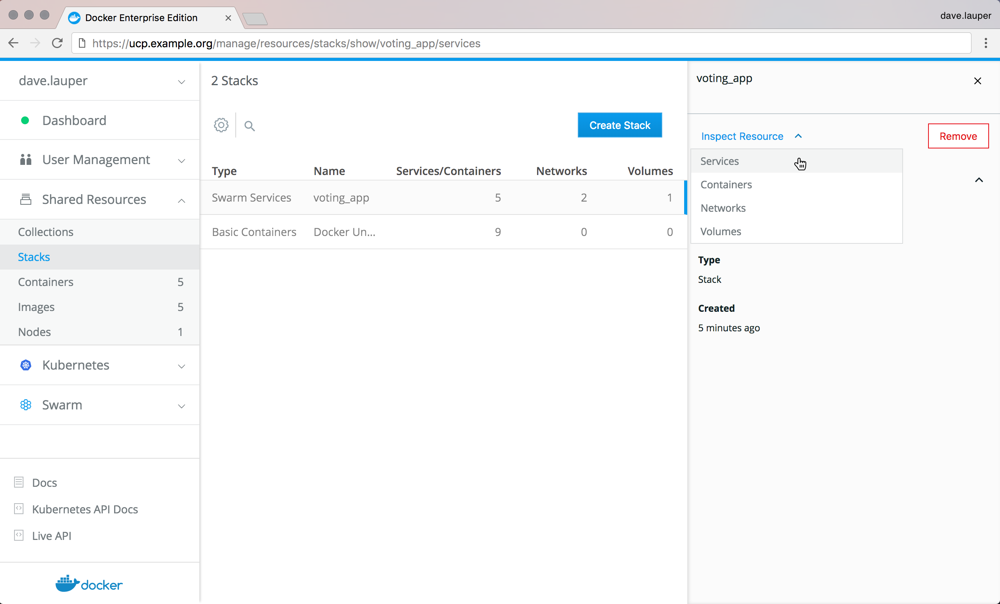
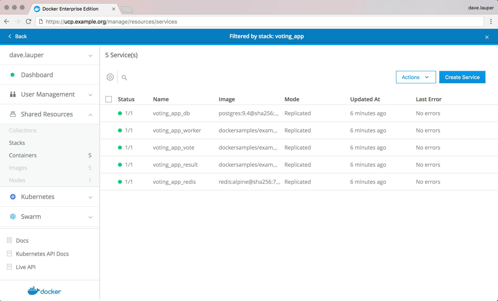

Docker Universal Control Plane allows you to use the tools you already know,
like `docker stack deploy` to deploy multi-service applications. You can
also deploy your applications from the UCP web UI.

In this example we'll deploy a multi-service application that allows users to
vote on whether they prefer cats or dogs.

```yaml
version: "3"
services:

  # A Redis key-value store to serve as message queue
  redis:
    image: redis:alpine
    ports:
      - "6379"
    networks:
      - frontend

  # A PostgreSQL database for persistent storage
  db:
    image: postgres:9.4
    volumes:
      - db-data:/var/lib/postgresql/data
    networks:
      - backend

  # Web UI for voting
  vote:
    image: dockersamples/examplevotingapp_vote:before
    ports:
      - 5000:80
    networks:
      - frontend
    depends_on:
      - redis

  # Web UI to count voting results
  result:
    image: dockersamples/examplevotingapp_result:before
    ports:
      - 5001:80
    networks:
      - backend
    depends_on:
      - db

  # Worker service to read from message queue
  worker:
    image: dockersamples/examplevotingapp_worker
    networks:
      - frontend
      - backend

networks:
  frontend:
  backend:

volumes:
  db-data:
```

## From the web UI

To deploy your applications from the **UCP web UI**, on the left navigation bar
expand **Shared resources**, choose **Stacks**, and click **Create stack**.

{: .with-border}

Choose the name you want for your stack, and choose **Swarm services** as the
deployment mode.

When you choose this option, UCP deploys your app using the
Docker swarm built-in orchestrator. If you choose 'Basic containers' as the
deployment mode, UCP deploys your app using the classic Swarm orchestrator.

Then copy-paste the application definition in docker-compose.yml format.

{: .with-border}

Once you're done click **Create** to deploy the stack.

## From the CLI

To deploy the application from the CLI, start by configuring your Docker
CLI using a [UCP client bundle](../user-access/cli.md).

Then, create a file named `docker-stack.yml` with the content of the yaml above,
and run:


<ul class="nav nav-tabs">
  <li class="active"><a data-toggle="tab" data-target="#tab1">Swarm orchestrator</a></li>
  <li><a data-toggle="tab" data-target="#tab2">Classic Swarm orchestrator</a></li>
</ul>
<div class="tab-content">
  <div id="tab1" class="tab-pane fade in active" markdown="1">
```
docker stack deploy --compose-file voting_app
```
  </div>
  <div id="tab2" class="tab-pane fade" markdown="1">
```
docker-compose --file docker-compose.yml --project-name voting_app up -d
```
  </div>
</div>


## Check your app

Once the multi-service application is deployed, it shows up in the UCP web UI.
The 'Stacks' page shows that you've deployed the voting app.

{: .with-border}

You can also inspect the individual services of the app you deployed. For that,
click the **voting_app** to open the details pane, open **Inspect resources** and
choose **Services**, since this app was deployed with the built-in Docker swarm
orchestrator.

{: .with-border}

You can also use the Docker CLI to check the status of your app:

```
docker stack ps voting_app
```

Great! The app is deployed so we can cast votes by accessing the service that's
listening on port 5000.
You don't need to know the ports a service listens to. You can
**click the voting_app_vote** service and click on the **Published endpoints**
link.

{: .with-border}

## Limitations

When deploying applications from the web UI, you can't reference any external
files, no matter if you're using the built-in swarm orchestrator or classic
Swarm. For that reason, the following keywords are not supported:

* build
* dockerfile
* env_file

Also, UCP doesn't store the stack definition you've used to deploy the stack.
You can use a version control system for this.

