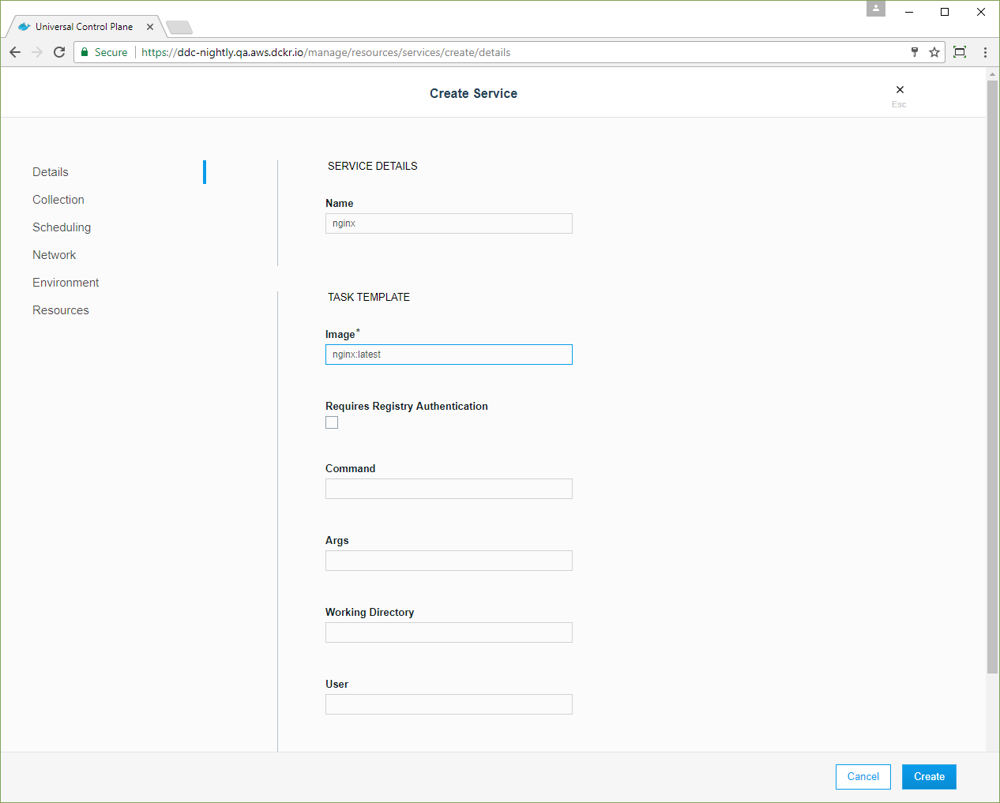
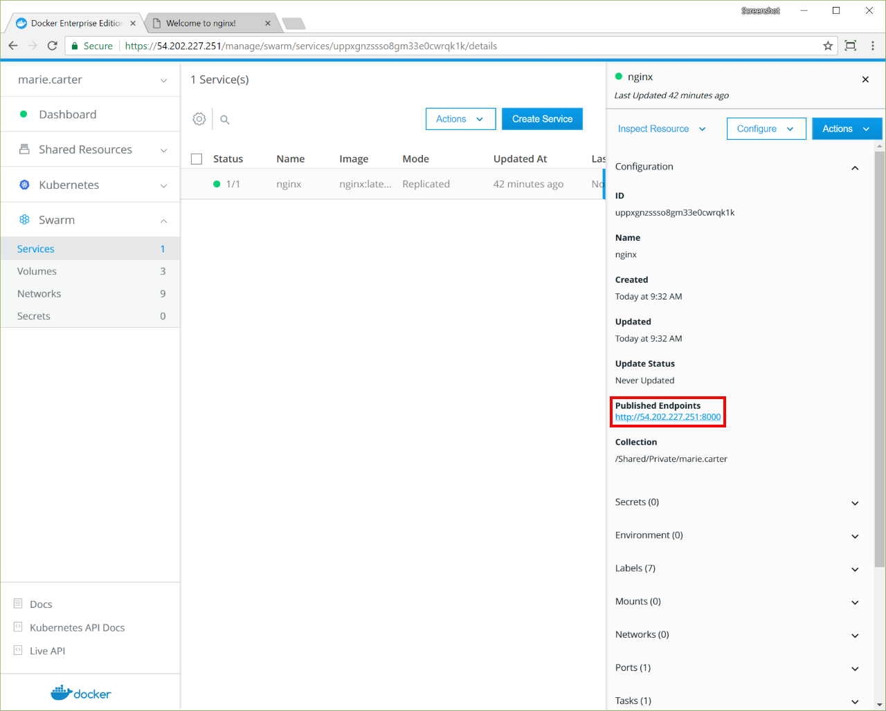

>

You can deploy and monitor your services from the UCP web UI. In this example, we'll deploy an [NGINX](https://www.nginx.com/) web server and make it
accessible on port `8000`.

To deploy a single service:

1. In your browser, navigate to the UCP web UI and click **Services**. The **Create a Service** page opens.
2. Click **Create Service** to configure the
NGINX service.

3. Complete the fields according to the information provided in the following table:

    | Field        | Value        |
    |:-------------|:-------------|
    | Service name | nginx        |
    | Image name   | nginx:latest |

    {: .with-border}
4. In the left pane, click **Network**. 
5. In the **Ports** section,
click **Publish Port** and complete the following fields:

    | Field          | Value   |
    |:---------------|:--------|
    | Target port    | 80      |
    | Protocol       | tcp     |
    | Publish mode   | Ingress |
    | Published port | 8000    |

    {: .with-border}
6. Click **Confirm** to map the ports for the NGINX service.
7. Specify the service image and ports, and click **Create** to
deploy the service into the UCP cluster.

    {: .with-border}

Once the service is up and running, you can view the default NGINX
page by going to `http://<node-ip>:8000`. In the **Services** list, click the
**nginx** service, and in the details pane, click the link under
**Published Endpoints**. 

{: .with-border}

Clicking the link opens a new tab that shows the default NGINX home page. 

{: .with-border}

## Use the CLI to deploy the service

You can also deploy the same service from the CLI. Once you've set up your
UCP client bundle, enter the following command:

```bash
docker service create --name nginx \
  --publish mode=ingress,target=80,published=8000 \
  --label com.docker.ucp.access.owner=<your-username> \
  nginx
```
For more information about UCP client bundles, see [CLI-based access](../user-access/cli.md).

## Where to go next
* [Deploy a multi-service app](https://docs.docker.com/ee/ucp/swarm/deploy-multi-service-app/)
* [Deploy application resources to a collection](https://docs.docker.com/ee/ucp/swarm/deploy-to-collection/)