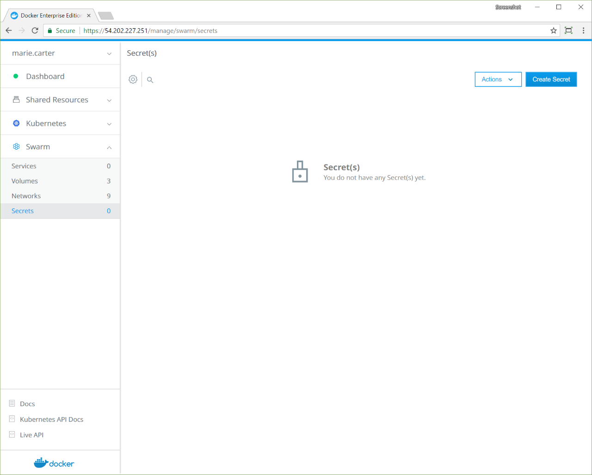

When deploying and orchestrating services, you often need to configure them
with sensitive information like passwords, TLS certificates, or private keys.

Universal Control Plane allows you to store this sensitive information, also
known as *secrets*, in a secure way. It also gives you role-based access control
so that you can control which users can use a secret in their services
and which ones can manage the secret.

UCP extends the functionality provided by Docker Engine, so you can continue
using the same workflows and tools you already use, like the Docker CLI client.
[Learn how to use secrets with Docker](/engine/swarm/secrets/).

In this example, we're going to deploy a WordPress application that's composed of
two services:

* wordpress: The service that runs Apache, PHP, and WordPress
* wordpress-db: a MySQL database used for data persistence

Instead of configuring our services to use a plain text password stored in an
environment variable, we're going to create a secret to store the password.
When we deploy those services, we'll attach the secret to them, which creates
a file with the password inside the container running the service.
Our services will be able to use that file, but no one else will be able
to see the plain text password.

To make things simpler, we're not going to configure the database service to
persist data. When the service stops, the data is lost.

## Create a secret

In the UCP web UI, open the **Swarm** section and click **Secrets**.

{: .with-border}

Click **Create Secret** to create a new secret. Once you create the secret
you won't be able to edit it or see the secret data again.

{: .with-border}

Assign a unique name to the secret and set its value. You can optionally define
a permission label so that other users have permission to use this secret. Also
note that a service and secret must have the same permission label, or both
must have no permission label at all, in order to be used together.

In this example, the secret is named `wordpress-password-v1`, to make it easier
to track which version of the password our services are using.

## Use secrets in your services

Before creating the MySQL and WordPress services, we need to create the network
that they're going to use to communicate with one another.

Navigate to the **Networks** page, and create the `wordpress-network` with the
default settings.

{: .with-border}

Now create the MySQL service:

1. Navigate to the **Services** page and click **Create Service**. Name the
   service "wordpress-db", and for the **Task Template**, use the "mysql:5.7"
   image.
2. In the left pane, click **Network**. In the **Networks** section, click
   **Attach Network**, and in the dropdown, select **wordpress-network**.
3. In the left pane, click **Environment**. The Environment page is where you
   assign secrets, environment variables, and labels to the service.
4. In the **Secrets** section, click **Use Secret**, and in the **Secret Name**
   dropdown, select **wordpress-password-v1**. Click **Confirm** to associate
   the secret with the service.
5. In the **Environment Variable** section, click **Add Environment Variable** and enter
   the string "MYSQL_ROOT_PASSWORD_FILE=/run/secrets/wordpress-password-v1" to
   create an environment variable that holds the path to the password file in
   the container.
6. If you specified a permission label on the secret, you must set the same
   permission label on this service. If the secret doesn't have a permission
   label, then this service also can't have a permission label.
7. Click **Create** to deploy the MySQL service.

This creates a MySQL service that's attached to the `wordpress-network` network
and that uses the `wordpress-password-v1` secret. By default, this creates a file
with the same name at `/run/secrets/<secret-name>` inside the container running
the service.

We also set the `MYSQL_ROOT_PASSWORD_FILE` environment variable to configure
MySQL to use the content of the `/run/secrets/wordpress-password-v1` file as
the root password.

{: .with-border}

Now that the MySQL service is running, we can deploy a WordPress service that
uses MySQL as a storage backend:

1. Navigate to the **Services** page and click **Create Service**. Name the
   service "wordpress", and for the **Task Template**, use the
   "wordpress:latest" image.
2. In the left pane, click **Network**. In the **Networks** section, click
   **Attach Network**, and in the dropdown, select **wordpress-network**.
3. In the left pane, click **Environment**.
4. In the **Secrets** section, click **Use Secret**, and in the **Secret Name**
   dropdown, select **wordpress-password-v1**. Click **Confirm** to associate
   the secret with the service.
5. In the **Environment Variable**, click **Add Environment Variable** and enter
   the string "WORDPRESS_DB_PASSWORD_FILE=/run/secrets/wordpress-password-v1" to
   create an environment variable that holds the path to the password file in
   the container.
6. Add another environment variable and enter the string
   "WORDPRESS_DB_HOST=wordpress-db:3306".
7. If you specified a permission label on the secret, you must set the same
   permission label on this service. If the secret doesn't have a permission
   label, then this service also can't have a permission label.
8. Click **Create** to deploy the WordPress service.

{: .with-border}

This creates the WordPress service attached to the same network as the MySQL
service so that they can communicate, and maps the port 80 of the service to
port 8000 of the cluster routing mesh.

{: .with-border}

Once you deploy this service, you'll be able to access it using the
IP address of any node in your UCP cluster, on port 8000.

{: .with-border}

## Update a secret

If the secret gets compromised, you'll need to rotate it so that your services
start using a new secret. In this case, we need to change the password we're
using and update the MySQL and WordPress services to use the new password.

Since secrets are immutable in the sense that you can't change the data
they store after they are created, we can use the following process to achieve
this:

1. Create a new secret with a different password.
2. Update all the services that are using the old secret to use the new one
   instead.
3. Delete the old secret.

Let's rotate the secret we've created. Navigate to the **Secrets** page
and create a new secret named `wordpress-password-v2`.

{: .with-border}

This example is simple, and we know which services we need to update,
but in the real world, this might not always be the case.

Click the **wordpress-password-v1** secret. In the details pane,
click **Inspect Resource**, and in the dropdown, select **Services**.

{: .with-border}

Start by updating the `wordpress-db` service to stop using the secret
`wordpress-password-v1` and use the new version instead.

The `MYSQL_ROOT_PASSWORD_FILE` environment variable is currently set to look for
a file at `/run/secrets/wordpress-password-v1` which won't exist after we
update the service. So we have two options:

1. Update the environment variable to have the value
`/run/secrets/wordpress-password-v2`, or
2. Instead of mounting the secret file in `/run/secrets/wordpress-password-v2`
(the default), we can customize it to be mounted in`/run/secrets/wordpress-password-v1`
instead. This way we don't need to change the environment variable. This is
what we're going to do.

When adding the secret to the services, instead of leaving the **Target Name**
field with the default value, set it with `wordpress-password-v1`. This will make
the file with the content of `wordpress-password-v2` be mounted in
`/run/secrets/wordpress-password-v1`.

Delete the `wordpress-password-v1` secret, and click **Update**.

{: .with-border}

Then do the same thing for the WordPress service. After this is done, the
WordPress application is running and using the new password.

## Managing secrets through the CLI

You can find additional documentation on managing secrets through the CLI at [How Docker manages secrets](/engine/swarm/secrets/#read-more-about-docker-secret-commands).

