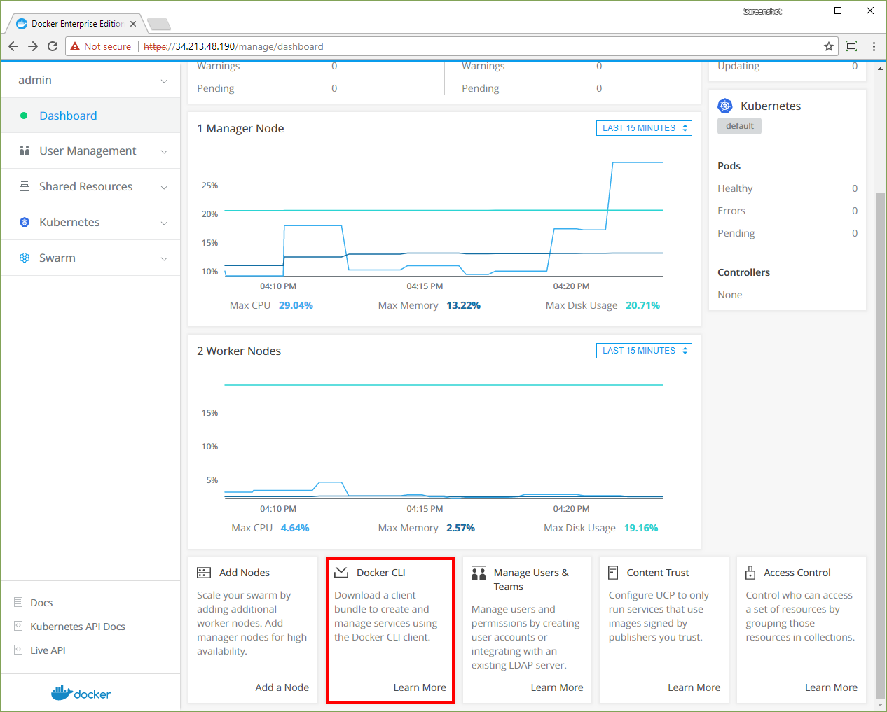
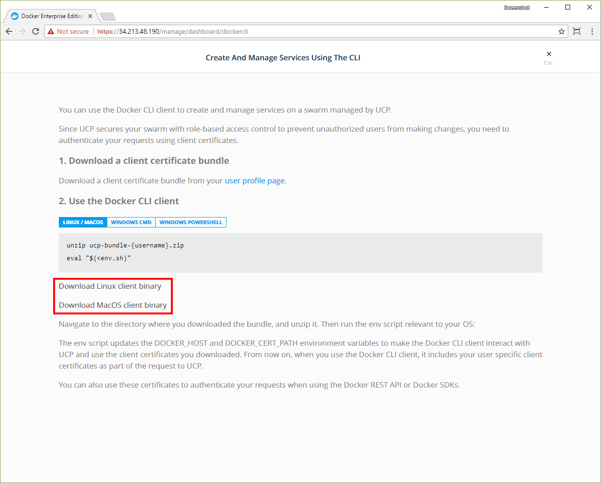
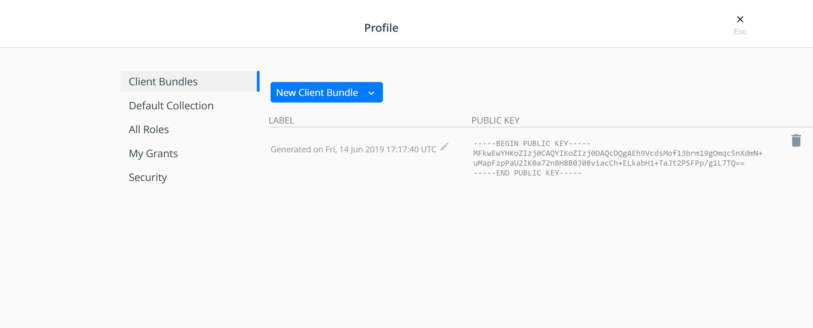

With Universal Control Plane you can continue using the tools you know and
love like the Docker CLI client and kubectl. You just need to download and use
a UCP client bundle.

A client bundle contains a private and public key pair that authorizes your
requests in UCP. It also contains utility scripts you can use to configure
your Docker and kubectl client tools to talk to your UCP deployment.

## Get the Docker CLI client

Download the Docker CLI client by using the UCP web UI. The web UI ensures that
you have the right version of the CLI tools for the current version of UCP.

1.  From the dashboard, click **Learn more** in the **Docker CLI** card at the
    bottom of the page.
    
    {: .with-border}

2.  On the **Create and manage services using the CLI** page, click 
    **Download Linux client binary** or **Download MacOS client binary**.

    {: .with-border}

3.  Unzip the `docker` archive.

## Download client certificates

To use the Docker CLI with UCP, download a client certificate bundle by using 
the UCP web UI.

1.  Navigate to the **My Profile** page.
2.  In the left pane, click **Client Bundles** and choose **New Client Bundle**
    to download the certificate bundle.

    {: .with-border}

## Use client certificates

Once you've downloaded a client certificate bundle to your local computer, you
can use it to authenticate your requests.

Navigate to the directory where you downloaded the user bundle, and extract the
zip file into a directory. Then use the utility script appropriate for your
system:

<ul class="nav nav-tabs">
  <li class="active"><a data-toggle="tab" data-target="#linux">Linux and macOS</a></li>
  <li><a data-toggle="tab" data-target="#cmd">Cmd</a></li>
  <li><a data-toggle="tab" data-target="#powershell">PowerShell</a></li>
</ul>
<div class="tab-content">
<div id="linux" class="tab-pane fade in active" markdown="1">
```bash
cd client-bundle && eval "$(<env.sh)"
```
<hr>
</div>
<div id="cmd" class="tab-pane fade" markdown="1">
```cmd
REM Run this from an elevated prompt session
cd client-bundle && env.cmd
```
<hr>
</div>
<div id="powershell" class="tab-pane fade" markdown="1">
```cmd
# Run this from an elevated PowerShell session
cd client-bundle; Import-Module .\env.ps1
```
<hr>
</div>
</div>

The client bundle utility scripts update the the environment variables
`DOCKER_HOST` to make your client tools communicate with your UCP deployment,
and the `DOCKER_CERT_PATH` environment variable to use the client certificates
that are included in the client bundle you downloaded. The utility scripts also
run the `kubectl config` command to configure kubectl.

To confirm that your client tools are now communicating with UCP, run:

<ul class="nav nav-tabs">
  <li class="active"><a data-toggle="tab" data-target="#docker">Docker</a></li>
  <li><a data-toggle="tab" data-target="#kube">Kubectl</a></li>
</ul>
<div class="tab-content">
<div id="docker" class="tab-pane fade in active" markdown="1">
```bash

docker version --format '{{.Server.Version}}'

{{ page.ucp_repo }}/{{ page.ucp_version }}
```
<hr>
</div>
<div id="kube" class="tab-pane fade" markdown="1">

```bash
kubectl config current-context
```
<hr>
</div>
</div>

You can now use the Docker and kubectl clients to create resources in UCP.

## Client certificates for administrators

UCP issues different types of certificates depending on the user:

* User certificate bundles: only allow running docker commands through a UCP
  manager node.
* Admin user certificate bundles: allow running docker commands on the
  Docker Engine of any node.

## Download client certificates by using the REST API

You can also download client bundles by using the
[UCP REST API](/reference/ucp/3.0/api/). In this example,
we use `curl` to make the web requests to the API, `jq` to parse the
responses, and `unzip` to unpack the zip archive.

To install these tools on an Ubuntu distribution, you can run:

```bash
sudo apt-get update && sudo apt-get install curl jq unzip
```

Then you get an authentication token from UCP and use it to download the
client certificates.

```bash
# Create an environment variable with the user security token
AUTHTOKEN=$(curl -sk -d '{"username":"<username>","password":"<password>"}' https://<ucp-ip>/auth/login | jq -r .auth_token)

# Download the client certificate bundle
curl -k -H "Authorization: Bearer $AUTHTOKEN" https://<ucp-ip>/api/clientbundle -o bundle.zip

# Unzip the bundle.
unzip bundle.zip

# Run the utility script.
eval "$(<env.sh)"
```

On Windows Server 2016, open an elevated PowerShell prompt and run:

```powershell
$AUTHTOKEN=((Invoke-WebRequest -Body '{"username":"<username>", "password":"<password>"}' -Uri https://`<ucp-ip`>/auth/login -Method POST).Content)|ConvertFrom-Json|select auth_token -ExpandProperty auth_token

[io.file]::WriteAllBytes("ucp-bundle.zip", ((Invoke-WebRequest -Uri https://`<ucp-ip`>/api/clientbundle -Headers @{"Authorization"="Bearer $AUTHTOKEN"}).Content))
 ```

## Where to go next

- [Deploy a service](../swarm.md)
