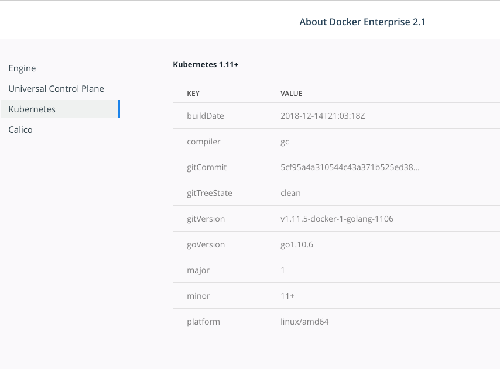

>

Docker Enterprise 2.0 and higher deploys Kubernetes as part of a UCP installation.
Deploy, manage, and monitor Kubernetes workloads from the UCP dashboard. Users can
also interact with the Kubernetes deployment through the Kubernetes
command-line tool named kubectl.

To access the UCP cluster with kubectl, install the [UCP client bundle](cli.md).

> Kubernetes on Docker Desktop for Mac and Docker Desktop for Windows
>
> Docker Desktop for Mac and Docker Desktop for Windows provide a standalone Kubernetes server that
> runs on your development machine, with kubectl installed by default. This installation is
> separate from the Kubernetes deployment on a UCP cluster.
> Learn how to [deploy to Kubernetes on Docker Desktop for Mac](/docker-for-mac/kubernetes.md).
{: .important}

## Install the kubectl binary

To use kubectl, install the binary on a workstation which has access to your UCP endpoint.

> Must install compatible version
>
> Kubernetes only guarantees compatibility with kubectl versions that are +/-1 minor versions away from the Kubernetes version.
{: .important}

First, find which version of Kubernetes is running in your cluster. This can be found
within the Universal Control Plane dashboard or at the UCP API endpoint [version](/reference/ucp/3.2/api/). You can also find the Kubernetes version using the Docker CLI. You need to source a client bundle and type the `docker version` command.

From the UCP dashboard, click **About** within the **Admin** menu in the top left corner
 of the dashboard. Then navigate to **Kubernetes**.

 {: .with-border}

Once you have the Kubernetes version, install the kubectl client for the relevant
operating system.

<ul class="nav nav-tabs">
  <li class="active"><a data-toggle="tab" data-target="#mac">Mac OS</a></li>
  <li><a data-toggle="tab" data-target="#linux">Linux</a></li>
  <li><a data-toggle="tab" data-target="#win">Windows</a></li>
</ul>
<div class="tab-content">
<div id="mac" class="tab-pane fade in active" markdown="1">
```
# Set the Kubernetes version as found in the UCP Dashboard or API
k8sversion=v1.11.5

# Get the kubectl binary.
curl -LO https://storage.googleapis.com/kubernetes-release/release/$k8sversion/bin/darwin/amd64/kubectl

# Make the kubectl binary executable.
chmod +x ./kubectl

# Move the kubectl executable to /usr/local/bin.
sudo mv ./kubectl /usr/local/bin/kubectl
```
<hr>
</div>
<div id="linux" class="tab-pane fade" markdown="1">
```
# Set the Kubernetes version as found in the UCP Dashboard or API
k8sversion=v1.11.5

# Get the kubectl binary.
curl -LO https://storage.googleapis.com/kubernetes-release/release/$k8sversion/bin/linux/amd64/kubectl

# Make the kubectl binary executable.
chmod +x ./kubectl

# Move the kubectl executable to /usr/local/bin.
sudo mv ./kubectl /usr/local/bin/kubectl
```
<hr>
</div>
<div id="win" class="tab-pane fade" markdown="1">
You can download the binary from this [link](https://storage.googleapis.com/kubernetes-release/release/v.1.8.11/bin/windows/amd64/kubectl.exe)

If you have curl installed on your system, you use these commands in Powershell.

```cmd
$env:k8sversion = "v1.11.5"

curl https://storage.googleapis.com/kubernetes-release/release/$env:k8sversion/bin/windows/amd64/kubectl.exe
```
<hr>
</div>
</div>

## Using kubectl with a Docker Enterprise cluster

Docker Enterprise provides users unique certificates and keys to authenticate against
 the Docker and Kubernetes APIs. Instructions on how to download these certificates and how to
 configure kubectl to use them can be found in [CLI-based access.](cli.md#download-client-certificates)

## Install Helm on Docker Enterprise

Helm is the package manager for Kubernetes. Tiller is the Helm server. Before installing Helm on Docker Enterprise, you must meet the following requirements:

* You must be running a Docker Enterprise 2.1 or higher cluster.
* You must have kubectl configured to communicate with the cluster (usually this is done via a client bundle).

To use Helm and Tiller with UCP, you must grant the default service account within the kube-system namespace the necessary roles. Enter the following kubectl commands in this order:

```bash
kubectl create rolebinding default-view --clusterrole=view --serviceaccount=kube-system:default --namespace=kube-system

kubectl create clusterrolebinding add-on-cluster-admin --clusterrole=cluster-admin --serviceaccount=kube-system:default
```
It is recommended that you specify a Role and RoleBinding to limit Tiller’s scope to a particular namespace, as described in [Helm’s documentation](https://helm.sh/docs/using_helm/#example-deploy-tiller-in-a-namespace-restricted-to-deploying-resources-only-in-that-namespace).

See [initialize Helm and install Tiller](https://helm.sh/docs/using_helm/#initialize-helm-and-install-tiller) for more information.

## Where to go next

- [Deploy a workload to a Kubernetes cluster](../kubernetes.md)
- [Deploy to Kubernetes on Docker Desktop for Mac](/docker-for-mac/kubernetes.md)
