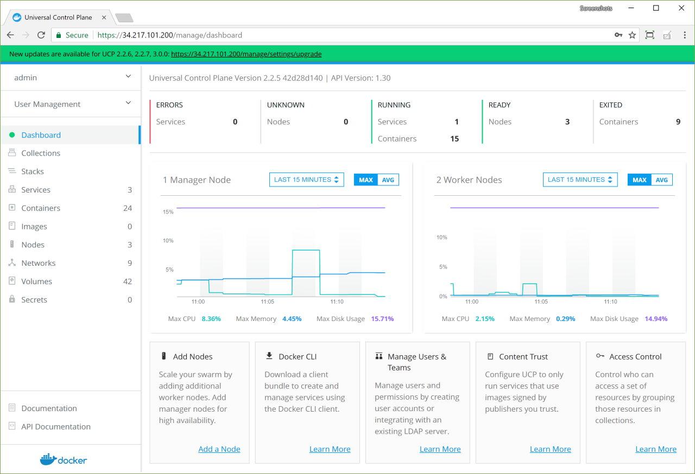
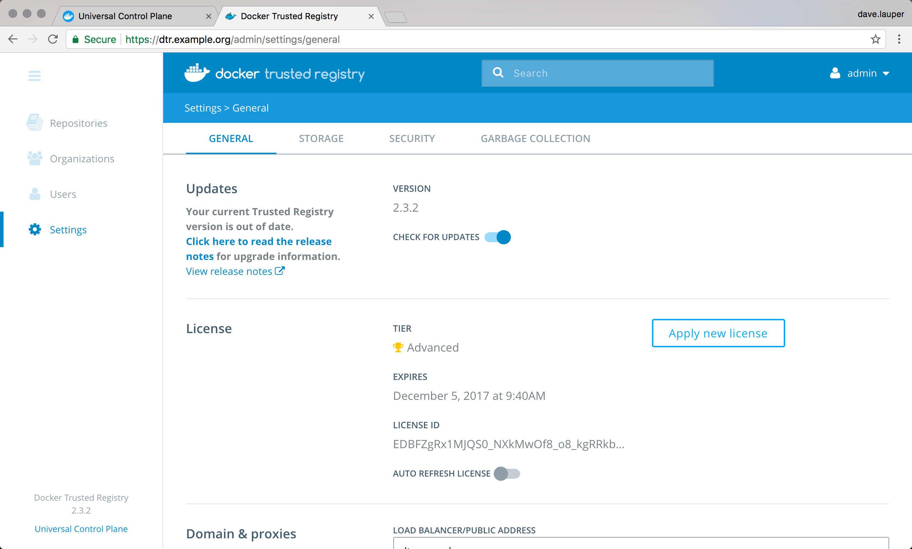

To upgrade Docker Enterprise Edition you need to individually upgrade each of the
following components:

1. Docker Engine.
2. Universal Control Plane (UCP).
3. Docker Trusted Registry (DTR).

While upgrading, some of these components become temporarily unavailable.
So you should schedule your upgrades to take place outside business peak hours
to make sure there's no impact to your business.

## Create a backup

Before upgrading Docker EE, you should make sure you [create a backup](backup.md).
This makes it possible to recover if anything goes wrong during the upgrade.

## Check the compatibility matrix

You should also check the [compatibility matrix](https://success.docker.com/Policies/Compatibility_Matrix),
to make sure all Docker EE components are certified to work with one another.
You may also want to check the
[Docker EE maintenance lifecycle](https://success.docker.com/Policies/Maintenance_Lifecycle),
to understand until when your version may be supported.

## Apply firewall rules

Before you upgrade, make sure:

- Your firewall rules are configured to allow traffic in the ports UCP uses
  for communication. Learn about [UCP port requirements](ucp/admin/install/system-requirements.md#ports-used).
- Make sure you don't have containers or services that are listening on ports
  used by UCP.
- Configure your load balancer to forward TCP traffic to the Kubernetes API
  server port (6443/TCP by default) running on manager nodes.

> Certificates
>
> Externally signed certificates are used by the Kubernetes API server and
> the UCP controller.
{: .important}

## Upgrade Docker Engine

To avoid application downtime, you should be running Docker in Swarm mode and
deploying your workloads as Docker services. That way you can
drain the nodes of any workloads before starting the upgrade.

If you have workloads running as containers as opposed to swarm services,
make sure they are configured with a [restart policy](/engine/admin/start-containers-automatically/).
This ensures that your containers are started automatically after the upgrade.

To ensure that workloads running as Swarm services have no downtime, you need to:

1. Drain the node you want to upgrade so that services get scheduled in another node.
2. Upgrade the Docker Engine on that node.
3. Make the node available again.

If you do this sequentially for every node, you can upgrade with no
application downtime.
When upgrading manager nodes, make sure the upgrade of a node finishes before
you start upgrading the next node. Upgrading multiple manager nodes at the same
time can lead to a loss of quorum, and possible data loss.

### Drain the node

Start by draining the node so that services get scheduled in another node and
continue running without downtime.
For that, run this command on a manager node:

```
docker node update --availability drain <node>
```

### Perform the upgrade

Upgrade Docker Engine on the node by following the instructions for your
specific distribution:

* [Windows Server](/install/windows/docker-ee.md#update-docker-ee)
* [Ubuntu](/install/linux/docker-ee/ubuntu.md#upgrade-docker-ee)
* [RHEL](/install/linux/docker-ee/rhel.md#upgrade-docker-ee)
* [CentOS](/install/linux/docker-ee/centos.md#upgrade-docker-ee)
* [Oracle Linux](/install/linux/docker-ee/oracle.md#upgrade-docker-ee)
* [SLES](/install/linux/docker-ee/suse.md#upgrade-docker-ee)

### Make the node active

Once you finish upgrading the node, make it available to run workloads. For
this, run:

```
docker node update --availability active <node>
```

## Upgrade UCP

Once you've upgraded the Docker Engine running on all the nodes, upgrade UCP.
You can do this from the UCP web UI.

{: .with-border}

Click on the banner, and choose the version you want to upgrade to.

{: .with-border}

Once you click **Upgrade UCP**, the upgrade starts. If you want you can upgrade
UCP from the CLI instead. [Learn more](/ee/ucp/admin/install/upgrade.md).

## Upgrade DTR

Log in into the DTR web UI to check if there's a new version available.

{: .with-border}

Then follow these [instructions to upgrade DTR](/ee/dtr/admin/upgrade.md).
When this is finished, your Docker EE has been upgraded.

## Where to go next

- [Backup Docker EE](backup.md)
