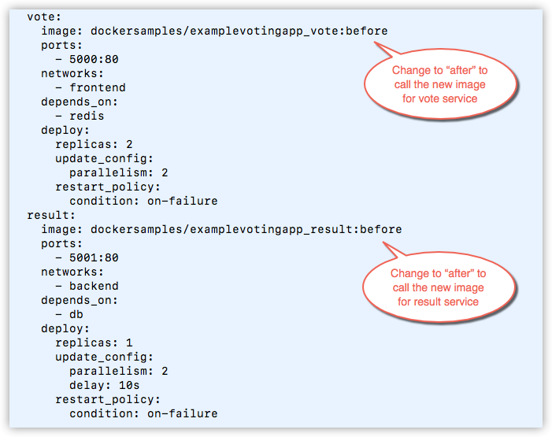
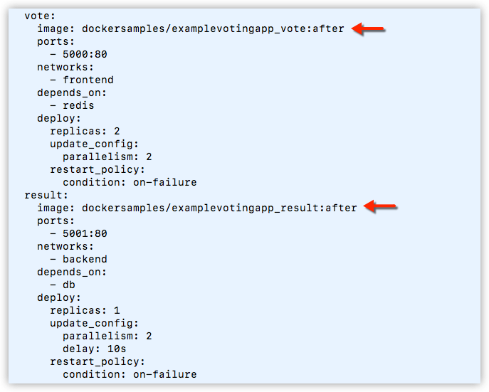
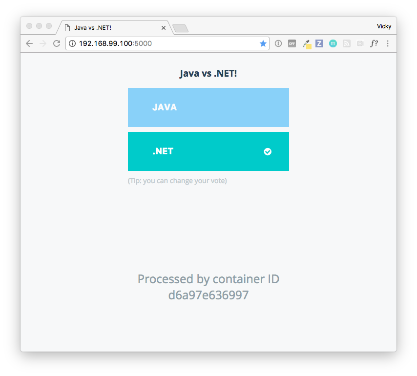
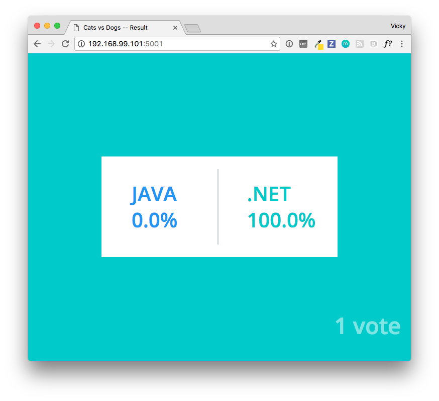
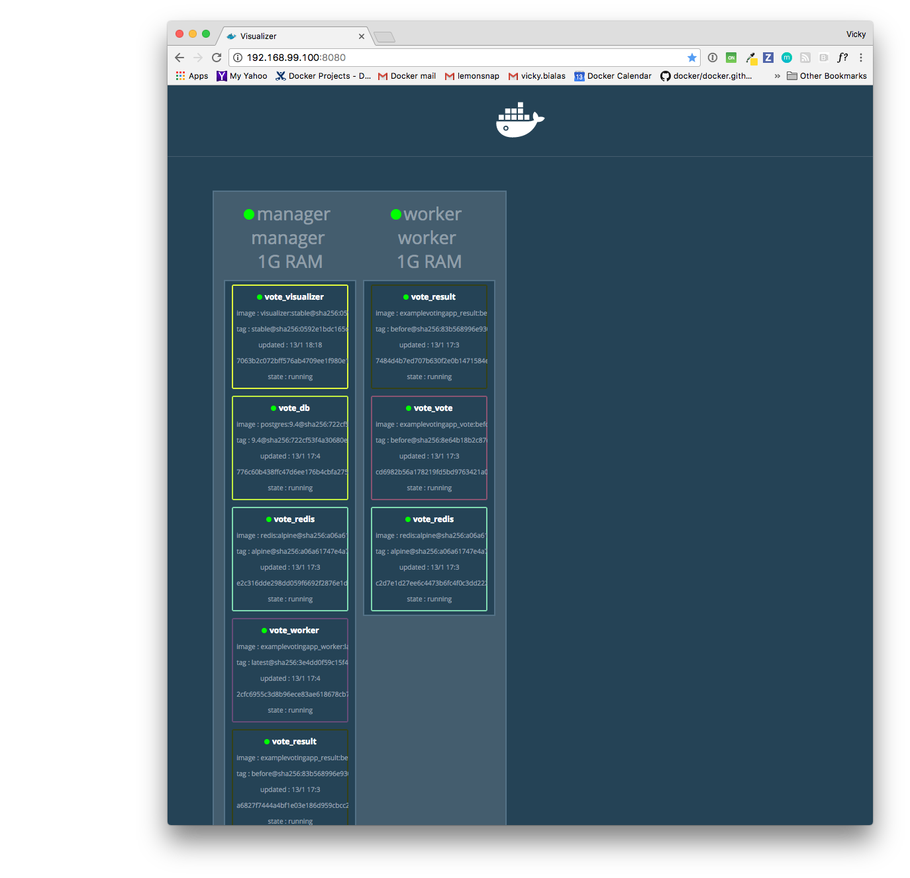

In this step, we'll make a simple change to the application and redeploy it.
We'll change the focus of the poll from Cats or Dogs to .NET or Java.

In the real world, you might do this by making code changes and rebuilding to
create new images, or new versions of the same images.

For our example, we've done this for you. We already have a different version of
the application available as built images. So, all you need to do is reconfigure
`docker-stack.yml` to point to the new images, then redeploy.

## Update docker-stack.yml to reference new images

Go back to `docker-stack.yml` and replace the `before` tags on both the `vote` and `result` images to reference `after` tags.






## Redeploy

Run the same deploy command again to run the app with the new configuration.

```
docker stack deploy --compose-file docker-stack.yml vote
```

The output will look similar to this:

```
docker@manager:~$ docker stack deploy --compose-file docker-stack.yml vote
Updating service vote_redis (id: md73fohylg8q85aryz07852o0)
Updating service vote_db (id: gny9ieqxancnufrg1oeazz9gq)
Updating service vote_vote (id: 0ig0s4gb10q8auek9tris5i8z)
Updating service vote_result (id: lqwxjmmdhmegs2aw0a6ehipsp)
Updating service vote_worker (id: 8u4cfu60dtliz77x1o74kiwpr)
Updating service vote_visualizer (id: ya2vt9z2b4to248tccjjeqitw)
```

## Try it out

Take the app for another test drive.

You'll see the new voting choices for Java and .NET at `<MANAGER-IP:>5000`.



And the related results at `<MANAGER-IP:>5001`.



The visualizer at  `<MANAGER-IP:>8080` will show some differences, such as
updates to the containers, and some services might have moved between the
manager and the worker.

However, the PostgreSQL container (`vote_db`) and the
visualizer (`vote_visualizer`) will still be running on the manager because of
the `[node.role == manager]` constraints on those services, which we
did not change.



## Resources

* [Introducing Docker 1.13.0](https://blog.docker.com/2017/01/whats-new-in-docker-1-13/) blog post
from [Docker Core Engineering](https://blog.docker.com/author/core_eng/)

* A deeper dive voting app walkthrough is available on
[Docker Labs](https://github.com/docker/labs/) as [Deploying an app to a Swarm](https://github.com/docker/labs/blob/master/beginner/chapters/votingapp.md).
The lab walkthrough provides more technical detail on deployment configuration,
Compose file keys, the application, stack and services concepts, and
networking.

* [Source code for the Voting App](https://github.com/docker/example-voting-app) (to go along with the lab walkthrough) is also available on Docker Labs.

* The images you used are available on [Docker Hub](https://hub.docker.com/). When you ran `docker-stack.yml` you pulled those images from Docker Hub.

* To learn how to build your own images, see
[Build your own image](/engine/getstarted/step_four.md) in Get Started with
Docker and topics on images in [Learn by example](/engine/tutorials/index.md).

* For more about the `docker-stack.yml` and the `docker stack deploy` commands,
see [deploy](/compose/compose-file.md#deploy) in the Compose file reference and
[`docker stack deploy`](/engine/reference/commandline/stack_deploy.md)
in the Docker Engine command line reference.

* To learn about all new features in Compose, see
[Compose file version 3 reference](/compose/compose-file/index.md) and
[Compose file versions and upgrading](/compose/compose-file/compose-versioning.md).

* For more about swarm mode, start with the
[Swarm mode overview](/engine/swarm/index.md).

## What's next?

* To learn about shutting down the sample app and cleaning up, see [Graceful shutdown, reboot, and clean-up](cleanup.md).
