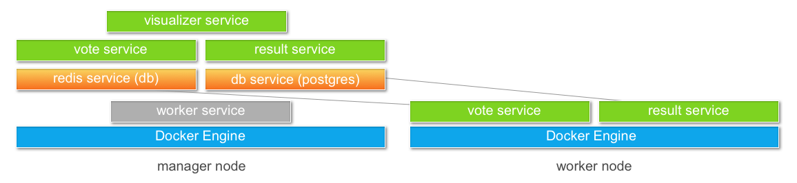

This example is built around a web-based voting application
that collects, tallies, and returns the results of votes
(for cats and dogs, or other choices you specify). The voting
app includes several services, each one running in its
own container. We'll deploy the app as a _stack_ to introduce
some new concepts surfaced in
[Compose Version 3](/compose/compose-file.md#version-3), and
also use [swarm mode](/engine/swarm/index.md), which is
cluster management and orchestration capability built into
Docker Engine.

## Got Docker?

If you haven't yet downloaded Docker or installed it, go to [Get
Docker](/engine/getstarted/step_one.md#step-1-get-docker) and grab Docker for
your platform.  You can follow along and run this example using Docker for Mac,
Docker for Windows or Docker for Linux.

Once you have Docker installed, you can run `docker run hello-world` or other
commands described in the Get Started with Docker tutorial to [verify your
installation](/engine/getstarted/step_one.md#step-3-verify-your-installation).
If you are totally new to Docker, you might continue through the full [Get
Started with Docker tutorial](/engine/getstarted/index.md) first, then come
back.

## What you'll learn and do

In this tutorial, you'll learn how to:

* Use `docker machine` to create multiple virtual local hosts or
dockerized cloud servers
* Use `docker` commands to set up and run a swarm with manager and worker nodes
* Deploy the `vote` app services across the two nodes by feeding our example `docker-stack.yml` file to
the `docker stack deploy` command
* Test the app by voting for cats and dogs, and view the results
* Use the `visualizer` to explore and understand the runtime app and services
* Update the `docker-stack.yml` and redeploy the app using a different
`vote` image to implement a poll on different choices
* Use features new in Compose Version 3, highlighted in the sample app



## Services and images overview

A [service](/engine/reference/glossary.md#service) is a bit of executable code designed to accomplish
a specific task. A service can run in one or more
containers. Defining a service configuration for your app
(above and beyond `docker run` commands in a Dockerfile) enables you to
deploy the app to a swarm and manage it as a distributed,
multi-container application.

The voting app you are about to deploy is composed
of several services, each based on an [image](/engine/reference/glossary.md#image):

| Service        | Description | Base Image  |
| ------------- |--------------| -----|
| `vote`      | Presents the voting interface via port `5000`. Viewable at `<manager-IP>:5000` | Based on a Python image, `dockersamples/examplevotingapp_vote` |
| `result`      | Displays the voting results via port 5001.  Viewable at `<manager-IP>:5001`     |  Based on a Node.js image, `dockersamples/examplevotingapp_result` |
| `visualizer` | A web app that shows a map of the deployment of the various services across the available nodes via port `8080`. Viewable at `<manager-IP>:8080`  |  Based on a Node.js image, `dockersamples/visualizer` |
| `redis` | Collects raw voting data and stores it in a key/value queue     |  Based on a `redis` image, `redis:alpine` |
| `db` | A PostgreSQL service which provides permanent storage on a host volume    |  Based on a `postgres` image, `postgres:9.4` |
| `worker` | A background service that transfers votes from the queue to permanent storage     |  Based on a .NET image, `dockersamples/examplevotingapp_worker` |

Each service will run in its own [container](/engine/reference/glossary.md#container). Using swarm mode,
we can also scale the application to deploy replicas
of containerized services distributed across multiple nodes.

Here is an example of one of the services fully defined:

```
vote:
  image: dockersamples/examplevotingapp_vote:before
  ports:
    - 5000:80
  networks:
    - frontend
  depends_on:
    - redis
  deploy:
    replicas: 2
    update_config:
      parallelism: 2
    restart_policy:
      condition: on-failure
```

The `image` key defines which image the service will use. The `vote` service
uses `dockersamples/examplevotingapp_vote:before`.

The `depends_on` key allows you to specify that a service is only
deployed after another service. In our example, `vote` only deploys
after `redis`.

The `deploy` key specifies aspects of a swarm deployment. For example, in this configuration we create _replicas_ of the `vote` and `result` services (2 containers of each will be deployed to the swarm), and we constrain some services (`db` and `visualizer`) to run only on a `manager` node.

## docker-stack.yml deployment configuration file

In addition to defining a set of build and run commands in a Dockerfile, you can
define services in a [Compose file](/compose/compose-file.md), along with
details about how and where those services will run. You can use Compose files
to kick off multiple Dockerfiles, or use Compose files independently of
Dockerfiles.

In the Getting Started with Docker tutorial, you wrote a
[Dockerfile for the whalesay app](/engine/getstarted/step_four.md) then used
it to build a single image and run it as a single container.

For this tutorial, the images are pre-built, and we will use `docker-stack.yml`
(a Version 3 Compose file) instead of a Dockerfile
to run the images. When we deploy, each image will run as a service in a
container (or in multiple containers, for those that have replicas defined to
scale the app). This example relies on Compose version 3, which is designed to be compatible with Docker Engine swarm mode.

To follow along with the example, you need only have Docker running and the copy
of `docker-stack.yml` we provide
[here](https://github.com/docker/example-voting-app/blob/master/docker-stack.yml).
This file defines all the services shown in the
[table above](#services-and-images-overview), their base images,
configuration details such as ports, networks, volumes,
application dependencies, and the swarm configuration.

```
version: "3"
services:

  redis:
    image: redis:alpine
    ports:
      - "6379"
    networks:
      - frontend
    deploy:
      replicas: 2
      update_config:
        parallelism: 2
        delay: 10s
      restart_policy:
        condition: on-failure
  db:
    image: postgres:9.4
    volumes:
      - db-data:/var/lib/postgresql/data
    networks:
      - backend
    deploy:
      placement:
        constraints: [node.role == manager]
  vote:
    image: dockersamples/examplevotingapp_vote:before
    ports:
      - 5000:80
    networks:
      - frontend
    depends_on:
      - redis
    deploy:
      replicas: 2
      update_config:
        parallelism: 2
      restart_policy:
        condition: on-failure
  result:
    image: dockersamples/examplevotingapp_result:before
    ports:
      - 5001:80
    networks:
      - backend
    depends_on:
      - db
    deploy:
      replicas: 1
      update_config:
        parallelism: 2
        delay: 10s
      restart_policy:
        condition: on-failure

  worker:
    image: dockersamples/examplevotingapp_worker
    networks:
      - frontend
      - backend
    deploy:
      mode: replicated
      replicas: 1
      labels: [APP=VOTING]
      restart_policy:
        condition: on-failure
        delay: 10s
        max_attempts: 3
        window: 120s
      placement:
        constraints: [node.role == manager]

  visualizer:
    image: dockersamples/visualizer:stable
    ports:
      - "8080:8080"
    stop_grace_period: 1m30s
    volumes:
      - "/var/run/docker.sock:/var/run/docker.sock"
    deploy:
      placement:
        constraints: [node.role == manager]

networks:
  frontend:
  backend:

volumes:
  db-data:
```

## Docker stacks and services

To deploy the voting app, we will run the [`docker stack
deploy`](/engine/reference/commandline/stack_deploy.md) command with appropriate
options using this `docker-stack.yml` file to pull the referenced images and
launch the services in a swarm.  This allows us to run the application across
multiple servers, and use swarm mode for load balancing and performance. Rather
than thinking about running individual containers, we can start to model
deployments as application stacks and services.

If you are interested in learning more about new Compose version 3.x features, Docker Engine 1.13.x, and swarm mode integration, check out the [list of resources](customize-app.md#resources) at the end of this tutorial.

## What's next?

In the next step, we'll [set up two Dockerized hosts](node-setup.md).
