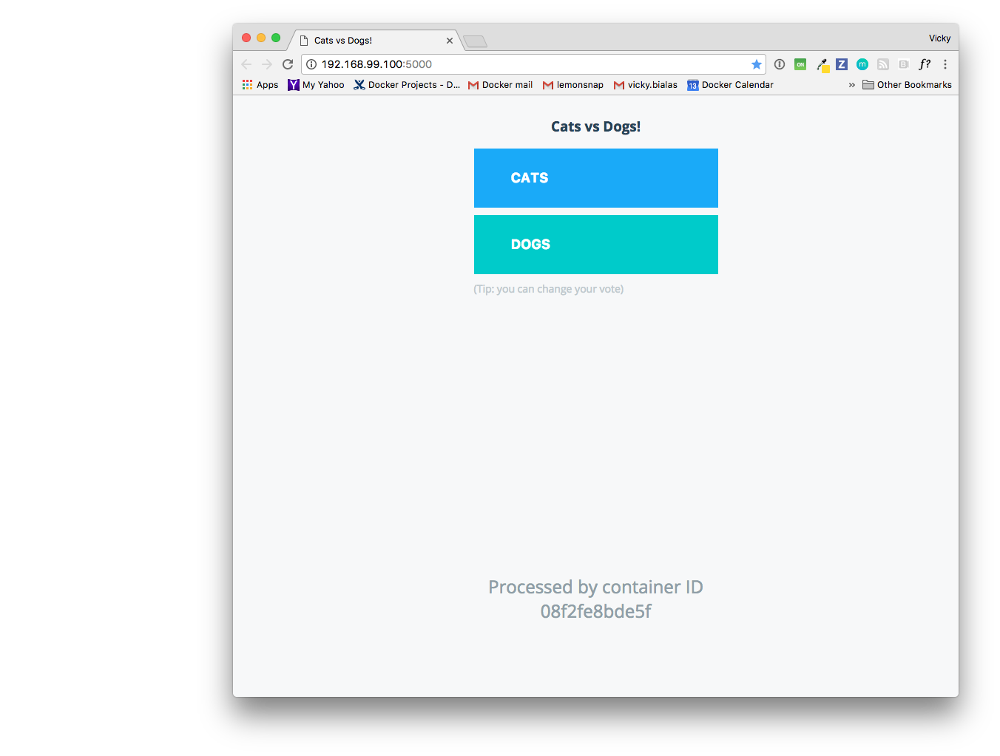
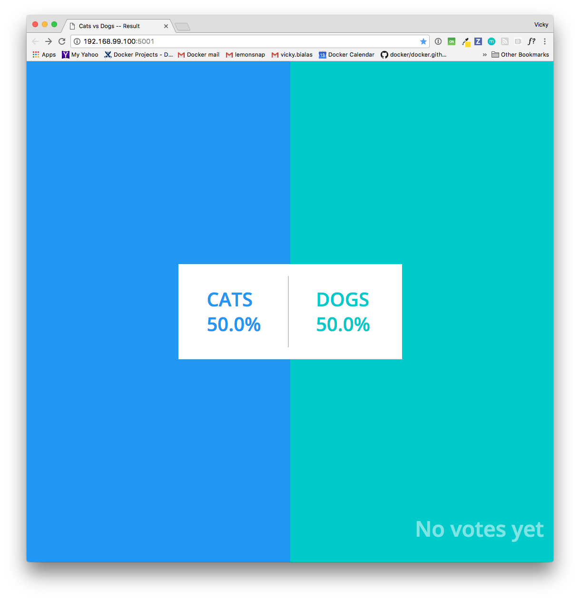
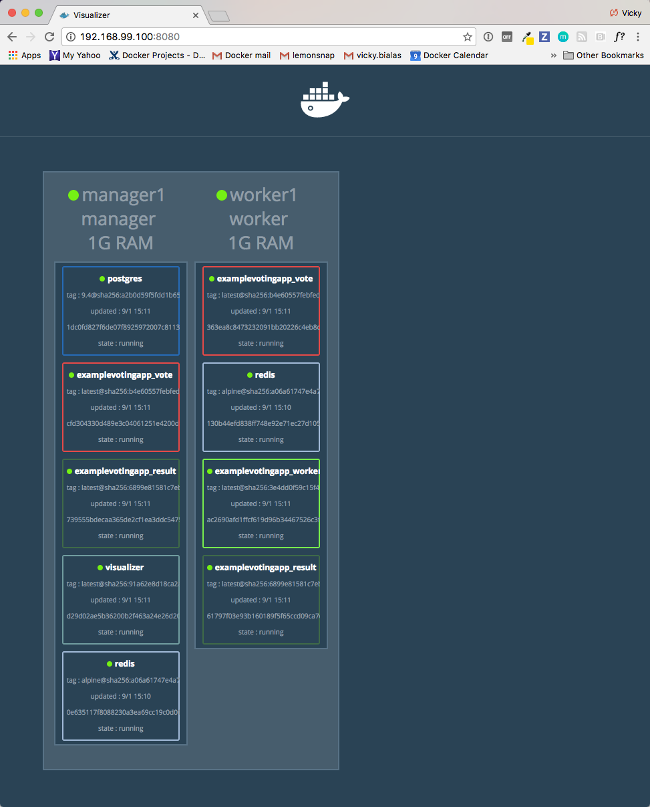
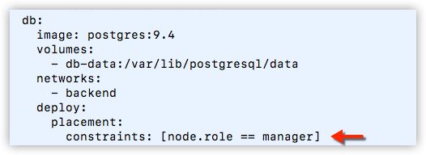
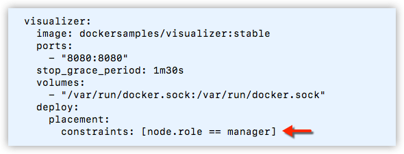
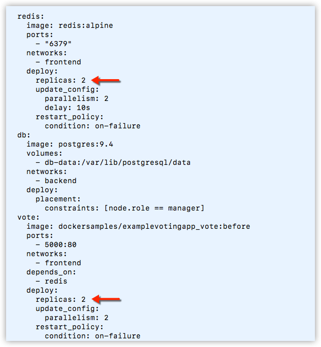

Now that the app is up and running, let's try it out.

We will vote for cats and dogs, view the
results, and monitor the manager and
worker nodes, containers and services on a visualizer.

## Vote for cats and dogs

Go to `<MANAGER-IP:>5000` in a web browser to view the voting page from a user perspective.

Click on either cats or dogs to vote.

## View the results tally

Now, go to `MANAGER-IP:5001` in a web browser to view the voting results tally, as one might do in the role of poll coordinator. The tally is shown by percentage in the current configuration of the app.

## Use the visualizer to monitor the app

Go to `<MANAGER-IP:>8080` to get a visual map of how the application is
deployed.

This surfaces some configuration and characteristics from
[docker-stack.yml](index.md#docker-stackyml), and you can see those strategies in
action here. For example:

*   We have two nodes running: a `manager` and a `worker`.

*   The manager node is running the PostgreSQL container, as configured by setting `[node.role == manager]` as a constraint in the deploy key for the `db` service. This service must be constrained to run on the manager in order to work properly.

  

*   The manager node is also running the visualizer itself, as configured by setting `[node.role == manager]` as a constraint in the deploy key for the `visualizer` service. This service must be constrained to run on the manager in order to work properly. If you remove the constraint, and it ends up on a worker, the web page display will be blank.

  

*   Two of the services are replicated:

    *   `vote` (represented in the visulizer by `vote_vote`)
    *   `redis` (represented in the visulizer by `vote_redis`)

    Both of these services are configured as `replicas: 2` under
    the `deploy` key. In the current state of this app (shown in the visualizer), one of each of these containers is running on a manager and on a worker. However, since neither are explicitly constrained to either node in `docker-stack.yml`, all or some of these services could be running on either node, depending on workload and re-balancing choices we've left to the swarm orchestration.

    

## What's next?

In the next steps, we'll [customize the app](customize-app.md) and redeploy it.
