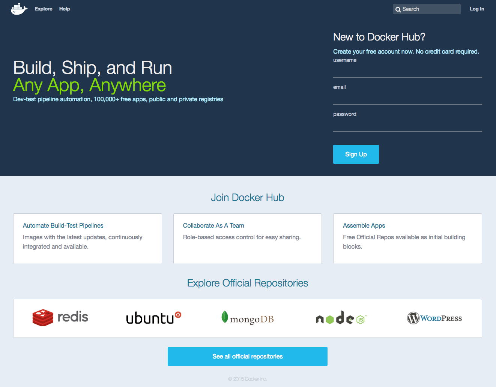
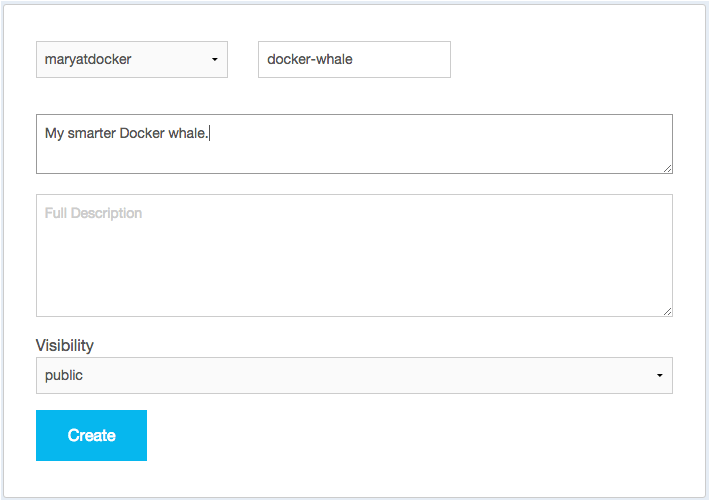

You've built something really cool, you should share it. In this next section,
you'll do just that. First, you'll create a Docker ID account. Then, you'll push
your image to a repository on Docker Hub so other people with Docker Engine can
run it.

## Step 1: Sign up for an account

1. In your web browser, go to <a href="https://hub.docker.com/register/?utm_source=getting_started_guide&utm_medium=embedded_MacOSX&utm_campaign=create_docker_hub_account" target="_blank">the Docker Hub signup page</a>.

	Your browser displays the page.

	

2. Enter a new Docker ID (username), and email address, and a password.

3. Click **Sign Up**.

	The browser displays a "Welcome to Docker Hub" page.

## Step 2: Verify your email and add a repository

Before you can share anything on Docker Hub, you need to verify your email address.

1. Go to your email, and look for the email titled `Please confirm email for your Docker ID`.

	  If you don't see the email, check your Spam folder or wait a moment for the email to arrive.

2. Open the email and click **Confirm Your Email**.

	 The browser opens Docker Hub to your profile page.

4. From that page, choose **Create Repository**.

5. Enter a Repository Name and Short Description.

6. Make sure the repo **Visibility** is set to **Public**.

    When you are done, your form should look similar to the following:

	

6. Press **Create** to save your entries and create the new repository.

## Where to go next

On this page, you created a Docker ID, navigated to your Docker Hub account and created a new repository.
In the next section, you populate the repository [by tagging and pushing the image you created earlier](step_six.md).
