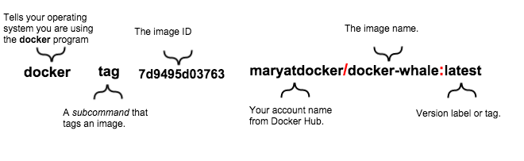
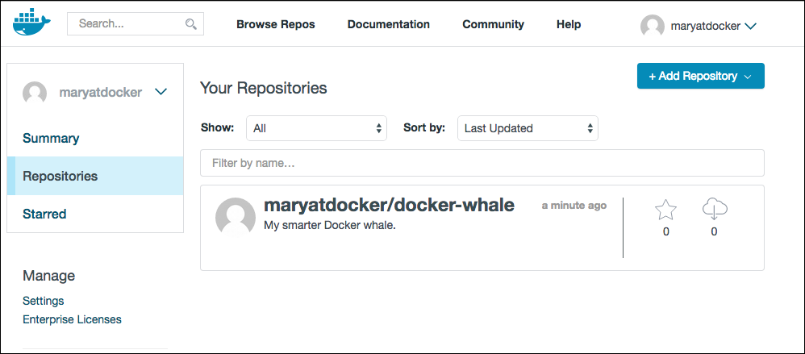

In this section, you tag and push your `docker-whale` image to your new
repository, then test the repository by pulling your
new image.

## Step 1: Tag and push the image

1.  If you don't already have a terminal open, open one now.

2.  Run `docker images` to list the images stored locally:

    ```bash
    $ docker images
    
    REPOSITORY           TAG          IMAGE ID            CREATED             SIZE
    docker-whale         latest       7d9495d03763        38 minutes ago      273.7 MB
    <none>               <none>       5dac217f722c        45 minutes ago      273.7 MB
    docker/whalesay      latest       fb434121fc77        4 hours ago         247 MB
    hello-world          latest       91c95931e552        5 weeks ago         910 B
    ```
    
5.  Find the image ID for the `docker-whale` image, in the second column. In this example,
    the id is `7d9495d03763`, but yours will be different.

    > **Note**: Currently, the repository shows the repo name `docker-whale`
    > with no namespace. You need to include the `namespace` for Docker Hub to
    > associate it with your account. The `namespace` is the same as your Docker
    > Hub account name. The next step adds the namespace to the image name, like
    >`YOUR_DOCKERHUB_NAME/docker-whale`.

6.  Tag the `docker-whale` image using the `docker tag` command and the image ID.

    The command you type looks like this:

    

    Make sure to use your own Docker Hub account name.
    
    ```bash
    $ docker tag 7d9495d03763 maryatdocker/docker-whale:latest
    ```
    
7.  Run `docker images` again to verify that the `docker-whale` image has been tagged.

    ```bash
    $ docker images
	
    REPOSITORY                  TAG       IMAGE ID        CREATED          SIZE
    maryatdocker/docker-whale   latest    7d9495d03763    5 minutes ago    273.7 MB
    docker-whale                latest    7d9495d03763    2 hours ago      273.7 MB
    <none>                      <none>    5dac217f722c    5 hours ago      273.7 MB
    docker/whalesay             latest    fb434121fc77    5 hours ago      247 MB
    hello-world                 latest    91c95931e552    5 weeks ago      910 B
    ```
    
    The same image ID actually now exists in two different repositories.

8.  Before you can push the image to Docker Hub, you need to log in, using
    the `docker login` command. The command doesn't take any parameters,
    but prompts you for the username and password, as below:
    
    ```bash
    $ docker login
    
        Username: *****
        Password: *****
        Login Succeeded
    ```

9.  Push your tagged image to Docker Hub, using the `docker push` command. A
    lot of output is generated, as each layer is pushed separately. That
    output is truncated in the example below.

    ```bash
    $ docker push maryatdocker/docker-whale
    
    The push refers to a repository [maryatdocker/docker-whale] (len: 1)
    7d9495d03763: Image already exists
    ...
    e9e06b06e14c: Image successfully pushed
    Digest: sha256:ad89e88beb7dc73bf55d456e2c600e0a39dd6c9500d7cd8d1025626c4b985011
    ```

10. Go back to the Docker Hub website to see the newly-pushed image.

    
    

## Step 2: Pull your new image

The goal of pushing the image to Docker Hub is so that you can access
it from any Docker host using `docker pull`. First, though, you need to
remove the local copy. Otherwise, `docker pull` will not have any work to do,
because it will see that you already have the latest version of the image
locally.

1.  If you don't already have a terminal open, open one now.

2.  Use `docker images` to list the images you have locally.

    ```bash
		$ docker images
    
		REPOSITORY                  TAG       IMAGE ID        CREATED          SIZE
		maryatdocker/docker-whale   latest    7d9495d03763    5 minutes ago    273.7 MB
		docker-whale                latest    7d9495d03763    2 hours ago      273.7 MB
		<none>                      <none>    5dac217f722c    5 hours ago      273.7 MB
		docker/whalesay             latest    fb434121fc77    5 hours ago      247 MB
		hello-world                 latest    91c95931e552    5 weeks ago      910 B
    ```
    
    In the next step, you will remove both versions of the `docker-whale` image
    from your local system. They share the same ID. Make a note of it.

3.  Use the `docker image remove`  command to remove the images. You can refer
    to an image by its ID or its name. Since they share an ID, if you wanted to
    keep one of them, you'd need to refer to the other one by name. For this
    example, use the ID to remove both of them. Your ID will be different from
    the one below.

    ```bash
    $ docker image remove 7d9495d03763
    ```

4.  When you use `docker run` it automatically downloads (pulls) images that
    don't yet exist locally, creates a container, and starts it. Use the
    following command to pull and run the `docker-whale` image, substituting
    your Docker Hub username.

    ```bash
    $ docker run yourusername/docker-whale
    ```

	  Since the image is no longer available on your local system, Docker
    downloads it. The output  below is truncated.

    ```bash
		$ docker run maryatdocker/docker-whale
    
		Unable to find image 'maryatdocker/docker-whale:latest' locally
		latest: Pulling from maryatdocker/docker-whale
		eb06e47a01d2: Pull complete
		c81071adeeb5: Pull complete
                ...
		fb434121fc77: Already exists
		Digest: sha256:ad89e88beb7dc73bf55d456e2c600e0a39dd6c9500d7cd8d1025626c4b985011
		Status: Downloaded newer image for maryatdocker/docker-whale:latest
         ________________________________________
        / Having wandered helplessly into a      \
        | blinding snowstorm Sam was greatly     |
        | relieved to see a sturdy Saint Bernard |
        | dog bounding toward him with the       |
        | traditional keg of brandy strapped to  |
        | his collar.                            |
        |                                        |
        | "At last," cried Sam, "man's best      |
        \ friend -- and a great big dog, too!"   /
         ----------------------------------------
                        \
                         \
                          \
                                  ##        .
                            ## ## ##       ==
                         ## ## ## ##      ===
                     /""""""""""""""""___/ ===
                ~~~ {~~ ~~~~ ~~~ ~~~~ ~~ ~ /  ===- ~~~
                     \______ o          __/
                      \    \        __/
                        \____\______/
    ```

## Next steps

After finishing this tutorial, you've done all of the following fundamental
Docker tasks.

* You installed Docker.
* You ran a software image in a container.
* You located an interesting image on Docker Hub and ran it on your own machine.
* You modified an image to create your own, and created and ran a container
  based on that image.
* You created a Docker Hub account and repository.
* You pushed your custom image to Docker Hub, and made it available both for
  yourself and other Docker users.

<a href="https://twitter.com/intent/tweet?button_hashtag=dockerdocs&text=Just%20ran%20a%20container%20with%20an%20image%20I%20built.%20Find%20it%20on%20%23dockerhub.%20Build%20your%20own%3A%20http%3A%2F%2Fgoo.gl%2FMUi7cA" class="twitter-hashtag-button" data-size="large" data-related="docker" target="_blank">Tweet your accomplishment!</a>
<script>!function(d,s,id){var js,fjs=d.getElementsByTagName(s)[0],p=/^http:/.test(d.location)?'http':'https';if(!d.getElementById(id)){js=d.createElement(s);js.id=id;js.src=p+'://platform.twitter.com/widgets.js';fjs.parentNode.insertBefore(js,fjs);}}(document, 'script', 'twitter-wjs');</script>

You've only scratched the surface of what Docker can do.
[Learn more](last_page.md) about where to go next.
