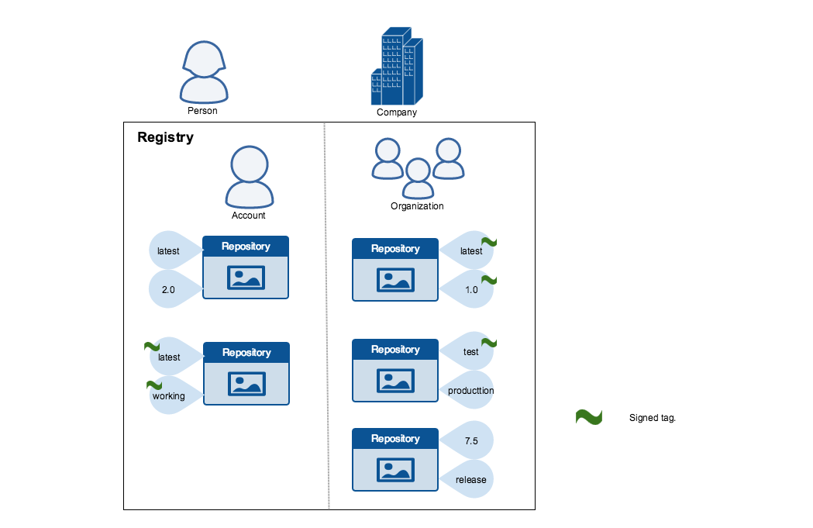

When transferring data among networked systems, *trust* is a central concern. In
particular, when communicating over an untrusted medium such as the internet, it
is critical to ensure the integrity and the publisher of all the data a system
operates on. You use the Docker Engine to push and pull images (data) to a 
public or private registry. Content trust gives you the ability to verify both 
the integrity and the publisher of all the data received from a registry over 
any channel.

## About Docker Content Trust (DCT)

Docker Content Trust (DCT) provides the ability to use digital signatures for 
data sent to and received from remote Docker registries. These signatures allow 
client-side or runtime verification of the integrity and publisher of specific 
image tags. 

Through DCT, image publishers can sign their images and image consumers can 
ensure that the images they use are signed. Publishers could be individuals 
or organizations manually signing their content or automated software supply 
chains signing content as part of their release process.

### Image tags and DCT

An individual image record has the following identifier:

```
[REGISTRY_HOST[:REGISTRY_PORT]/]REPOSITORY[:TAG]
```

A particular image `REPOSITORY` can have multiple tags. For example, `latest` and
 `3.1.2` are both tags on the `mongo` image. An image publisher can build an image
 and tag combination many times changing the image with each build.

DCT is associated with the `TAG` portion of an image. Each image repository has
a set of keys that image publishers use to sign an image tag. Image publishers 
have discretion on which tags they sign.

An image repository can contain an image with one tag that is signed and another
tag that is not. For example, consider [the Mongo image
repository](https://hub.docker.com/r/library/mongo/tags/). The `latest`
tag could be unsigned while the `3.1.6` tag could be signed. It is the
responsibility of the image publisher to decide if an image tag is signed or
not. In this representation, some image tags are signed, others are not:



Publishers can choose to sign a specific tag or not. As a result, the content of
an unsigned tag and that of a signed tag with the same name may not match. For
example, a publisher can push a tagged image `someimage:latest` and sign it.
Later, the same publisher can push an unsigned `someimage:latest` image. This second
push replaces the last unsigned tag `latest` but does not affect the signed `latest` version.
The ability to choose which tags they can sign, allows publishers to iterate over
the unsigned version of an image before officially signing it.

Image consumers can enable DCT to ensure that images they use were signed. If a 
consumer enables DCT, they can only pull, run, or build with trusted images. 
Enabling DCT is a bit like applying a "filter" to your registry. Consumers "see" 
only signed image tags and the less desirable, unsigned image tags are 
"invisible" to them.


To the consumer who has not enabled DCT, nothing about how they work with Docker 
images changes. Every image is visible regardless of whether it is signed or 
not.

### Docker Content Trust Keys

Trust for an image tag is managed through the use of signing keys. A key set is
created when an operation using DCT is first invoked. A key set consists
of the following classes of keys:

- an offline key that is the root of DCT for an image tag
- repository or tagging keys that sign tags
- server-managed keys such as the timestamp key, which provides freshness
	security guarantees for your repository

The following image depicts the various signing keys and their relationships:


>**WARNING**:
> Loss of the root key is **very difficult** to recover from.
>Correcting this loss requires intervention from [Docker
>Support](https://support.docker.com) to reset the repository state. This loss
>also requires **manual intervention** from every consumer that used a signed
>tag from this repository prior to the loss.
{:.warning}

You should back up the root key somewhere safe. Given that it is only required
to create new repositories, it is a good idea to store it offline in hardware.
For details on securing, and backing up your keys, make sure you
read how to [manage keys for DCT](trust_key_mng.md).

## Signing Images with Docker Content Trust

> Note this applies to Docker Community Engine 17.12 and newer, and Docker 
> Enterprise Engine 18.03 and newer.

Within the Docker CLI we can sign and push a container image with the 
`$ docker trust` command syntax. This is built on top of the Notary feature
set, more information on Notary can be found [here](/notary/getting_started/). 

A prerequisite for signing an image is a Docker Registry with a Notary server
attached (Such as the Docker Hub or Docker Trusted Registry). Instructions for
standing up a self-hosted environment can be found [here](/engine/security/trust/deploying_notary/).

To sign a Docker Image you will need a delegation key pair. These keys
can be generated locally using `$ docker trust key generate`, generated 
by a certificate authority, or if you are using Docker Enterprise's 
Universal Control Plane (UCP), a user's Client Bundle provides adequate keys for a 
delegation. Find more information on Delegation Keys 
[here](trust_delegation/#creating-delegation-keys).

First we will add the delegation private key to the local Docker trust 
repository. (By default this is stored in `~/.docker/trust/`). If you are 
generating delegation keys with `$ docker trust key generate`, the private key 
is automatically added to the local trust store. If you are importing a separate 
key, such as one from a UCP Client Bundle you will need to use the 
`$ docker trust key load` command.

```
$ docker trust key generate jeff
Generating key for jeff...
Enter passphrase for new jeff key with ID 9deed25: 
Repeat passphrase for new jeff key with ID 9deed25: 
Successfully generated and loaded private key. Corresponding public key available: /home/ubuntu/Documents/mytrustdir/jeff.pub
```

Or if you have an existing key: 

```
$ docker trust key load key.pem --name jeff
Loading key from "key.pem"...
Enter passphrase for new jeff key with ID 8ae710e: 
Repeat passphrase for new jeff key with ID 8ae710e: 
Successfully imported key from key.pem
```

Next we will need to add the delegation public key to the Notary server; 
this is specific to a particular image repository in Notary known as a Global 
Unique Name (GUN). If this is the first time you are adding a delegation to that
repository, this command will also initiate the repository, using a local Notary 
canonical root key. To understand more about initiating a repository, and the
role of delegations, head to 
[delegations for content trust](trust_delegation/#managing-delegations-in-a-notary-server).

```
$ docker trust signer add --key cert.pem jeff dtr.example.com/admin/demo
Adding signer "jeff" to dtr.example.com/admin/demo...
Enter passphrase for new repository key with ID 10b5e94: 
```

Finally, we will use the delegation private key to sign a particular tag and 
push it up to the registry.

```
$ docker trust sign dtr.example.com/admin/demo:1
Signing and pushing trust data for local image dtr.example.com/admin/demo:1, may overwrite remote trust data
The push refers to repository [dtr.example.com/admin/demo]
7bff100f35cb: Pushed 
1: digest: sha256:3d2e482b82608d153a374df3357c0291589a61cc194ec4a9ca2381073a17f58e size: 528
Signing and pushing trust metadata
Enter passphrase for signer key with ID 8ae710e: 
Successfully signed dtr.example.com/admin/demo:1
```

Alternatively, once the keys have been imported an image can be pushed with the 
`$ docker push` command, by exporting the DCT environmental variable.

```
$ export DOCKER_CONTENT_TRUST=1

$ docker push dtr.example.com/admin/demo:1
The push refers to repository [dtr.example.com/admin/demo:1]
7bff100f35cb: Pushed 
1: digest: sha256:3d2e482b82608d153a374df3357c0291589a61cc194ec4a9ca2381073a17f58e size: 528
Signing and pushing trust metadata
Enter passphrase for signer key with ID 8ae710e: 
Successfully signed dtr.example.com/admin/demo:1
```

Remote trust data for a tag or a repository can be viewed by the 
`$ docker trust inspect` command:

```
$ docker trust inspect --pretty dtr.example.com/admin/demo:1

Signatures for dtr.example.com/admin/demo:1

SIGNED TAG          DIGEST                                                             SIGNERS
1                   3d2e482b82608d153a374df3357c0291589a61cc194ec4a9ca2381073a17f58e   jeff

List of signers and their keys for dtr.example.com/admin/demo:1

SIGNER              KEYS
jeff                8ae710e3ba82

Administrative keys for dtr.example.com/admin/demo:1

  Repository Key:	10b5e94c916a0977471cc08fa56c1a5679819b2005ba6a257aa78ce76d3a1e27
  Root Key:	84ca6e4416416d78c4597e754f38517bea95ab427e5f95871f90d460573071fc
```

Remote Trust data for a tag can be removed by the `$ docker trust revoke` command:

```
$ docker trust revoke dtr.example.com/admin/demo:1
Enter passphrase for signer key with ID 8ae710e: 
Successfully deleted signature for dtr.example.com/admin/demo:1
```

## Runtime Enforcement with Docker Content Trust

> Note this only applies to Docker Enterprise Engine 18.09 or newer. This 
> implementation is also separate from the `only run signed images` feature of 
> [Universal Control Plane](/ee/ucp/admin/configure/run-only-the-images-you-trust/)

Docker Content Trust within the Docker Enterprise Engine prevents a user from
using a container image from an unknown source, it will also prevent a user from 
building a container image from a base layer from an unknown source. Trusted
sources could include Official Docker Images, found on the [Docker
Hub](https://hub.docker.com/search?image_filter=official&type=image), or User
trusted sources, with repositories and tags signed with the commands [above](#signing-images-with-docker-content-trust).

Engine Signature Verification prevents the following:
* `$ docker container run` of an unsigned image.
* `$ docker pull` of an unsigned image.
* `$ docker build` where the `FROM` image is not signed or is not scratch.

DCT does not verify that a running container’s filesystem has not been altered 
from what was in the image. For example, it does not prevent a container from 
writing to the filesystem, once the container is running, nor does it prevent 
the container’s filesystem from being altered on disk. DCT will also not prevent 
unsigned images from being imported, loaded, or created.

### Enabling DCT within the Docker Enterprise Engine 

DCT is controlled by the Docker Engine's configuration file. By default this is
found at `/etc/docker/daemon.json`. More details on this file can be found 
[here](/engine/reference/commandline/dockerd/#daemon-configuration-file).

The `content-trust` flag is based around a `mode` variable instructing
the engine whether to enforce signed images, and a `trust-pinning` variable 
instructing the engine which sources to trust. 

`Mode` can take three variables: 

* `Disabled` - Verification is not active and the remainder of the content-trust 
related metadata will be ignored. This is the default value if `mode` is not
specified.
* `Permissive` - Verification will be performed, but only failures will be 
logged and remain unenforced. This configuration is intended for testing of 
changes related to content-trust. The results of the signature verification 
is displayed in the Docker Engine's daemon logs. 
* `Enforced` - Content trust will be enforced and an image that cannot be 
verified successfully will not be pulled or run.

```
{
    "content-trust": {
        "mode": "enforced"
    }
}
```

### Official Docker images

All official Docker library images found on the Docker Hub (docker.io/library/*)
are signed by the same Notary root key. This root key's ID has been embedded 
inside of the Docker Enterprise Engine. Therefore, to enforce that, only official 
Docker images can be used. Specify: 

```
{
  "content-trust": {
    "trust-pinning": {
      "official-library-images": true
    },
    "mode": "enforced"
  }
}
```

### User-Signed images

There are two options for trust pinning user-signed images: 

* Notary Canonical Root Key ID (DCT Root Key) is an ID that describes *just* the 
root key used to sign a repository (or rather its respective keys). This is the 
root key on the host that originally signed the repository (i.e. your workstation). 
This can be retrieved from the workstation that signed the repository through 
`$ grep -r "root" ~/.docker/trust/private/` (Assuming your trust data is 
at `~/.docker/trust/*`). It is expected that this canonical ID has initiated 
multiple image repositories (`mydtr/user1/image1` and `mydtr/user1/image2`).

```
# Retrieving Root ID
$ grep -r "root" ~/.docker/trust/private
/home/ubuntu/.docker/trust/private/0b6101527b2ac766702e4b40aa2391805b70e5031c04714c748f914e89014403.key:role: root
 
# Using a Canonical ID that has signed 2 repos (mydtr/user1/repo1 and mydtr/user1/repo2). Note you can use a Wildcard.
 
{
  "content-trust": {
    "trust-pinning": {
      "root-keys": {
         "mydtr/user1/*": [
           "0b6101527b2ac766702e4b40aa2391805b70e5031c04714c748f914e89014403"
         ]
      }
    },
    "mode": "enforced"
  }
}
```

* Notary Root key ID (DCT Certificate ID) is an ID that describes the same, but 
the ID is unique per repository. For example, `mydtr/user1/image1` and `mydtr/usr1/image2` 
will have unique certificate IDs. A certificate ID can be retrieved through a 
`$ docker trust inspect` command and is labelled as a root-key (referring back 
to the Notary key name). This is designed for when different users are signing 
their own repositories, for example, when there is no central signing server. As a cert-id 
is more granular, it would take priority if a conflict occurs over a root ID. 
 
```
# Retrieving Cert ID
$ docker trust inspect mydtr/user1/repo1 | jq -r '.[].AdministrativeKeys[] | select(.Name=="Root") | .Keys[].ID'
9430d6e31e3b3e240957a1b62bbc2d436aafa33726d0fcb50addbf7e2dfa2168 

# Using Cert Ids, by specifying 2 repositories by their DCT root ID. Example for using this may be different DTRs or maybe because the repository was initiated on different hosts, therefore having different canonical IDs.
 
{
  "content-trust": {
    "trust-pinning": {
      "cert-ids": {
         "mydtr/user1/repo1": [
           "9430d6e31e3b3e240957a1b62bbc2d436aafa33726d0fcb50addbf7e2dfa2168"
         ],
         "mydtr/user2/repo1": [
           "544cf09f294860f9d5bc953ad80b386063357fd206b37b541bb2c54166f38d08"
         ]
      }
    },
    "mode": "enforced"
  }
}
```

### Using DCT in an offline environment

If your engine is unable to communicate to the registry, we can enable DCT to
trust cached signature data. This is done through the 
`allow-expired-cached-trust-data` variable. 

```
{
  "content-trust": {
    "trust-pinning": {
      "official-library-images": true,
      "root-keys": {
         "mydtr/user1/*": [
           "0b6101527b2ac766702e4b40aa2391805b70e5031c04714c748f914e89014403"
         ]
      },
      "cert-ids": {
         "mydtr/user2/repo1": [
           "9430d6e31e3b3e240957a1b62bbc2d436aafa33726d0fcb50addbf7e2dfa2168"
         ],
      }
    },
    "mode": "enforced",
    "allow-expired-cached-trust-data": true 
  }
}
```

## Client Enforcement with Docker Content Trust

> Note this is supported on Docker Community and Enterprise Engines newer than 
> 17.03.

Currently, content trust is disabled by default in the Docker Client. To enable 
it, set the `DOCKER_CONTENT_TRUST` environment variable to `1`. This prevents 
users from working with tagged images unless they contain a signature.

When DCT is enabled in the Docker client, `docker` CLI commands that operate on 
tagged images must either have content signatures or explicit content hashes. 
The commands that operate with DCT are:

* `push`
* `build`
* `create`
* `pull`
* `run`

For example, with DCT enabled a `docker pull someimage:latest` only
succeeds if `someimage:latest` is signed. However, an operation with an explicit
content hash always succeeds as long as the hash exists:

```
$ docker pull dtr.example.com/user/image:1
Error: remote trust data does not exist for dtr.example.com/user/image: dtr.example.com does not have trust data for dtr.example.com/user/image

$ docker pull dtr.example.com/user/image@sha256:d149ab53f8718e987c3a3024bb8aa0e2caadf6c0328f1d9d850b2a2a67f2819a
sha256:ee7491c9c31db1ffb7673d91e9fac5d6354a89d0e97408567e09df069a1687c1: Pulling from user/image
ff3a5c916c92: Pull complete 
a59a168caba3: Pull complete 
Digest: sha256:ee7491c9c31db1ffb7673d91e9fac5d6354a89d0e97408567e09df069a1687c1
Status: Downloaded newer image for dtr.example.com/user/image@sha256:ee7491c9c31db1ffb7673d91e9fac5d6354a89d0e97408567e09df069a1687c1
```

## Related information

* [Delegations for content trust](trust_delegation.md)
* [Automation with content trust](trust_automation.md)
* [Manage keys for content trust](trust_key_mng.md)
* [Play in a content trust sandbox](trust_sandbox.md)
