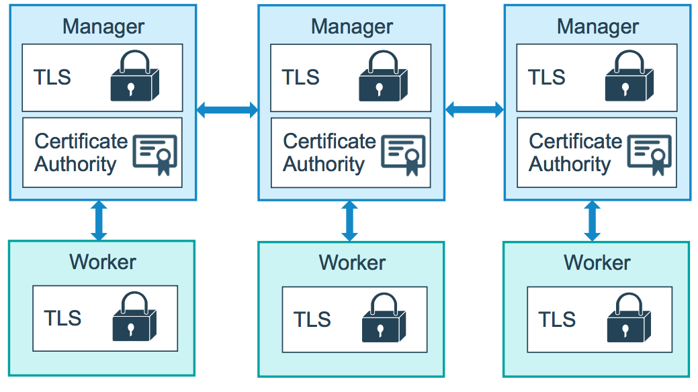

The swarm mode public key infrastructure (PKI) system built into Docker Engine
makes it simple to securely deploy a container orchestration system. The nodes
in a swarm use mutual Transport Layer Security (TLS) to authenticate, authorize,
and encrypt the communications between themselves and other nodes in the swarm.

When you create a swarm by running `docker swarm init`, the Docker Engine
designates itself as a manager node. By default, the manager node generates
itself a new root Certificate Authority (CA) along with a key pair to secure
communications with other nodes that join the swarm. If you prefer, you can pass
the `--external-ca` flag to specify a root CA external to the swarm. Refer to
the [docker swarm init](../../reference/commandline/swarm_init.md) CLI
reference.

The manager node also generates two tokens to use when you join additional nodes
to the swarm: one worker token and one manager token. Each token includes the
digest of the root CA's certificate and a randomly generated secret. When a node
joins the swarm, it uses the digest to validate the root CA certificate from the
remote manager. It uses the secret to ensure the node is an approved node.

Each time a new node joins the swarm, the manager issues a certificate to the
node that contains a randomly generated node id to identify the node under the
certificate common name (CN) and the role under the organizational unit (OU).
The node id serves as the cryptographically secure node identity for the
lifetime of the node in the current swarm.

The diagram below illustrates how worker manager nodes and worker nodes encrypt
communications using a minimum of TLS 1.2.




The example below shows the information from a certificate from a worker node:

```bash
Certificate:
    Data:
        Version: 3 (0x2)
        Serial Number:
            3b:1c:06:91:73:fb:16:ff:69:c3:f7:a2:fe:96:c1:73:e2:80:97:3b
        Signature Algorithm: ecdsa-with-SHA256
        Issuer: CN=swarm-ca
        Validity
            Not Before: Aug 30 02:39:00 2016 GMT
            Not After : Nov 28 03:39:00 2016 GMT
        Subject: O=ec2adilxf4ngv7ev8fwsi61i7, OU=swarm-worker, CN=dw02poa4vqvzxi5c10gm4pq2g
...snip...
```

By default, each node in the swarm renews its certificate every three months.
You can run `docker swarm update --cert-expiry <TIME PERIOD>` to configure the
frequency for nodes to renew their certificates. The minimum rotation value is 1
hour. Refer to the [docker swarm update](../../reference/commandline/swarm_update.md)
CLI reference.

## Rotating the CA certificate

In the event that a cluster CA key or a manager node is compromised, the swarm root
CA can be rotated so that none of the nodes will trust certificates signed by the old
root CA anymore.

You can run `docker swarm ca --rotate` to tell swarm to generate a new CA certificate
and key.  If you prefer, you can pass the `--ca-cert` and `--external-ca` flags to specify
the root certificate and a root CA external to the swarm.  Alternately, you can pass the
`--ca-cert` and `--ca-key` flags to specify the exact certificate and key you would like
the swarm to use.

When the command is issued, swarm will generate a cross-signed certificate (a version of the
new root CA certificate that is signed with the old root CA certificate), and use this
as an intermediate certificate for all new node certificates.  This is so nodes that still
trust the old root CA will be able to validate a certificate that is signed by the
new root CA.

During a root rotation, swarm will also tell all nodes (>= 17.06) to immediately renew
TLS certificates. Once every node in the swarm has a TLS certificate signed by the new CA,
(which may take a little while, depending on the number of nodes) swarm will forget about
the old CA certificate and key material and tell all the nodes to trust the new CA
certificate only.  This will also cause a change in the swarm's join tokens - the previous
join tokens will no longer be valid.

From this point on, all new node certificates issued will be signed with the new root CA,
and will not contain any intermediates.

## Learn More

* Read about how [nodes](nodes.md) work.
* Learn how swarm mode [services](services.md) work.
