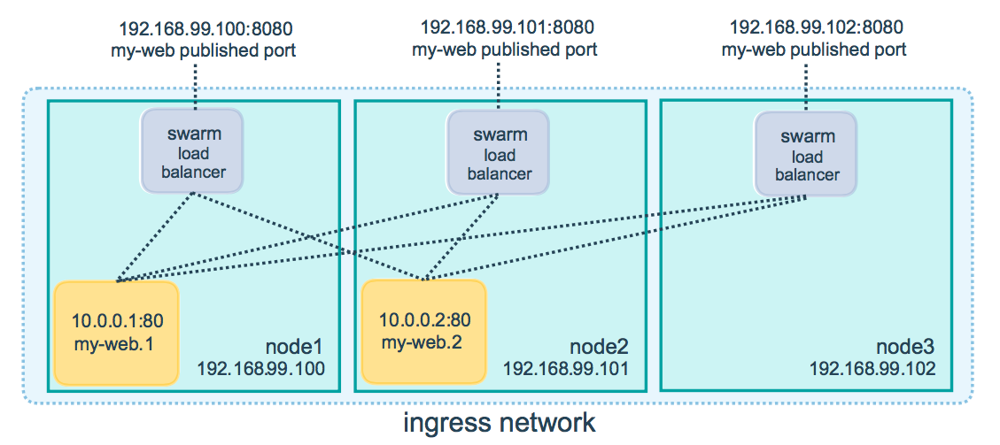

Docker Engine swarm mode makes it easy to publish ports for services to make
them available to resources outside the swarm. All nodes participate in an
ingress **routing mesh**. The routing mesh enables each node in the swarm to
accept connections on published ports for any service running in the swarm, even
if there's no task running on the node. The routing mesh routes all
incoming requests to published ports on available nodes to an active container.

To use the ingress network in the swarm, you need to have the following
ports open between the swarm nodes before you enable swarm mode:

* Port `7946` TCP/UDP for container network discovery.
* Port `4789` UDP for the container ingress network.

You must also open the published port between the swarm nodes and any external
resources, such as an external load balancer, that require access to the port.

You can also [bypass the routing mesh](#bypass-the-routing-mesh) for a given
service.

## Publish a port for a service

Use the `--publish` flag to publish a port when you create a service. `target`
is used to specify the port inside the container, and `published` is used to
specify the port to bind on the routing mesh. If you leave off the `published`
port, a random high-numbered port is bound for each service task. You
need to inspect the task to determine the port.

```bash
$ docker service create \
  --name <SERVICE-NAME> \
  --publish published=<PUBLISHED-PORT>,target=<CONTAINER-PORT> \
  <IMAGE>
```

> **Note**: The older form of this syntax is a colon-separated string, where
> the published port is first and the target port is second, such as
> `-p 8080:80`. The new syntax is preferred because it is easier to read and
> allows more flexibility.

The `<PUBLISHED-PORT>` is the port where the swarm makes the service available.
If you omit it, a random high-numbered port is bound.
The `<CONTAINER-PORT>` is the port where the container listens. This parameter
is required.

For example, the following command publishes port 80 in the nginx container to
port 8080 for any node in the swarm:

```bash
$ docker service create \
  --name my-web \
  --publish published=8080,target=80 \
  --replicas 2 \
  nginx
```

When you access port 8080 on any node, Docker routes your request to an active
container. On the swarm nodes themselves, port 8080 may not actually be bound,
but the routing mesh knows how to route the traffic and prevents any port
conflicts from happening.

The routing mesh listens on the published port for any IP address assigned to
the node. For externally routable IP addresses, the port is available from
outside the host. For all other IP addresses the access is only available from
within the host.



You can publish a port for an existing service using the following command:

```bash
$ docker service update \
  --publish-add published=<PUBLISHED-PORT>,target=<CONTAINER-PORT> \
  <SERVICE>
```

You can use `docker service inspect` to view the service's published port. For
instance:


```bash
$ docker service inspect --format="{{json .Endpoint.Spec.Ports}}" my-web

[{"Protocol":"tcp","TargetPort":80,"PublishedPort":8080}]
```


The output shows the `<CONTAINER-PORT>` (labeled `TargetPort`) from the containers and the
`<PUBLISHED-PORT>` (labeled `PublishedPort`) where nodes listen for requests for the service.

### Publish a port for TCP only or UDP only

By default, when you publish a port, it is a TCP port. You can
specifically publish a UDP port instead of or in addition to a TCP port. When
you publish both TCP and UDP ports, If you omit the protocol specifier,
the port is published as a TCP port. If you use the longer syntax (recommended
  for Docker 1.13 and higher), set the `protocol` key to either `tcp` or `udp`.

#### TCP only

**Long syntax:**

```bash
$ docker service create --name dns-cache \
  --publish published=53,target=53 \
  dns-cache
```

**Short syntax:**

```bash
$ docker service create --name dns-cache \
  -p 53:53 \
  dns-cache
```

#### TCP and UDP

**Long syntax:**

```bash
$ docker service create --name dns-cache \
  --publish published=53,target=53 \
  --publish published=53,target=53,protocol=udp \
  dns-cache
```

**Short syntax:**

```bash
$ docker service create --name dns-cache \
  -p 53:53 \
  -p 53:53/udp \
  dns-cache
```

#### UDP only

**Long syntax:**

```bash
$ docker service create --name dns-cache \
  --publish published=53,target=53,protocol=udp \
  dns-cache
```

**Short syntax:**

```bash
$ docker service create --name dns-cache \
  -p 53:53/udp \
  dns-cache
```

## Bypass the routing mesh

You can bypass the routing mesh, so that when you access the bound port on a
given node, you are always accessing the instance of the service running on
that node. This is referred to as `host` mode. There are a few things to keep
in mind.

- If you access a node which is not running a service task, the service does not
  listen on that port. It is possible that nothing is listening, or
  that a completely different application is listening.

- If you expect to run multiple service tasks on each node (such as when you
  have 5 nodes but run 10 replicas), you cannot specify a static target port.
  Either allow Docker to assign a random high-numbered port (by leaving off the
  `target`), or ensure that only a single instance of the service runs on a
  given node, by using a global service rather than a replicated one, or by
  using placement constraints.

To bypass the routing mesh, you must use the long `--publish` service and
set `mode` to `host`. If you omit the `mode` key or set it to `ingress`, the
routing mesh is used. The following command creates a global service using
`host` mode and bypassing the routing mesh.

```bash
$ docker service create --name dns-cache \
  --publish published=53,target=53,protocol=udp,mode=host \
  --mode global \
  dns-cache
```

## Configure an external load balancer

You can configure an external load balancer for swarm services, either in
combination with the routing mesh or without using the routing mesh at all.

### Using the routing mesh

You can configure an external load balancer to route requests to a swarm
service. For example, you could configure [HAProxy](http://www.haproxy.org) to
balance requests to an nginx service published to port 8080.


In this case, port 8080 must be open between the load balancer and the nodes in
the swarm. The swarm nodes can reside on a private network that is accessible to
the proxy server, but that is not publicly accessible.

You can configure the load balancer to balance requests between every node in
the swarm even if there are no tasks scheduled on the node. For example, you
could have the following HAProxy configuration in `/etc/haproxy/haproxy.cfg`:

```bash
global
        log /dev/log    local0
        log /dev/log    local1 notice
...snip...

# Configure HAProxy to listen on port 80
frontend http_front
   bind *:80
   stats uri /haproxy?stats
   default_backend http_back

# Configure HAProxy to route requests to swarm nodes on port 8080
backend http_back
   balance roundrobin
   server node1 192.168.99.100:8080 check
   server node2 192.168.99.101:8080 check
   server node3 192.168.99.102:8080 check
```

When you access the HAProxy load balancer on port 80, it forwards requests to
nodes in the swarm. The swarm routing mesh routes the request to an active task.
If, for any reason the swarm scheduler dispatches tasks to different nodes, you
don't need to reconfigure the load balancer.

You can configure any type of load balancer to route requests to swarm nodes.
To learn more about HAProxy, see the [HAProxy documentation](https://cbonte.github.io/haproxy-dconv/).

### Without the routing mesh

To use an external load balancer without the routing mesh, set `--endpoint-mode`
to `dnsrr` instead of the default value of `vip`. In this case, there is not a
single virtual IP. Instead, Docker sets up DNS entries for the service such that
a DNS query for the service name returns a list of IP addresses, and the client
connects directly to one of these. You are responsible for providing the list of
IP addresses and ports to your load balancer. See
[Configure service discovery](networking.md#configure-service-discovery).

## Learn more

* [Deploy services to a swarm](services.md)
