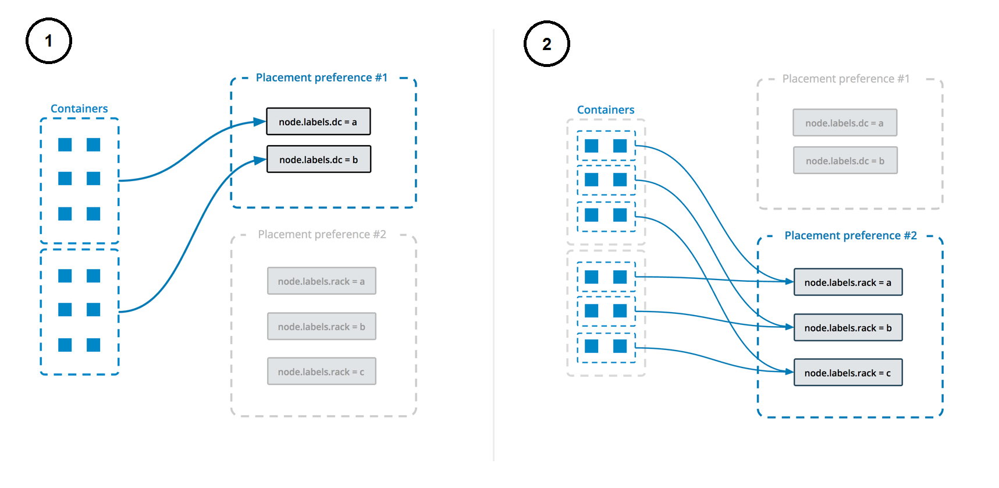

Swarm services use a *declarative* model, which means that you define the
desired state of the service, and rely upon Docker to maintain this state. The
state includes information such as (but not limited to):

- the image name and tag the service containers should run
- how many containers participate in the service
- whether any ports are exposed to clients outside the swarm
- whether the service should start automatically when Docker starts
- the specific behavior that happens when the service is restarted (such as
  whether a rolling restart is used)
- characteristics of the nodes where the service can run (such as resource
  constraints and placement preferences)

For an overview of swarm mode, see [Swarm mode key concepts](key-concepts.md).
For an overview of how services work, see
[How services work](how-swarm-mode-works/services.md).

## Create a service

To create a single-replica service with no extra configuration, you only need
to supply the image name. This command starts an Nginx service with a
randomly-generated name and no published ports. This is a naive example, since
you can't interact with the Nginx service.

```bash
$ docker service create nginx
```

The service is scheduled on an available node. To confirm that the service
was created and started successfully, use the `docker service ls` command:

```bash
$ docker service ls

ID                  NAME                MODE                REPLICAS            IMAGE                                                                                             PORTS
a3iixnklxuem        quizzical_lamarr    replicated          1/1                 docker.io/library/nginx@sha256:41ad9967ea448d7c2b203c699b429abe1ed5af331cd92533900c6d77490e0268
```

Created services do not always run right away. A service can be in a pending
state if its image is unavailable, if no node meets the requirements you
configure for the service, or other reasons. See
[Pending services](how-swarm-mode-works/services.md#pending-services) for more
information.

To provide a name for your service, use the `--name` flag:

```bash
$ docker service create --name my_web nginx
```

Just like with standalone containers, you can specify a command that the
service's containers should run, by adding it after the image name. This example
starts a service called `helloworld` which uses an `alpine` image and runs the
command `ping docker.com`:

```bash
$ docker service create --name helloworld alpine ping docker.com
```

You can also specify an image tag for the service to use. This example modifies
the previous one to use the `alpine:3.6` tag:

```bash
$ docker service create --name helloworld alpine:3.6 ping docker.com
```

For more details about image tag resolution, see
[Specify the image version the service should use](#specify-the-image-version-a-service-should-use).

### gMSA for Swarm

Swarm now allows using a Docker Config as a gMSA credential spec - a requirement for Active Directory-authenticated applications. This reduces the burden of distributing credential specs to the nodes they're used on. 

The following example assumes a gMSA and its credential spec (called credspec.json) already exists, and that the nodes being deployed to are correctly configured for the gMSA.

To use a Config as a credential spec, first create the Docker Config containing the credential spec:


```bash
docker config create credspec credspec.json
```

Now, you should have a Docker Config named credspec, and you can create a service using this credential spec. To do so, use the --credential-spec flag with the config name, like this:

```bash
docker service create --credential-spec="config://credspec" <your image>
```

Your service will use the gMSA credential spec when it starts, but unlike a typical Docker Config (used by passing the --config flag), the credential spec will not be mounted into the container.

### Create a service using an image on a private registry

If your image is available on a private registry which requires login, use the
`--with-registry-auth` flag with `docker service create`, after logging in. If
your image is stored on `registry.example.com`, which is a private registry, use
a command like the following:

```bash
$ docker login registry.example.com

$ docker service  create \
  --with-registry-auth \
  --name my_service \
  registry.example.com/acme/my_image:latest
```

This passes the login token from your local client to the swarm nodes where the
service is deployed, using the encrypted WAL logs. With this information, the
nodes are able to log into the registry and pull the image.

### Provide credential specs for managed service accounts

 In Enterprise Edition 3.0, security is improved through the centralized distribution and management of Group Managed Service Account(gMSA) credentials using Docker Config functionality. Swarm now allows using a Docker Config as a gMSA credential spec, which reduces the burden of distributing credential specs to the nodes on which they are used. 

 **Note**: This option is only applicable to services using Windows containers.

 Credential spec files are applied at runtime, eliminating the need for host-based credential spec files or registry entries - no gMSA credentials are written to disk on worker nodes. You can make credential specs available to Docker Engine running swarm kit worker nodes before a container starts. When deploying a service using a gMSA-based config, the credential spec is passed directly to the runtime of containers in that service.

 The `--credential-spec` must be one of the following formats:

 - `file://<filename>`: The referenced file must be present in the `CredentialSpecs` subdirectory in the docker data directory, which defaults to `C:\ProgramData\Docker\` on Windows. For example, specifying `file://spec.json` loads `C:\ProgramData\Docker\CredentialSpecs\spec.json`.
- `registry://<value-name>`: The credential spec is read from the Windows registry on the daemon’s host. 
- `config://<config-name>`: The config name is automatically converted to the config ID in the CLI. 
The credential spec contained in the specified `config` is used.

 The following simple example retrieves the gMSA name and JSON contents from your Active Directory (AD) instance:

 ```
name="mygmsa"
contents="{...}"
echo $contents > contents.json
```
Make sure that the nodes to which you are deploying are correctly configured for the gMSA.

 To use a Config as a credential spec, create a Docker Config in a credential spec file named `credpspec.json`. 
 You can specify any name for the name of the `config`. 

```
docker config create --label com.docker.gmsa.name=mygmsa credspec credspec.json
```
Now you can create a service using this credential spec. Specify the `--credential-spec` flag with the config name:
```
docker service create --credential-spec="config://credspec" <your image>
```

 Your service uses the gMSA credential spec when it starts, but unlike a typical Docker Config (used by passing the --config flag), the credential spec is not mounted into the container.

## Update a service

You can change almost everything about an existing service using the
`docker service update` command. When you update a service, Docker stops its
containers and restarts them with the new configuration.

Since Nginx is a web service, it works much better if you publish port 80
to clients outside the swarm. You can specify this when you create the service,
using the `-p` or `--publish` flag. When updating an existing service, the flag
is `--publish-add`. There is also a `--publish-rm` flag to remove a port that
was previously published.

Assuming that the `my_web` service from the previous section still exists, use
the following command to update it to publish port 80.

```bash
$ docker service update --publish-add 80 my_web
```

To verify that it worked, use `docker service ls`:

```bash
$ docker service ls

ID                  NAME                MODE                REPLICAS            IMAGE                                                                                             PORTS
4nhxl7oxw5vz        my_web              replicated          1/1                 docker.io/library/nginx@sha256:41ad9967ea448d7c2b203c699b429abe1ed5af331cd92533900c6d77490e0268   *:0->80/tcp
```

For more information on how publishing ports works, see
[publish ports](#publish-ports).

You can update almost every configuration detail about an existing service,
including the image name and tag it runs. See
[Update a service's image after creation](#update-a-services-image-after-creation).

## Remove a service

To remove a service, use the `docker service remove` command. You can remove a
service by its ID or name, as shown in the output of the `docker service ls`
command. The following command removes the `my_web` service.

```bash
$ docker service remove my_web
```

## Service configuration details

The following sections provide details about service configuration. This topic
does not cover every flag or scenario. In almost every instance where you can
define a configuration at service creation, you can also update an existing
service's configuration in a similar way.

See the command-line references for
[`docker service create`](../reference/commandline/service_create.md) and
[`docker service update`](../reference/commandline/service_update.md), or run
one of those commands with the `--help` flag.

### Configure the runtime environment

You can configure the following options for the runtime environment in the
container:

* environment variables using the `--env` flag
* the working directory inside the container using the `--workdir` flag
* the username or UID using the `--user` flag

The following service's containers have an environment variable `$MYVAR`
set to `myvalue`, run from the `/tmp/` directory, and run as the
`my_user` user.

```bash
$ docker service create --name helloworld \
  --env MYVAR=myvalue \
  --workdir /tmp \
  --user my_user \
  alpine ping docker.com
```

### Update the command an existing service runs

To update the command an existing service runs, you can use the `--args` flag.
The following example updates an existing service called `helloworld` so that
it runs the command `ping docker.com` instead of whatever command it was running
before:

```bash
$ docker service update --args "ping docker.com" helloworld
```

### Specify the image version a service should use

When you create a service without specifying any details about the version of
the image to use, the service uses the version tagged with the `latest` tag.
You can force the service to use a specific version of the image in a few
different ways, depending on your desired outcome.

An image version can be expressed in several different ways:

- If you specify a tag, the manager (or the Docker client, if you use
  [content trust](#image_resolution_with_trust)) resolves that tag to a digest.
  When the request to create a container task is received on a worker node, the
  worker node only sees the digest, not the tag.

  ```bash
  $ docker service create --name="myservice" ubuntu:16.04
  ```

  Some tags represent discrete releases, such as `ubuntu:16.04`. Tags like this
  almost always resolve to a stable digest over time. It is recommended
  that you use this kind of tag when possible.

  Other types of tags, such as `latest` or `nightly`, may resolve to a new
  digest often, depending on how often an image's author updates the tag. It is
  not recommended to run services using a tag which is updated frequently, to
  prevent different service replica tasks from using different image versions.

- If you don't specify a version at all, by convention the image's `latest` tag
  is resolved to a digest. Workers use the image at this digest when creating
  the service task.

  Thus, the following two commands are equivalent:

  ```bash
  $ docker service create --name="myservice" ubuntu

  $ docker service create --name="myservice" ubuntu:latest
  ```

- If you specify a digest directly, that exact version of the image is always
  used when creating service tasks.

  ```bash
  $ docker service create \
      --name="myservice" \
      ubuntu:16.04@sha256:35bc48a1ca97c3971611dc4662d08d131869daa692acb281c7e9e052924e38b1
  ```

When you create a service, the image's tag is resolved to the specific digest
the tag points to **at the time of service creation**. Worker nodes for that
service use that specific digest forever unless the service is explicitly
updated. This feature is particularly important if you do use often-changing tags
such as `latest`, because it ensures that all service tasks use the same version
of the image.

> **Note**: If [content trust](../security/trust/content_trust.md) is
> enabled, the client actually resolves the image's tag to a digest before
> contacting the swarm manager, to verify that the image is signed.
> Thus, if you use content trust, the swarm manager receives the request
> pre-resolved. In this case, if the client cannot resolve the image to a
> digest, the request fails.
{: id="image_resolution_with_trust" }

If the manager can't resolve the tag to a digest, each worker
node is responsible for resolving the tag to a digest, and different nodes may
use different versions of the image. If this happens, a warning like the
following is logged, substituting the placeholders for real information.

```none
unable to pin image <IMAGE-NAME> to digest: <REASON>
```

To see an image's current digest, issue the command
`docker inspect <IMAGE>:<TAG>` and look for the `RepoDigests` line. The
following is the current digest for `ubuntu:latest` at the time this content
was written. The output is truncated for clarity.

```bash
$ docker inspect ubuntu:latest
```

```json
"RepoDigests": [
    "ubuntu@sha256:35bc48a1ca97c3971611dc4662d08d131869daa692acb281c7e9e052924e38b1"
],
```

After you create a service, its image is never updated unless you explicitly run
`docker service update` with the `--image` flag as described below. Other update
operations such as scaling the service, adding or removing networks or volumes,
renaming the service, or any other type of update operation do not update the
service's image.

### Update a service's image after creation

Each tag represents a digest, similar to a Git hash. Some tags, such as
`latest`, are updated often to point to a new digest. Others, such as
`ubuntu:16.04`, represent a released software version and are not expected to
update to point to a new digest often if at all. In Docker 1.13 and higher, when
you create a service, it is constrained to create tasks using a specific digest
of an image until you update the service using `service update` with the
`--image` flag. If you use an older version of Docker Engine, you must remove
and re-create the service to update its image.

When you run `service update` with the `--image` flag, the swarm manager queries
Docker Hub or your private Docker registry for the digest the tag currently
points to and updates the service tasks to use that digest.

> **Note**: If you use [content trust](#image_resolution_with_trust), the Docker
> client resolves image and the swarm manager receives the image and digest,
>  rather than a tag.

Usually, the manager can resolve the tag to a new digest and the service
updates, redeploying each task to use the new image. If the manager can't
resolve the tag or some other problem occurs, the next two sections outline what
to expect.

#### If the manager resolves the tag

If the swarm manager can resolve the image tag to a digest, it instructs the
worker nodes to redeploy the tasks and use the image at that digest.

- If a worker has cached the image at that digest, it uses it.

- If not, it attempts to pull the image from Docker Hub or the private registry.

  - If it succeeds, the task is deployed using the new image.

  - If the worker fails to pull the image, the service fails to deploy on that
    worker node. Docker tries again to deploy the task, possibly on a different
    worker node.

#### If the manager cannot resolve the tag

If the swarm manager cannot resolve the image to a digest, all is not lost:

- The manager instructs the worker nodes to redeploy the tasks using the image
  at that tag.

- If the worker has a locally cached image that resolves to that tag, it uses
  that image.

- If the worker does not have a locally cached image that resolves to the tag,
  the worker tries to connect to Docker Hub or the private registry to pull the
  image at that tag.

  - If this succeeds, the worker uses that image.

  - If this fails, the task fails to deploy and the manager tries again to deploy
    the task, possibly on a different worker node.

### Publish ports

When you create a swarm service, you can publish that service's ports to hosts
outside the swarm in two ways:

- [You can rely on the routing mesh](#publish-a-services-ports-using-the-routing-mesh).
  When you publish a service port, the swarm makes the service accessible at the
  target port on every node, regardless of whether there is a task for the
  service running on that node or not. This is less complex and is the right
  choice for many types of services.

- [You can publish a service task's port directly on the swarm node](#publish-a-services-ports-directly-on-the-swarm-node)
  where that service is running. This feature is available in Docker 1.13 and
  higher. This bypasses the routing mesh and provides the maximum flexibility,
  including the ability for you to develop your own routing framework. However,
  you are responsible for keeping track of where each task is running and
  routing requests to the tasks, and load-balancing across the nodes.

Keep reading for more information and use cases for each of these methods.

#### Publish a service's ports using the routing mesh

To publish a service's ports externally to the swarm, use the
`--publish <PUBLISHED-PORT>:<SERVICE-PORT>` flag. The swarm makes the service
accessible at the published port **on every swarm node**. If an external host
connects to that port on any swarm node, the routing mesh routes it to a task.
The external host does not need to know the IP addresses or internally-used
ports of the service tasks to interact with the service. When a user or process
connects to a service, any worker node running a service task may respond. For
more details about swarm service networking, see
[Manage swarm service networks](networking.md).

##### Example: Run a three-task Nginx service on 10-node swarm

Imagine that you have a 10-node swarm, and you deploy an Nginx service running
three tasks on a 10-node swarm:

```bash
$ docker service create --name my_web \
                        --replicas 3 \
                        --publish published=8080,target=80 \
                        nginx
```

Three tasks run on up to three nodes. You don't need to know which nodes
are running the tasks; connecting to port 8080 on **any** of the 10 nodes
connects you to one of the three `nginx` tasks. You can test this using `curl`.
The following example assumes that `localhost` is one of the swarm nodes. If
this is not the case, or `localhost` does not resolve to an IP address on your
host, substitute the host's IP address or resolvable host name.

The HTML output is truncated:

```bash
$ curl localhost:8080

<!DOCTYPE html>
<html>
<head>
<title>Welcome to nginx!</title>
...truncated...
</html>
```

Subsequent connections may be routed to the same swarm node or a different one.

#### Publish a service's ports directly on the swarm node

Using the routing mesh may not be the right choice for your application if you
need to make routing decisions based on application state or you need total
control of the process for routing requests to your service's tasks. To publish
a service's port directly on the node where it is running, use the `mode=host`
option to the `--publish` flag.

> **Note**: If you publish a service's ports directly on the swarm node using
> `mode=host` and also set `published=<PORT>` this creates an implicit
> limitation that you can only run one task for that service on a given swarm
> node. You can work around this by specifying `published` without a port
> definition, which causes Docker to assign a random port for each task.
>
> In addition, if you use `mode=host` and you do not use the
> `--mode=global` flag on `docker service create`, it is difficult to know
> which nodes are running the service to route work to them.

##### Example: Run an `nginx` web server service on every swarm node

[nginx](https://hub.docker.com/_/nginx/) is an open source reverse proxy, load
balancer, HTTP cache, and a web server. If you run nginx as a service using the
routing mesh, connecting to the nginx port on any swarm node shows you the
web page for (effectively) **a random swarm node** running the service.

The following example runs nginx as a service on each node in your swarm and
exposes nginx port locally on each swarm node.

```bash
$ docker service create \
  --mode global \
  --publish mode=host,target=80,published=8080 \
  --name=nginx \
  nginx:latest
```

You can reach the nginx server on port 8080 of every swarm node. If you add a
node to the swarm, a nginx task is started on it. You cannot start another
service or container on any swarm node which binds to port 8080.

> **Note**: This is a naive example. Creating an application-layer
> routing framework for a multi-tiered service is complex and out of scope for
> this topic.

### Connect the service to an overlay network

You can use overlay networks to connect one or more services within the swarm.

First, create overlay network on a manager node using the `docker network create`
command with the `--driver overlay` flag.

```bash
$ docker network create --driver overlay my-network
```

After you create an overlay network in swarm mode, all manager nodes have access
to the network.

You can create a new service and pass the `--network` flag to attach the service
to the overlay network:

```bash
$ docker service create \
  --replicas 3 \
  --network my-network \
  --name my-web \
  nginx
```

The swarm extends `my-network` to each node running the service.

You can also connect an existing service to an overlay network using the
`--network-add` flag.

```bash
$ docker service update --network-add my-network my-web
```

To disconnect a running service from a network, use the `--network-rm` flag.

```bash
$ docker service update --network-rm my-network my-web
```

For more information on overlay networking and service discovery, refer to
[Attach services to an overlay network](networking.md) and
[Docker swarm mode overlay network security model](../../network/overlay.md).

### Grant a service access to secrets

To create a service with access to Docker-managed secrets, use the `--secret`
flag. For more information, see
[Manage sensitive strings (secrets) for Docker services](secrets.md)

### Customize a service's isolation mode

Docker 17.12 CE and higher allow you to specify a swarm service's isolation
mode. **This setting applies to Windows hosts only and is ignored for Linux
hosts.** The isolation mode can be one of the following:

- `default`: Use the default isolation mode configured for the Docker host, as
  configured by the `-exec-opt` flag or `exec-opts` array in `daemon.json`. If
  the daemon does not specify an isolation technology, `process` is the default
  for Windows Server, and `hyperv` is the default (and only) choice for
  Windows 10.

- `process`: Run the service tasks as a separate process on the host.

  > **Note**: `process` isolation mode is only supported on Windows Server.
  > Windows 10 only supports `hyperv` isolation mode.

- `hyperv`: Run the service tasks as isolated `hyperv` tasks. This increases
  overhead but provides more isolation.

You can specify the isolation mode when creating or updating a new service using
the `--isolation` flag.

### Control service placement

Swarm services provide a few different ways for you to control scale and
placement of services on different nodes.

- You can specify whether the service needs to run a specific number of replicas
  or should run globally on every worker node. See
  [Replicated or global services](#replicated-or-global-services).

- You can configure the service's
  [CPU or memory requirements](#reserve-memory-or-cpus-for-a-service), and the
  service only runs on nodes which can meet those requirements.

- [Placement constraints](#placement-constraints) let you configure the service
  to run only on nodes with specific (arbitrary) metadata set, and cause the
  deployment to fail if appropriate nodes do not exist. For instance, you can
  specify that your service should only run on nodes where an arbitrary label
  `pci_compliant` is set to `true`.

- [Placement preferences](#placement-preferences) let you apply an arbitrary
  label with a range of values to each node, and spread your service's tasks
  across those nodes using an algorithm. Currently, the only supported algorithm
  is `spread`, which tries to place them evenly. For instance, if you
  label each node with a label `rack` which has a value from 1-10, then specify
  a placement preference keyed on `rack`, then service tasks are placed as
  evenly as possible across all nodes with the label `rack`, after taking other
  placement constraints, placement preferences, and other node-specific
  limitations into account.

  Unlike constraints, placement preferences are best-effort, and a service does
  not fail to deploy if no nodes can satisfy the preference. If you specify a
  placement preference for a service, nodes that match that preference are
  ranked higher when the swarm managers decide which nodes should run the
  service tasks. Other factors, such as high availability of the service,
  also factor into which nodes are scheduled to run service tasks. For
  example, if you have N nodes with the rack label (and then some others), and
  your service is configured to run N+1 replicas, the +1 is scheduled on a
  node that doesn't already have the service on it if there is one, regardless
  of whether that node has the `rack` label or not.


#### Replicated or global services

Swarm mode has two types of services: replicated and global. For replicated
services, you specify the number of replica tasks for the swarm manager to
schedule onto available nodes. For global services, the scheduler places one
task on each available node that meets the service's
[placement constraints](#placement-constraints) and
[resource requirements](#reserve-memory-or-cpus-for-a-service).

You control the type of service using the `--mode` flag. If you don't specify a
mode, the service defaults to `replicated`. For replicated services, you specify
the number of replica tasks you want to start using the `--replicas` flag. For
example, to start a replicated nginx service with 3 replica tasks:

```bash
$ docker service create \
  --name my_web \
  --replicas 3 \
  nginx
```

To start a global service on each available node, pass `--mode global` to
`docker service create`. Every time a new node becomes available, the scheduler
places a task for the global service on the new node. For example to start a
service that runs alpine on every node in the swarm:

```bash
$ docker service create \
  --name myservice \
  --mode global \
  alpine top
```

Service constraints let you set criteria for a node to meet before the scheduler
deploys a service to the node. You can apply constraints to the
service based upon node attributes and metadata or engine metadata. For more
information on constraints, refer to the `docker service create`
[CLI reference](../reference/commandline/service_create.md).

#### Reserve memory or CPUs for a service

To reserve a given amount of memory or number of CPUs for a service, use the
`--reserve-memory` or `--reserve-cpu` flags. If no available nodes can satisfy
the requirement (for instance, if you request 4 CPUs and no node in the swarm
has 4 CPUs), the service remains in a pending state until an appropriate node is
available to run its tasks.

##### Out Of Memory Exceptions (OOME)

If your service attempts to use more memory than the swarm node has available,
you may experience an Out Of Memory Exception (OOME) and a container, or the
Docker daemon, might be killed by the kernel OOM killer. To prevent this from
happening, ensure that your application runs on hosts with adequate memory and
see
[Understand the risks of running out of memory](../../config/containers/resource_constraints.md#understand-the-risks-of-running-out-of-memory).

Swarm services allow you to use resource constraints, placement preferences, and
labels to ensure that your service is deployed to the appropriate swarm nodes.

#### Placement constraints

Use placement constraints to control the nodes a service can be assigned to. In
the following example, the service only runs on nodes with the
[label](manage-nodes.md#add-or-remove-label-metadata) `region` set
to `east`. If no appropriately-labelled nodes are available, tasks will wait in
`Pending` until they become available. The `--constraint` flag uses an equality
operator (`==` or `!=`). For replicated services, it is possible that all
services run on the same node, or each node only runs one replica, or that some
nodes don't run any replicas. For global services, the service runs on every
node that meets the placement constraint and any [resource requirements](#reserve-memory-or-cpus-for-a-service).

```bash
$ docker service create \
  --name my-nginx \
  --replicas 5 \
  --constraint node.labels.region==east \
  nginx
```

You can also use the `constraint` service-level key in a `docker-compose.yml`
file.

If you specify multiple placement constraints, the service only deploys onto
nodes where they are all met. The following example limits the service to run on
all nodes where `region` is set to `east` and `type` is not set to `devel`:

```bash
$ docker service create \
  --name my-nginx \
  --mode global \
  --constraint node.labels.region==east \
  --constraint node.labels.type!=devel \
  nginx
```

You can also use placement constraints in conjunction with placement preferences
and CPU/memory constraints. Be careful not to use settings that are not
possible to fulfill.

For more information on constraints, refer to the `docker service create`
[CLI reference](../reference/commandline/service_create.md).

#### Placement preferences

While [placement constraints](#placement-constraints) limit the nodes a service
can run on, _placement preferences_ try to place tasks on appropriate nodes
in an algorithmic way (currently, only spread evenly). For instance, if you
assign each node a `rack` label, you can set a placement preference to spread
the service evenly across nodes with the `rack` label, by value. This way, if
you lose a rack, the service is still running on nodes on other racks.

Placement preferences are not strictly enforced. If no node has the label
you specify in your preference, the service is deployed as though the
preference were not set.

> Placement preferences are ignored for global services.

The following example sets a preference to spread the deployment across nodes
based on the value of the `datacenter` label. If some nodes have
`datacenter=us-east` and others have `datacenter=us-west`, the service is
deployed as evenly as possible across the two sets of nodes.

```bash
$ docker service create \
  --replicas 9 \
  --name redis_2 \
  --placement-pref 'spread=node.labels.datacenter' \
  redis:3.0.6
```

> Missing or null labels
>
> Nodes which are missing the label used to spread still receive
> task assignments. As a group, these nodes receive tasks in equal
> proportion to any of the other groups identified by a specific label
> value. In a sense, a missing label is the same as having the label with
> a null value attached to it. If the service should **only** run on
> nodes with the label being used for the spread preference, the
> preference should be combined with a constraint.

You can specify multiple placement preferences, and they are processed in the
order they are encountered. The following example sets up a service with
multiple placement preferences. Tasks are spread first over the various
datacenters, and then over racks (as indicated by the respective labels):

```bash
$ docker service create \
  --replicas 9 \
  --name redis_2 \
  --placement-pref 'spread=node.labels.datacenter' \
  --placement-pref 'spread=node.labels.rack' \
  redis:3.0.6
```

You can also use placement preferences in conjunction with placement constraints
or CPU/memory constraints. Be careful not to use settings that are not
possible to fulfill.

This diagram illustrates how placement preferences work:



When updating a service with `docker service update`, `--placement-pref-add`
appends a new placement preference after all existing placement preferences.
`--placement-pref-rm` removes an existing placement preference that matches the
argument.


### Configure a service's update behavior

When you create a service, you can specify a rolling update behavior for how the
swarm should apply changes to the service when you run `docker service update`.
You can also specify these flags as part of the update, as arguments to
`docker service update`.

The `--update-delay` flag configures the time delay between updates to a service
task or sets of tasks. You can describe the time `T` as a combination of the
number of seconds `Ts`, minutes `Tm`, or hours `Th`. So `10m30s` indicates a 10
minute 30 second delay.

By default the scheduler updates 1 task at a time. You can pass the
`--update-parallelism` flag to configure the maximum number of service tasks
that the scheduler updates simultaneously.

When an update to an individual task returns a state of `RUNNING`, the scheduler
continues the update by continuing to another task until all tasks are updated.
If, at any time during an update a task returns `FAILED`, the scheduler pauses
the update. You can control the behavior using the `--update-failure-action`
flag for `docker service create` or `docker service update`.

In the example service below, the scheduler applies updates to a maximum of 2
replicas at a time. When an updated task returns either `RUNNING` or `FAILED`,
the scheduler waits 10 seconds before stopping the next task to update:

```bash
$ docker service create \
  --replicas 10 \
  --name my_web \
  --update-delay 10s \
  --update-parallelism 2 \
  --update-failure-action continue \
  alpine
```

The `--update-max-failure-ratio` flag controls what fraction of tasks can fail
during an update before the update as a whole is considered to have failed. For
example, with `--update-max-failure-ratio 0.1 --update-failure-action pause`,
after 10% of the tasks being updated fail, the update is paused.

An individual task update is considered to have failed if the task doesn't
start up, or if it stops running within the monitoring period specified with
the `--update-monitor` flag. The default value for `--update-monitor` is 30
seconds, which means that a task failing in the first 30 seconds after its
started counts towards the service update failure threshold, and a failure
after that is not counted.

### Roll back to the previous version of a service

In case the updated version of a service doesn't function as expected, it's
possible to manually roll back to the previous version of the service using
`docker service update`'s `--rollback` flag. This reverts the service
to the configuration that was in place before the most recent
`docker service update` command.

Other options can be combined with `--rollback`; for example,
`--update-delay 0s` to execute the rollback without a delay between tasks:

```bash
$ docker service update \
  --rollback \
  --update-delay 0s
  my_web
```

In Docker 17.04 and higher, you can configure a service to roll back
automatically if a service update fails to deploy. See
[Automatically roll back if an update fails](#automatically-roll-back-if-an-update-fails).

Related to the new automatic rollback feature, in Docker 17.04 and higher,
manual rollback is handled at the server side, rather than the client, if the
daemon is running Docker 17.04 or higher. This allows manually-initiated
rollbacks to respect the new rollback parameters. The client is version-aware,
so it still uses the old method against an older daemon.

Finally, in Docker 17.04 and higher, `--rollback` cannot be used in conjunction
with other flags to `docker service update`.

### Automatically roll back if an update fails

You can configure a service in such a way that if an update to the service
causes redeployment to fail, the service can automatically roll back to the
previous configuration. This helps protect service availability. You can set
one or more of the following flags at service creation or update. If you do not
set a value, the default is used.

| Flag                           | Default | Description                                                                                                                                                                                                                                                                                                             |
|:-------------------------------|:--------|:------------------------------------------------------------------------------------------------------------------------------------------------------------------------------------------------------------------------------------------------------------------------------------------------------------------------|
| `--rollback-delay`             | `0s`    | Amount of time to wait after rolling back a task before rolling back the next one. A value of `0` means to roll back the second task immediately after the first rolled-back task deploys.                                                                                                                              |
| `--rollback-failure-action`    | `pause` | When a task fails to roll back, whether to `pause` or `continue` trying to roll back other tasks.                                                                                                                                                                                                                       |
| `--rollback-max-failure-ratio` | `0`     | The failure rate to tolerate during a rollback, specified as a floating-point number between 0 and 1. For instance, given 5 tasks, a failure ratio of `.2` would tolerate one task failing to roll back. A value of `0` means no failure are tolerated, while a value of `1` means any number of failure are tolerated. |
| `--rollback-monitor`           | `5s`    | Duration after each task rollback to monitor for failure. If a task stops before this time period has elapsed, the rollback is considered to have failed.                                                                                                                                                               |
| `--rollback-parallelism`       | `1`     | The maximum number of tasks to roll back in parallel. By default, one task is rolled back at a time. A value of `0` causes all tasks to be rolled back in parallel.                                                                                                                                                     |

The following example configures a `redis` service to roll back automatically
if a `docker service update` fails to deploy. Two tasks can be rolled back in
parallel. Tasks are monitored for 20 seconds after rollback to be sure they do
not exit, and a maximum failure ratio of 20% is tolerated. Default values are
used for `--rollback-delay` and `--rollback-failure-action`.

```bash
$ docker service create --name=my_redis \
                        --replicas=5 \
                        --rollback-parallelism=2 \
                        --rollback-monitor=20s \
                        --rollback-max-failure-ratio=.2 \
                        redis:latest
```

### Give a service access to volumes or bind mounts

For best performance and portability, you should avoid writing important data
directly into a container's writable layer, instead using data volumes or bind
mounts. This principle also applies to services.

You can create two types of mounts for services in a swarm, `volume` mounts or
`bind` mounts. Regardless of which type of mount you use, configure it using the
`--mount` flag when you create a service, or the `--mount-add` or `--mount-rm`
flag when updating an existing service. The default is a data volume if you
don't specify a type.

#### Data volumes

Data volumes are storage that exist independently of a container. The
lifecycle of data volumes under swarm services is similar to that under
containers. Volumes outlive tasks and services, so their removal must be
managed separately. Volumes can be created before deploying a service, or if
they don't exist on a particular host when a task is scheduled there, they are
created automatically according to the volume specification on the service.

To use existing data volumes with a service use the `--mount` flag:

```bash
$ docker service create \
  --mount src=<VOLUME-NAME>,dst=<CONTAINER-PATH> \
  --name myservice \
  <IMAGE>
```

If a volume with the same `<VOLUME-NAME>` does not exist when a task is
scheduled to a particular host, then one is created. The default volume
driver is `local`.  To use a different volume driver with this create-on-demand
pattern, specify the driver and its options with the `--mount` flag:

```bash
$ docker service create \
  --mount type=volume,src=<VOLUME-NAME>,dst=<CONTAINER-PATH>,volume-driver=<DRIVER>,volume-opt=<KEY0>=<VALUE0>,volume-opt=<KEY1>=<VALUE1>
  --name myservice \
  <IMAGE>
```

For more information on how to create data volumes and the use of volume
drivers, see [Use volumes](../../storage/volumes.md).


#### Bind mounts

Bind mounts are file system paths from the host where the scheduler deploys
the container for the task. Docker mounts the path into the container. The
file system path must exist before the swarm initializes the container for the
task.

The following examples show bind mount syntax:

- To mount a read-write bind:

  ```bash
  $ docker service create \
    --mount type=bind,src=<HOST-PATH>,dst=<CONTAINER-PATH> \
    --name myservice \
    <IMAGE>
  ```

- To mount a read-only bind:

  ```bash
  $ docker service create \
    --mount type=bind,src=<HOST-PATH>,dst=<CONTAINER-PATH>,readonly \
    --name myservice \
    <IMAGE>
  ```

> **Important**: Bind mounts can be useful but they can also cause problems. In
> most cases, it is recommended that you architect your application such that
> mounting paths from the host is unnecessary. The main risks include the
> following:
>
> - If you bind mount a host path into your service’s containers, the path
>   must exist on every swarm node. The Docker swarm mode scheduler can schedule
>   containers on any machine that meets resource availability requirements
>   and satisfies all constraints and placement preferences you specify.
>
> - The Docker swarm mode scheduler may reschedule your running service
>   containers at any time if they become unhealthy or unreachable.
>
> - Host bind mounts are non-portable. When you use bind mounts, there is no
>   guarantee that your application runs the same way in development as it does
>   in production.

### Create services using templates

You can use templates for some flags of `service create`, using the syntax
provided by the Go's [text/template](http://golang.org/pkg/text/template/)
package.

The following flags are supported:

- `--hostname`
- `--mount`
- `--env`

Valid placeholders for the Go template are:

| Placeholder       | Description    |
|:------------------|:---------------|
| `.Service.ID`     | Service ID     |
| `.Service.Name`   | Service name   |
| `.Service.Labels` | Service labels |
| `.Node.ID`        | Node ID        |
| `.Node.Hostname`  | Node hostname  |
| `.Task.Name`      | Task name      |
| `.Task.Slot`      | Task slot      |

#### Template example

This example sets the template of the created containers based on the
service's name and the ID of the node where the container is running:


```bash
$ docker service create --name hosttempl \
                        --hostname="{{.Node.ID}}-{{.Service.Name}}"\
                         busybox top
```


To see the result of using the template, use the `docker service ps` and
`docker inspect` commands.

```bash
$ docker service ps va8ew30grofhjoychbr6iot8c

ID            NAME         IMAGE                                                                                   NODE          DESIRED STATE  CURRENT STATE               ERROR  PORTS
wo41w8hg8qan  hosttempl.1  busybox:latest@sha256:29f5d56d12684887bdfa50dcd29fc31eea4aaf4ad3bec43daf19026a7ce69912  2e7a8a9c4da2  Running        Running about a minute ago
```


```bash
$ docker inspect --format="{{.Config.Hostname}}" hosttempl.1.wo41w8hg8qanxwjwsg4kxpprj
```


## Learn More

* [Swarm administration guide](admin_guide.md)
* [Docker Engine command line reference](../reference/commandline/docker.md)
* [Swarm mode tutorial](swarm-tutorial/index.md)
