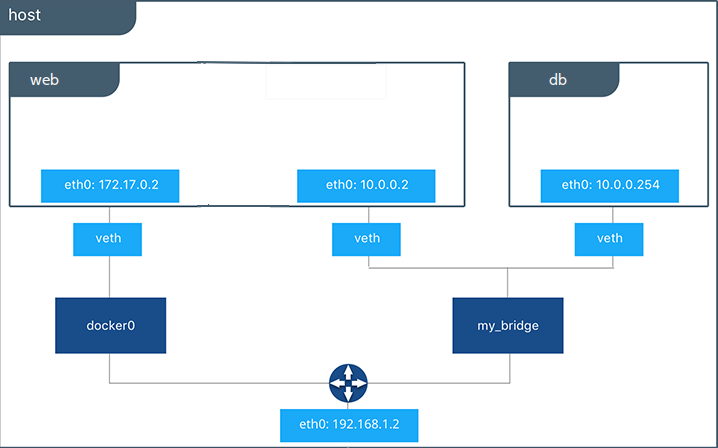

If you are working your way through the user guide, you just built and ran a
simple application. You've also built in your own images. This section teaches
you how to network your containers.

## Launch a container on the default network

Docker includes support for networking containers through the use of **network
drivers**. By default, Docker provides two network drivers for you, the
`bridge` and the `overlay` drivers. You can also write a network driver plugin so
that you can create your own drivers but that is an advanced task.

Every installation of the Docker Engine automatically includes three default networks. You can list them:

    $ docker network ls

    NETWORK ID          NAME                DRIVER
    18a2866682b8        none                null
    c288470c46f6        host                host
    7b369448dccb        bridge              bridge

The network named `bridge` is a special network. Unless you tell it otherwise, Docker always launches your containers in this network. Try this now:

    $ docker run -itd --name=networktest ubuntu

    74695c9cea6d9810718fddadc01a727a5dd3ce6a69d09752239736c030599741

<p style="text-align:center;"></p>

Inspecting the network is an easy way to find out the container's IP address.

```bash
$ docker network inspect bridge

[
    {
        "Name": "bridge",
        "Id": "f7ab26d71dbd6f557852c7156ae0574bbf62c42f539b50c8ebde0f728a253b6f",
        "Scope": "local",
        "Driver": "bridge",
        "EnableIPv6": false,
        "IPAM": {
            "Driver": "default",
            "Options": null,
            "Config": [
                {
                    "Subnet": "172.17.0.1/16",
                    "Gateway": "172.17.0.1"
                }
            ]
        },
        "Internal": false,
        "Containers": {
            "3386a527aa08b37ea9232cbcace2d2458d49f44bb05a6b775fba7ddd40d8f92c": {
                "Name": "networktest",
                "EndpointID": "647c12443e91faf0fd508b6edfe59c30b642abb60dfab890b4bdccee38750bc1",
                "MacAddress": "02:42:ac:11:00:02",
                "IPv4Address": "172.17.0.2/16",
                "IPv6Address": ""
            }
        },
        "Options": {
            "com.docker.network.bridge.default_bridge": "true",
            "com.docker.network.bridge.enable_icc": "true",
            "com.docker.network.bridge.enable_ip_masquerade": "true",
            "com.docker.network.bridge.host_binding_ipv4": "0.0.0.0",
            "com.docker.network.bridge.name": "docker0",
            "com.docker.network.driver.mtu": "9001"
        },
        "Labels": {}
    }
]
```

You can remove a container from a network by disconnecting the container. To do this, you supply both the network name and the container name. You can also use the container ID. In this example, though, the name is faster.

    $ docker network disconnect bridge networktest

While you can disconnect a container from a network, you cannot remove the
builtin `bridge` network named `bridge`. Networks are natural ways to isolate
containers from other containers or other networks. So, as you get more
experienced with Docker, create your own networks.

## Create your own bridge network

Docker Engine natively supports both bridge networks and overlay networks. A bridge network is limited to a single host running Docker Engine. An overlay network can include multiple hosts and is a more advanced topic. For this example, create a bridge network:

    $ docker network create -d bridge my_bridge

The `-d` flag tells Docker to use the `bridge` driver for the new network. You could have left this flag off as `bridge` is the default value for this flag. Go ahead and list the networks on your machine:

    $ docker network ls

    NETWORK ID          NAME                DRIVER
    7b369448dccb        bridge              bridge
    615d565d498c        my_bridge           bridge
    18a2866682b8        none                null
    c288470c46f6        host                host

If you inspect the network, it has nothing in it.

    $ docker network inspect my_bridge

    [
        {
            "Name": "my_bridge",
            "Id": "5a8afc6364bccb199540e133e63adb76a557906dd9ff82b94183fc48c40857ac",
            "Scope": "local",
            "Driver": "bridge",
            "IPAM": {
                "Driver": "default",
                "Config": [
                    {
                        "Subnet": "10.0.0.0/24",
                        "Gateway": "10.0.0.1"
                    }
                ]
            },
            "Containers": {},
            "Options": {},
            "Labels": {}
        }
    ]

## Add containers to a network

To build web applications that act in concert but do so securely, create a
network. Networks, by definition, provide complete isolation for containers. You
can add containers to a network when you first run a container.

Launch a container running a PostgreSQL database and pass it the `--net=my_bridge` flag to connect it to your new network:

    $ docker run -d --net=my_bridge --name db training/postgres

If you inspect your `my_bridge` you can see it has a container attached.
You can also inspect your container to see where it is connected:

    
    $ docker inspect --format='{{json .NetworkSettings.Networks}}'  db
    

    {"my_bridge":{"NetworkID":"7d86d31b1478e7cca9ebed7e73aa0fdeec46c5ca29497431d3007d2d9e15ed99",
    "EndpointID":"508b170d56b2ac9e4ef86694b0a76a22dd3df1983404f7321da5649645bf7043","Gateway":"10.0.0.1","IPAddress":"10.0.0.254","IPPrefixLen":24,"IPv6Gateway":"","GlobalIPv6Address":"","GlobalIPv6PrefixLen":0,"MacAddress":"02:42:ac:11:00:02"}}

Now, go ahead and start your by now familiar web application. This time don't specify a network.

    $ docker run -d --name web training/webapp python app.py


Which network is your `web` application running under? Inspect the application to verify that it is running in the default `bridge` network.

    
    $ docker inspect --format='{{json .NetworkSettings.Networks}}'  web
    

    {"bridge":{"NetworkID":"7ea29fc1412292a2d7bba362f9253545fecdfa8ce9a6e37dd10ba8bee7129812",
    "EndpointID":"508b170d56b2ac9e4ef86694b0a76a22dd3df1983404f7321da5649645bf7043","Gateway":"172.17.0.1","IPAddress":"10.0.0.2","IPPrefixLen":24,"IPv6Gateway":"","GlobalIPv6Address":"","GlobalIPv6PrefixLen":0,"MacAddress":"02:42:ac:11:00:02"}}

Then, get the IP address of your `web`

    
    $ docker inspect --format='{{range .NetworkSettings.Networks}}{{.IPAddress}}{{end}}' web
    

    172.17.0.2

Now, open a shell to your running `db` container:

    $ docker container exec -it db bash

    root@a205f0dd33b2:/# ping 172.17.0.2
    ping 172.17.0.2
    PING 172.17.0.2 (172.17.0.2) 56(84) bytes of data.
    ^C
    --- 172.17.0.2 ping statistics ---
    44 packets transmitted, 0 received, 100% packet loss, time 43185ms

After a bit, use `CTRL-C` to end the `ping` and notice that the ping failed. That is because the two containers are running on different networks. You can fix that. Then, use the `exit` command to close the container.

Docker networking allows you to attach a container to as many networks as you like. You can also attach an already running container. Go ahead and attach your running `web` app to the `my_bridge`.

    $ docker network connect my_bridge web




Open a shell into the `db` application again and try the ping command. This time just use the container name `web` rather than the IP address.

    $ docker container exec -it db bash

    root@a205f0dd33b2:/# ping web
    PING web (10.0.0.2) 56(84) bytes of data.
    64 bytes from web (10.0.0.2): icmp_seq=1 ttl=64 time=0.095 ms
    64 bytes from web (10.0.0.2): icmp_seq=2 ttl=64 time=0.060 ms
    64 bytes from web (10.0.0.2): icmp_seq=3 ttl=64 time=0.066 ms
    ^C
    --- web ping statistics ---
    3 packets transmitted, 3 received, 0% packet loss, time 2000ms
    rtt min/avg/max/mdev = 0.060/0.073/0.095/0.018 ms

The `ping` shows it is contacting a different IP address, the address on the `my_bridge` which is different from its address on the `bridge` network.

## Next steps

Now that you know how to network containers, see [how to manage data in containers](../../storage/volumes.md).
