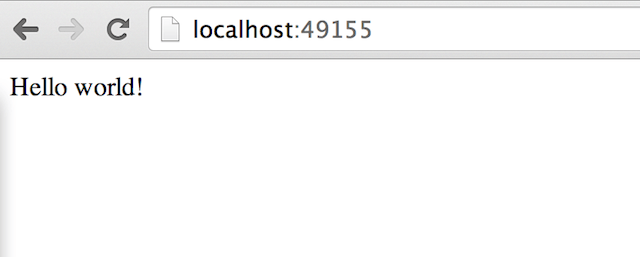

---
redirect_from:
- /engine/userguide/containers/usingdocker/
description: Learn how to manage and operate Docker containers.
keywords: docker, the docker guide, documentation, docker.io, monitoring containers, docker top, docker inspect, docker port, ports, docker logs, log, logs
title: Run a simple application
---

In the ["*Hello world in a container*"](dockerizing.md) you launched your first
containers using the `docker run` command. You ran an *interactive container*
that ran in the foreground. You also ran a *detached container* that ran in the
background. In the process you learned about several Docker commands:

* `docker ps` - Lists containers.
* `docker logs` - Shows the standard output of a container.
* `docker stop` - Stops running containers.

## Learn about the Docker client

The `docker` program is called the Docker client. To control Docker using the
client, you use commands, flags, and arguments. Have a look at the following
example, which uses the `run` command, the `-i` and `-t` flags, and the `ubuntu`
and `/bin/bash` arguments.

```bash
$ docker run -i -t ubuntu /bin/bash
```

The `docker version` command shows information about the version of Docker the
client is using, as well as other version-specific information.

```bash
$ docker version

Client:
 Version:      1.12.5
 API version:  1.24
 Go version:   go1.6.4
 Git commit:   7392c3b
 Built:        Fri Dec 16 02:42:17 2016
 OS/Arch:      windows/amd64

Server:
 Version:      1.12.5
 API version:  1.24
 Go version:   go1.6.4
 Git commit:   7392c3b
 Built:        Fri Dec 16 02:42:17 2016
 OS/Arch:      linux/amd64
```

## Get Docker command help

Each Docker command has associated usage information, which you can see when you
use the `--help` flag. You can use `--help` for the `docker` command itself, or
for its sub-commands.

To see usage information for the entire `docker` command, including a list of
all the possible commands, use `docker --help`.

```bash
$ docker --help
```

To see usage for a specific command, add the `--help` flag after that specific
command. For instance, the following command shows the help text for the
`docker attach` command.

```bash
$ docker attach --help

Usage: docker attach [OPTIONS] CONTAINER

Attach to a running container

Options:
  --detach-keys string   Override the key sequence for detaching a container
  --help                 Print usage
  --no-stdin             Do not attach STDIN
  --sig-proxy            Proxy all received signals to the process (default true)
```

> **Note:**
> For further details and examples of each command, see the
> [command reference](../reference/commandline/) in this guide.

## Run a web application in Docker

Now that you've learned a bit more about the Docker client, you can move onto
the important stuff: running more containers. First, run an example Python Flask
web application as a Docker container.

```bash
$ docker run -d -P --name my_webapp training/webapp python app.py
```

This command consists of the following parts:

* The `-d` flag runs the container in the background (as a so-called daemon).
* The `--name my_webapp` flag names the container `my_webapp`. If you do not
  specify a name, Docker creates a random (and sometimes amusing) name for the
  container. This name is guaranteed to be unique among all the containers
  running on a given Docker host.
* The `-P` flag maps any required network ports inside the container to your
  host. This lets you view the web application.
* The `training/webapp` image is a pre-built image that contains a simple Python
  Flask web application.
* The remaining arguments make up the command that is run inside
  the container. The `python app.py` command launches the web application.

> **Note:**
> You can see more detail on the `docker run` command
> in the [command reference](../reference/commandline/run.md)
> and the [docker run reference](../reference/run.md).

## View the web application container

To see information about your running container, use the `docker ps` command.

```bash
$ docker ps -l

CONTAINER ID  IMAGE                   COMMAND       CREATED        STATUS        PORTS                    NAMES
bc533791f3f5  training/webapp:latest  python app.py 5 seconds ago  Up 2 seconds  0.0.0.0:49155->5000/tcp  my_webapp
```

The `-l` flag shows only the details of the *last* container started.

> **Note:**
> By default, the `docker ps` command only shows information about running
> containers. If you want to see stopped containers too, use the `-a` flag.

In particular, have a look at the `PORTS` column.

```none
PORTS
0.0.0.0:49155->5000/tcp
```

When you passed the `-P` flag to the `docker run` command, Docker mapped any
ports exposed in the container to ports on your host machine. In this case,
port 5000 (the default port for Python Flask) is mapped to port 49155 on the
Docker host.

> **Note:**
> You'll learn more about how to expose ports in Docker images when
> [you learn how to build images](dockerimages.md).

Network port bindings are very configurable in Docker. In the last example the
`-P` flag is a shortcut for `-p 5000` that maps port 5000 inside the container
to a high port (from *ephemeral port range* which typically ranges from 32768
to 61000) on the local Docker host. You can also bind Docker containers to
specific ports using the `-p` flag, for example:

```bash
$ docker run -d --name my_other_webapp -p 80:5000 training/webapp python app.py
```

This would map port 5000 inside your container to port 80 on your local
host. You might be asking about now: why wouldn't we just want to always
use 1:1 port mappings in Docker containers rather than mapping to high
ports? Well, 1:1 mappings have the constraint of only being able to map
one of each port on your local host.

Suppose you want to test two Python applications: both bound to port 5000 inside
their own containers. Without Docker's port mapping you could only access one at
a time on the Docker host.

So you can now browse to port 80 in a web browser to see the application.

.

Your Python web application is live!

> **Note:**
> If you have been using a virtual machine on macOS, Windows or Linux,
> you'll need to get the IP of the virtual host instead of using localhost.
> You can do this by running `docker-machine ip` from the command line:
>
>     $ docker-machine ip
>     192.168.99.100
>
> In this case you'd browse to `http://192.168.99.100:49155` for the above example.

## A network port shortcut

Using the `docker ps` command to return the mapped port is a bit clumsy,
so Docker has a useful shortcut you can use: `docker port`.
To use `docker port`, specify the ID or name of your container and then
the port for which you need the corresponding public-facing port.

```bash
$ docker port my_webapp 5000

0.0.0.0:49155
```

In this case you've looked up what port is mapped externally to port 5000 inside
the container.

## View the web application's logs

You can also find out a bit more about what's happening with your
application and use another of the commands you've learned, `docker logs`.

```basg
$ docker logs -f my_webapp

* Running on http://0.0.0.0:5000/
10.0.2.2 - - [06/Nov/2016 20:16:31] "GET / HTTP/1.1" 200 -
10.0.2.2 - - [06/Nov/2016 20:16:31] "GET /favicon.ico HTTP/1.1" 404 -
```

The `-f` flag causes the `docker logs` command to act like the `tail -f` command
and watch the container's standard output. You can see here the logs from Flask
showing the application running on port 5000 and the access log entries for it.

## Look at the web application container's processes

In addition to the container's logs you can also examine the processes
running inside it using the `docker top` command.

```bash
$ docker top my_webapp

PID                 USER                COMMAND
854                 root                python app.py
```

Here you can see that the `python app.py` command is the only process
running inside the container.

## Inspect the web application container

Lastly, you can take a low-level dive into the Docker container using the
`docker inspect` command. It returns a JSON document containing useful
configuration and status information for the specified container.

```bash
$ docker inspect my_webapp
```

You can see a sample of that JSON output.

```none
[{
    "ID": "bc533791f3f500b280a9626688bc79e342e3ea0d528efe3a86a51ecb28ea20",
    "Created": "2014-05-26T05:52:40.808952951Z",
    "Path": "python",
    "Args": [
       "app.py"
    ],
    "Config": {
       "Hostname": "bc533791f3f5",
       "Domainname": "",
       "User": "",
  ...
}]
```

You can also narrow down the information you want to return by requesting a
specific element, for example to return the container's IP address, you would:

```bash

$ docker inspect -f '{{range .NetworkSettings.Networks}}{{.IPAddress}}{{end}}' my_webapp

172.17.0.5

```

## Stop the web application container

The web application is still running inside the container. You can stop it using
the `docker stop` command and the name of the container: `my_webapp`.

```bash
$ docker stop my_webapp

my_webapp
```

You can now use the `docker ps` command to check if the container has
been stopped.

```bash
$ docker ps -l
```

## Restart the web application container

Oops! Just after you stopped the container you get a call to say another
developer needs the container back. From here you have two choices: you
can create a new container or restart the old one. Look at
starting your previous container back up.

```bash
$ docker start my_webapp

my_webapp
```

Now quickly run `docker ps -l` again to see the running container is
back up or browse to the container's URL to see if the application
responds.

> **Note:**
> The `docker restart` command is also available. It is the equivalent of
> running `docker stop` followed by `docker start`.

## Remove the web application container

Your colleague has let you know that they've now finished with the container
and won't need it again. Now, you can remove it using the `docker rm` command.

```bash
$ docker rm my_webapp

Error: Impossible to remove a running container, please stop it first or use -f
2014/05/24 08:12:56 Error: failed to remove one or more containers
```

What happened? You can't actually remove a running container. This protects
you from accidentally removing a running container you might need. You can try
this again by stopping the container first.

```bash
$ docker stop my_webapp

my_webapp

$ docker rm my_webapp

my_webapp
```

Now the container is stopped and deleted.

> **Note:**
> Always remember that removing a container is final!

# Next steps

Until now you've only used images that you've downloaded from Docker Hub. Next,
you can get introduced to building and sharing your own images.

Go to [Working with Docker Images](dockerimages.md).
