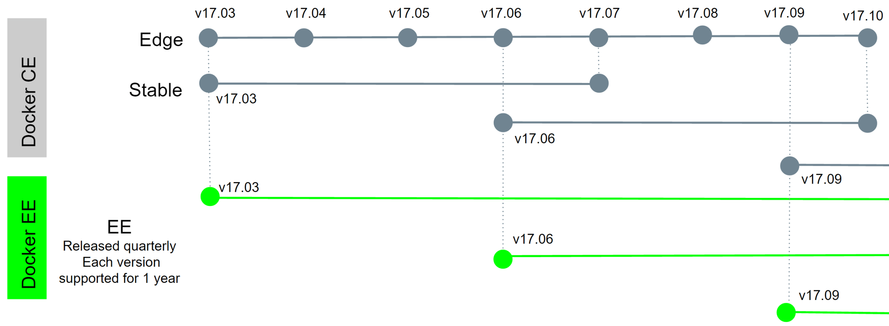

Docker Enterprise Edition (*Docker EE*) is designed for enterprise
development and IT teams who build, ship, and run business-critical
applications in production and at scale. Docker EE is integrated, certified,
and supported to provide enterprises with the most secure container platform
in the industry. For more info about Docker EE, including purchasing
options, see [Docker Enterprise Edition](https://www.docker.com/enterprise-edition/).

The free Docker products continue to be available as the Docker Community
Edition (*Docker CE*).

## Platform support matrix

This table shows all of the platforms that are available for Docker EE and
Docker CE. Each link in the first column takes you to the installation
instructions for the corresponding platform. Docker EE is an integrated,
supported, and certified container platform for the listed cloud providers and
operating systems.



## Certified containers and plugins in Docker Store

The Docker Certification Program includes technology from Docker's ecosystem
partners. [Docker Certified
containers](https://store.docker.com/search?certification_status=certified&q=&source=verified&type=image)
are created by Independent Software Vendors (ISVs) and run on top of Docker
EE. [Docker Certified plugins](https://store.docker.com/search?certification_status=certified&q=&type=plugin)
extend the Docker platform with new networking and storage features.

The *Docker Certification Program* is designed for technology partners and
enterprise customers to recognize containers and plugins that excel in
quality, collaborative support, and compliance. Certification is aligned with
the Docker EE infrastructure and gives enterprises a trusted way
to run more technology in containers that are supported both by Docker and
publishers.

[Docker Store](https://store.docker.com/) provides a marketplace for publishers to distribute, sell, and manage their listings, and it enables customers to browse, evaluate, and purchase publisher technologies as containers.

Certified containers and plugins have visible badges, so customers can
quickly find certified content. Customers can be confident that badged
content is built with best practices and tested to operate smoothly on Docker
EE. Customers manage all subscriptions, including those for Docker products
and publisher content, in a single place.

Three categories of Docker Certified technology are available:

1.  **Certified Infrastructure:** Includes cloud providers and operating
    systems that the Docker platform is integrated with, optimized for, and
    tested for certification. With certified infrastructure, Docker provides
    a great user experience and preserves application portability.
2.  **Certified Containers:** ISVs can package and distribute their software
    as containers directly to the end user. These containers are tested, built
    with Docker-recommended best practices, scanned for vulnerabilities, and
    reviewed before posting on Docker Store.
3.  **Certified Plugins:** Networking and Volume plugins for Docker EE are
    available to be packaged and distributed to end users as containers. These
    plugin containers are built with Docker-recommended best practices,
    scanned for vulnerabilities, and must pass an additional suite of API
    compliance testing before they're reviewed and posted on Docker Store.
    Apps are portable across different network and storage infrastructure, and
    they work with new plugins without recoding.

The Docker Certification Program broadens the Docker platform to a wide
community of developers and IT ops teams at businesses of all sizes.
Businesses that seek to modernize their applications can build and deploy on
Docker EE for Linux and Windows, on any infrastructure. Many components of
enterprise environments come from third parties, and the Docker Certified
Program accelerates the adoption of these technologies into Docker
environments with assurances and support.

## Docker EE feature tiers

Docker EE is available in three tiers:

-  **Basic:** The Docker platform for certified infrastructure, with support
   from Docker Inc. and certified containers and plugins from Docker Store.
-  **Standard:** Adds advanced image and container management, LDAP/AD user
   integration, and role-based access control. Together, these features
   comprise *Docker Datacenter*.
-  **Advanced:** Adds
   [Docker Security Scanning](https://blog.docker.com/2016/05/docker-security-scanning/)
   and continuous vulnerability monitoring.

## Docker Enterprise Edition and Docker Community Edition release cycles

Docker EE and Docker CE are released quarterly. Both use a time-based
versioning scheme, so for example, Docker EE version 17.03 was released in
March 2017.

Each Docker EE release is supported and maintained for one year and receives
security and critical bug fixes during this period.

Each Docker CE quarterly release is maintained for 4 months, which gives
Docker CE users a one-month window to update to the next version.

Docker CE has two channels:

-  **Edge:** Released monthly for users who want the latest and greatest
   features.
-  **Stable:** Released quarterly for users who want an easier-to-maintain
   release cadence.

The following diagram shows how Docker CE and Docker EE versions are released.

The Docker API version is independent of the Docker platform version. The API
version doesn't change from Docker 1.13.1 to Docker 17.03. We maintain
careful API backward compatibility and deprecate APIs and features slowly and
conservatively. We remove features after deprecating them for a period of
three stable releases. Docker 1.13 introduced improved interoperability
between clients and servers using different API versions, including dynamic
feature negotiation.

The deterministic release train benefits the Docker project. Maintainers and
partners who want to ship new features in Docker are guaranteed that new
features are in the hands of Edge channel users within a month of being
merged.

## Upgrades and support

Docker CE for Mac and Windows users get automatic upgrade notifications. If
you're a user of Docker for AWS or Azure, refer to the release notes for
upgrade instructions. If you're a legacy `docker-engine` package user, 
upgrade using your distro package manager, or upgrade to the new `docker-ce`
package.

If you're a Docker DDC or CS Engine customer, you don't need to upgrade to
Docker EE to continue to get support. We will continue to support customers
with valid subscriptions whether the subscription covers Docker EE or
Commercially Supported Docker. You can choose to stay with your current
deployed version, or you can upgrade to the latest Docker EE version. For
more info, see [Scope of Coverage and Maintenance
Lifecycle](https://success.docker.com/Policies/Scope_of_Support).
