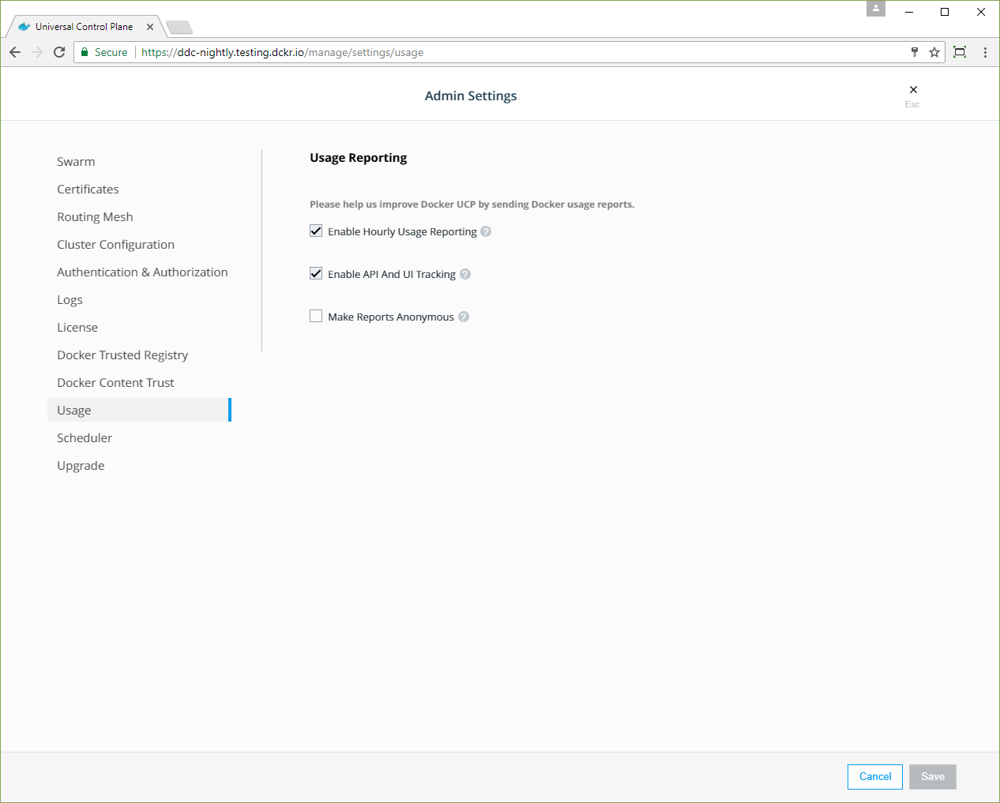

Docker EE 17.06 and higher include a telemetry plugin which is enabled by
default on Ubuntu. This plugin sends Docker information about your running
system so that we can improve Docker EE. For details about the telemetry plugin
and the types of data it collects, see the
[`telemetry` plugin documentation](https://store.docker.com/community/images/docker/telemetry).

If your Docker instance runs in an environment with no internet connectivity,
the plugin does not collect or attempt to send any information to Docker.

## Manage data collection

If you do not wish to send any usage data to Docker, you can disable the plugin,
either using the Docker CLI or using Universal Control Plane.

 > **Note**: If you're using Docker EE Standard or Advanced with Universal Control Plane, use Universal Control Plane (UCP) to enable and disable metrics. Only use the CLI if you do not have UCP. UCP will re-enable the telemetry plugin for hosts where it was disabled with the CLI.

### Use the Docker CLI

To disable the telemetry plugin, use the `docker plugin disable` command:

```bash
$ docker plugin disable telemetry
```

This command needs to be run on each Docker host.

To re-enable the telemetry plugin, you can use `docker plugin enable`.

```bash
$ docker plugin enable telemetry
```

### Use Universal Control Plane

If you use Universal Control Plane with Docker EE, do not use the Docker CLI to
disable the telemetry plugin. Instead, you can manage the information sent to
Docker by going to **Admin Settings** and choosing **Usage**.



To disable the telemetry plugin, disable all three options and click **Save**.
Enabling either or both of the top two options will enable the telemetry plugin.
You can find out more about an individual option by clicking the **?** icon next
to it.

> **Note**: If you enable gathering of API statistics, the payloads are not
> collected, but only information about which API endpoints you use.

