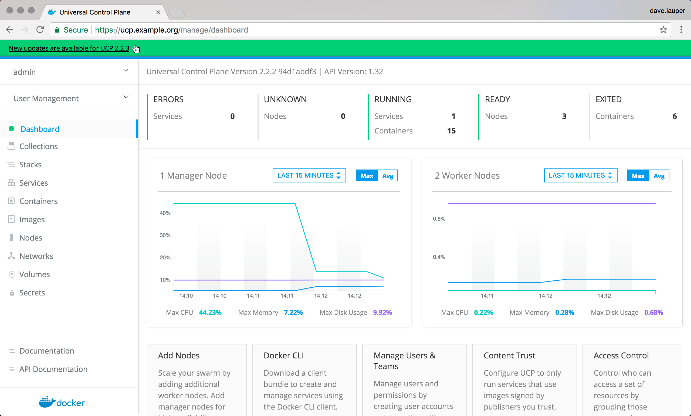
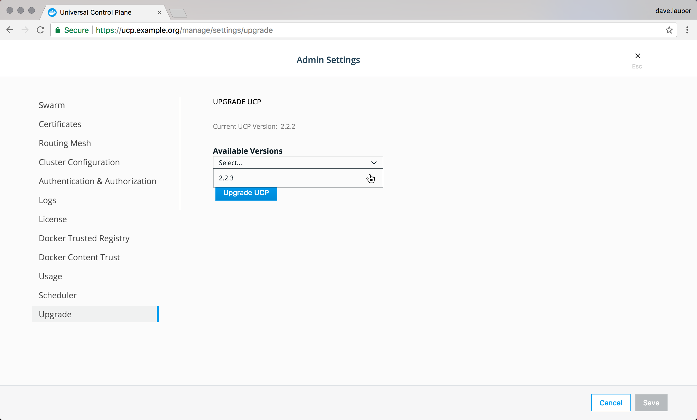

To upgrade Docker Enterprise Edition you need to individually upgrade each of the
following components:

1. Docker Engine.
2. Universal Control Plane (UCP).
3. Docker Trusted Registry (DTR).

While upgrading some of these components will become temporarily unavailable.
So you should schedule your upgrades to take place outside business peak hours,
to make sure there's no impact to your business.

## Create a backup

Before upgrading Docker EE, you should make sure you [create a backup](backup.md).
This will make it possible to recover if anything goes wrong during the upgrade.

## Check the compatibility matrix

You should also check the [compatibility matrix](https://success.docker.com/Policies/Compatibility_Matrix),
to make sure all Docker EE components are certified to work with one another.
You may also want to check the
[Docker EE maintenance lifecycle](https://success.docker.com/Policies/Maintenance_Lifecycle),
to understand until when your version will be supported.

## Upgrade Docker EE

Start by sequentially upgrading the Docker Engine running on each node.
When upgrading manager nodes, make sure the upgrade of a node finishes before
you start upgrading the next node. Upgrading multiple manager nodes at the same
time can lead to a loss of quorum, and possible data loss.

Before upgrading the Docker Engine on a node, drain the node so that any
workloads running on the node get scheduled in some other node. You can do
this by running `docker node update --availability drain <node>` on a manager
node.

Follow the upgrade instructions for your specific distribution:

* [Windows Server](/engine/installation/windows/docker-ee.md#update-docker-ee)
* [Ubuntu](/engine/installation/linux/docker-ee/ubuntu.md#upgrade-docker-ee)
* [RHEL](/engine/installation/linux/docker-ee/rhel.md#upgrade-docker-ee)
* [CentOS](/engine/installation/linux/docker-ee/centos.md#upgrade-docker-ee)
* [Oracle Linux](/engine/installation/linux/docker-ee/oracle.md#upgrade-docker-ee)
* [SLES](/engine/installation/linux/docker-ee/suse.md#upgrade-docker-ee)

Once you finish upgrading the node, make it available to run workloads. For
this, run `docker node update --availability active <node>`.

## Upgrade UCP

Once you've upgraded the Docker Engine running on all the nodes, upgrade UCP.
You can do this from the UCP web UI.

{: .with-border}

Click on the banner, and choose the version you want to upgrade to.

{: .with-border}

Once you click **Upgrade UCP**, the upgrade starts. If you want you can upgrade
UCP from the CLI instead. [Learn more](/datacenter/ucp/2.2/guides/admin/install/upgrade.md).

## Upgrade DTR

Log in into the DTR web UI to check if there's a new version available.

{: .with-border}

Then follow these [instructions to upgrade DTR](/datacenter/dtr/2.3/guides/admin/upgrade.md).
When this is finished, your Docker EE has been upgraded.

## Where to go next

* [Backup Docker EE](backup.md)
