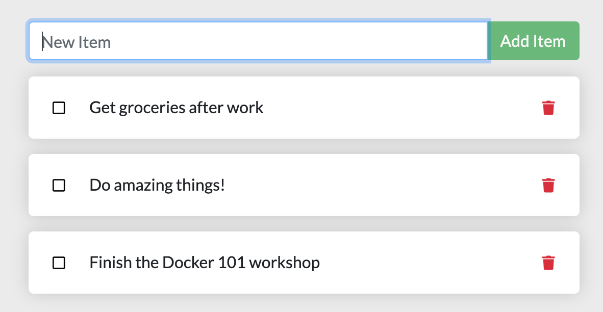

For the rest of this tutorial, we will be working with a simple todo
list manager that is running in Node.js. If you're not familiar with Node.js,
don't worry! No real JavaScript experience is needed!

At this point, your development team is quite small and you're simply
building an app to prove out your MVP (minimum viable product). You want
to show how it works and what it's capable of doing without needing to
think about how it will work for a large team, multiple developers, etc.

{: style="width:50%;" }

## Get the app

Before we can run the application, we need to get the application source code onto 
our machine. For real projects, you will typically clone the repo. But, for this tutorial,
we have created a ZIP file containing the application.

1. [Download the App contents](https://github.com/docker/getting-started/tree/master/app){:target="_blank" rel="noopener" class="_"}. You can either pull the entire project or download it as a zip and extract the app folder out to get started with

2. Once extracted, use your favorite code editor to open the project. If you're in need of
    an editor, you can use [Visual Studio Code](https://code.visualstudio.com/){:target="_blank" rel="noopener" class="_"}. You should
    see the `package.json` and two subdirectories (`src` and `spec`).

    {: style="width:650px;margin-top:20px;"}
    {: .text-center }

## Build the app's container image

In order to build the application, we need to use a `Dockerfile`. A
Dockerfile is simply a text-based script of instructions that is used to
create a container image. If you've created Dockerfiles before, you might
see a few flaws in the Dockerfile below. But, don't worry! We'll go over them.

1. Create a file named `Dockerfile` in the same folder as the file `package.json` with the following contents.

    ```dockerfile
    FROM node:12-alpine
    RUN apk add --no-cache python g++ make
    WORKDIR /app
    COPY . .
    RUN yarn install --production
    CMD ["node", "src/index.js"]
    ```
    
    Please check that the file `Dockerfile` has no file extension like `.txt`. Some editors may append this file extension automatically and this would result in an error in the next step.

2. If you haven't already done so, open a terminal and go to the `app` directory with the `Dockerfile`. Now build the container image using the `docker build` command.

    ```bash
    docker build -t getting-started .
    ```

    This command used the Dockerfile to build a new container image. You might
    have noticed that a lot of "layers" were downloaded. This is because we instructed
    the builder that we wanted to start from the `node:12-alpine` image. But, since we
    didn't have that on our machine, that image needed to be downloaded.

    After the image was downloaded, we copied in our application and used `yarn` to 
    install our application's dependencies. The `CMD` directive specifies the default 
    command to run when starting a container from this image.

    Finally, the `-t` flag tags our image. Think of this simply as a human-readable name
    for the final image. Since we named the image `getting-started`, we can refer to that
    image when we run a container.

    The `.` at the end of the `docker build` command tells that Docker should look for the `Dockerfile` in the current directory.

## Start an app container

Now that we have an image, let's run the application! To do so, we will use the `docker run`
command (remember that from earlier?).

1. Start your container using the `docker run` command and specify the name of the image we 
    just created:

    ```bash
    docker run -dp 3000:3000 getting-started
    ```

    Remember the `-d` and `-p` flags? We're running the new container in "detached" mode (in the 
    background) and creating a mapping between the host's port 3000 to the container's port 3000.
    Without the port mapping, we wouldn't be able to access the application.

2. After a few seconds, open your web browser to [http://localhost:3000](http://localhost:3000).
    You should see our app!

    {: style="width:450px;margin-top:20px;"}
    {: .text-center }

3. Go ahead and add an item or two and see that it works as you expect. You can mark items as
   complete and remove items. Your frontend is successfully storing items in the backend!
   Pretty quick and easy, huh?


At this point, you should have a running todo list manager with a few items, all built by you!
Now, let's make a few changes and learn about managing our containers.

If you take a quick look at the Docker Dashboard, you should see your two containers running now 
(this tutorial and your freshly launched app container)!


## Recap

In this short section, we learned the very basics about building a container image and created a
Dockerfile to do so. Once we built an image, we started the container and saw the running app!

Next, we're going to make a modification to our app and learn how to update our running application
with a new image. Along the way, we'll learn a few other useful commands.
